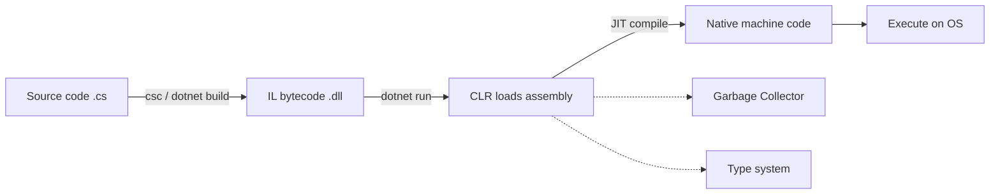

# Dotnet Overview

> **One-liner**: .NET is a free, cross-platform runtime + SDK + ecosystem for building apps in C#, F#, and VB — modern .NET (5+) replaces both .NET Framework and .NET Core.

---

## Quick Reference

| Concept | What it is |
|---------|------------|
| **.NET Framework** | Windows-only legacy (1.0–4.8). Frozen, security fixes only |
| **.NET Core** | Cross-platform rewrite (1.0–3.1). Renamed to ".NET" from v5 |
| **.NET (modern)** | Unified platform: .NET 5, 6, 7, 8, 9... (current) |
| **CLR** | Common Language Runtime — executes IL, GC, JIT |
| **BCL** | Base Class Library — `System.*` namespaces |
| **SDK** | Build, compile, publish (`dotnet` CLI) |
| **Runtime** | Just runs apps — smaller, no compiler |
| **NuGet** | Package manager (`dotnet add package`) |

---

## Core Concept

**.NET** is a managed runtime that runs C# code on Windows, Linux, macOS, and even mobile/embedded. You write `.cs` files, the compiler turns them into **IL** (Intermediate Language), and the **CLR** runs the IL — JIT-compiling it to native machine code at runtime.

The confusing history: **.NET Framework** (Windows-only, 2002–2019) was rebuilt cross-platform as **.NET Core** (2016–2020), and then renamed to just **".NET"** starting with version 5 (2020). Today you should always use modern .NET — pick the latest LTS (Long-Term Support) release like .NET 8.

The **SDK** is what developers install (it includes the runtime + compiler + CLI). The **Runtime** is what's installed on production servers (smaller, no build tools).

---

## Diagram



---

## Syntax & API

### Install and verify
```bash
# Check installed versions
dotnet --version
dotnet --list-sdks
dotnet --list-runtimes
```

### Common CLI commands
```bash
dotnet new console -n MyApp        # Create console app
dotnet new webapi -n MyApi         # Create REST API
dotnet new sln -n MySolution       # Create solution file
dotnet sln add MyApp/MyApp.csproj  # Add project to solution

dotnet restore                     # Restore NuGet packages
dotnet build                       # Compile
dotnet run                         # Build + run
dotnet test                        # Run tests
dotnet publish -c Release          # Production build
dotnet add package Newtonsoft.Json # Add NuGet package
```

### Project file (.csproj)
```xml
<Project Sdk="Microsoft.NET.Sdk">
  <PropertyGroup>
    <OutputType>Exe</OutputType>
    <TargetFramework>net8.0</TargetFramework>
    <Nullable>enable</Nullable>
    <ImplicitUsings>enable</ImplicitUsings>
  </PropertyGroup>
</Project>
```

---

## Common Patterns

```bash
# Typical workflow: scaffold → code → run
dotnet new console -n HelloApp
cd HelloApp
dotnet run
```

```bash
# Multi-project solution layout
dotnet new sln -n Shop
dotnet new classlib -n Shop.Domain
dotnet new webapi -n Shop.Api
dotnet sln add Shop.Domain Shop.Api
dotnet add Shop.Api reference Shop.Domain
```

---

## Gotchas & Tips

- **".NET Core" no longer exists as a name** — versions 5+ are just ".NET". Many tutorials still say "Core"; treat the terms as synonyms for modern .NET.
- **Pick LTS versions** (.NET 8, 10) for production — supported 3 years. STS (.NET 9) only 18 months.
- **`<Nullable>enable</Nullable>`** activates nullable reference types — non-negotiable on new projects.
- **`<ImplicitUsings>enable</ImplicitUsings>`** auto-imports common namespaces (System, System.Linq, etc.).
- The `bin/` and `obj/` folders are build output — always `.gitignore` them.

---

## See Also

- [[02 - CSharp Basics]]
- [[14 - ASP.NET Core Basics]]
- [[17 - Docker and Containers]]
