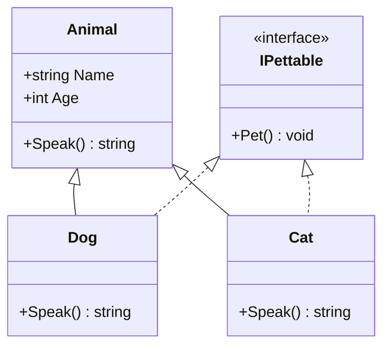

# OOP Fundamentals

> **One-liner**: C# is class-based with single inheritance plus interfaces; modern features include **records** for value semantics, **init-only setters** for immutable construction, and **primary constructors**.

---

## Quick Reference

| Construct | Use for |
|-----------|---------|
| `class` | Reference type with identity |
| `struct` | Value type (small, copied) |
| `record class` | Reference type with value equality |
| `record struct` | Value type with auto-generated equality |
| `interface` | Contract, no state |
| `enum` | Named integer constants |
| `public` | Accessible everywhere |
| `private` | Same class only (default for members) |
| `protected` | Same class + subclasses |
| `internal` | Same assembly only (default for types) |
| `protected internal` | Subclasses OR same assembly |
| `private protected` | Subclasses in same assembly |

---

## Core Concept

A **class** is a blueprint that bundles data (fields/properties) with behavior (methods). An **object** is an instance of a class. Classes are reference types — variables hold a pointer to the object on the heap.

A **struct** is a lightweight value type, copied on assignment. Use for small (≤16 bytes), short-lived data.

A **record** is a class (or struct) where the compiler auto-generates equality, `GetHashCode`, `ToString`, and a `with`-expression for non-destructive copy. Use for **data carriers** (DTOs, events, value objects).

**Properties** look like fields but have getters/setters under the hood — they let you add validation, logging, or computed values without breaking callers.

---

## Diagram



---

## Syntax & API

### Class with properties
```csharp
public class Person
{
    // Auto-property
    public string Name { get; set; } = "";

    // Init-only property (immutable after construction)
    public DateOnly DateOfBirth { get; init; }

    // Computed (read-only)
    public int Age => DateTime.Now.Year - DateOfBirth.Year;

    // Property with backing field + validation
    private int _score;
    public int Score
    {
        get => _score;
        set => _score = value < 0 ? 0 : value;
    }

    // Constructor
    public Person(string name, DateOnly dob)
    {
        Name = name;
        DateOfBirth = dob;
    }
}

var p = new Person("Alice", new DateOnly(1990, 5, 1));
```

### Object initializer
```csharp
var p = new Person("Bob", new DateOnly(2000, 1, 1))
{
    Score = 42
};
```

### Records (modern C#)
```csharp
// Positional record — primary constructor + value equality
public record Point(double X, double Y);

var a = new Point(1, 2);
var b = a with { Y = 5 };       // non-destructive copy → Point(1, 5)
Console.WriteLine(a == new Point(1, 2)); // true (value equality)
```

```csharp
// Record class with extra members
public record User(string Email, string Name)
{
    public DateTime CreatedAt { get; init; } = DateTime.UtcNow;
    public bool IsAdmin => Email.EndsWith("@admin.com");
}
```

### Struct
```csharp
public readonly struct Money
{
    public Money(decimal amount, string currency)
    {
        Amount = amount;
        Currency = currency;
    }

    public decimal Amount { get; }
    public string Currency { get; }

    public override string ToString() => $"{Amount:F2} {Currency}";
}
```

### Interface
```csharp
public interface IRepository<T>
{
    Task<T?> GetByIdAsync(int id);
    Task AddAsync(T entity);
}

public class UserRepository : IRepository<User>
{
    public Task<User?> GetByIdAsync(int id) { /* ... */ }
    public Task AddAsync(User entity)       { /* ... */ }
}
```

### Enum
```csharp
public enum OrderStatus
{
    Pending,    // 0
    Paid,       // 1
    Shipped,    // 2
    Delivered,  // 3
    Cancelled = 99
}

[Flags]
public enum Permissions
{
    None  = 0,
    Read  = 1,
    Write = 2,
    Admin = 4
}

var p = Permissions.Read | Permissions.Write;
```

---

## Common Patterns

```csharp
// Pattern: record for DTOs and value objects
public record EmailAddress(string Value)
{
    public EmailAddress
    {
        if (!Value.Contains('@'))
            throw new ArgumentException("Invalid email");
    }
}
```

```csharp
// Pattern: static factory method
public class Money
{
    public decimal Amount { get; }
    public string Currency { get; }

    private Money(decimal amount, string currency) { /* ... */ }

    public static Money Usd(decimal amount) => new(amount, "USD");
    public static Money Eur(decimal amount) => new(amount, "EUR");
}

var price = Money.Usd(9.99m);
```

---

## Gotchas & Tips

- **Default value of a class field is `null`** — enable nullable to surface this at compile time.
- **`struct` defaults all fields to zero/null** — there's always a parameterless constructor you can't disable (until C# 10 with restrictions).
- **Records with mutable properties lose their guarantees** — keep them with `init` or readonly.
- **Don't override `Equals` manually on a record** — you'll lose the auto-generated one. If you need custom equality, use a class.
- **Interfaces can have default implementations** (C# 8+), but use sparingly — they break ABI compatibility for implementers.
- **`sealed`** prevents inheritance — apply to leaf classes for clarity and slight perf gain (devirtualization).

---

## See Also

- [[02 - CSharp Basics]]
- [[01 - OOP Advanced]]
- [[02 - Generics]]
- [[09 - Memory Management and GC]]
