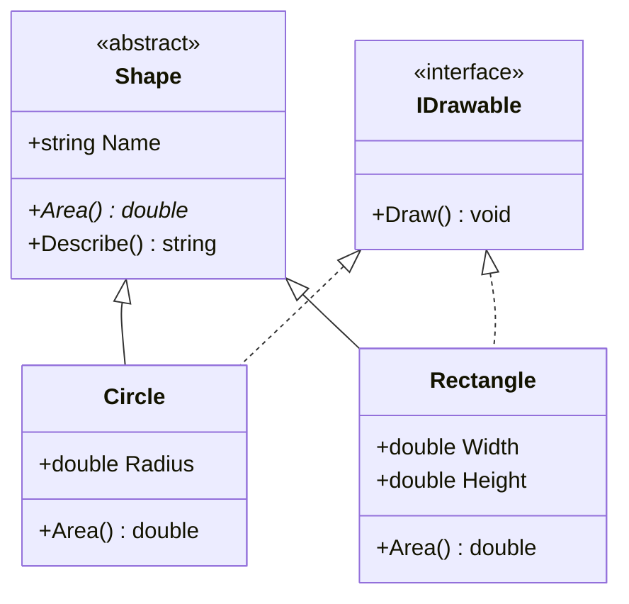

# OOP Advanced

> **One-liner**: Advanced OOP in C# centers on **inheritance**, **interfaces**, **polymorphism**, and the modifiers that control them — `virtual`, `override`, `abstract`, `sealed`, `new`.

---

## Quick Reference

| Modifier | On | Effect |
|----------|----|--------|
| `virtual` | method/property | Subclass MAY override |
| `override` | method/property | Replace base implementation |
| `abstract` | class | Cannot instantiate |
| `abstract` | method | Subclass MUST implement |
| `sealed` | class | Cannot inherit |
| `sealed override` | method | Stop further overriding |
| `new` | method | Hide base member (avoid) |
| `base.X()` | call site | Call base class member |
| `: BaseClass` | class decl | Single inheritance |
| `: IFoo, IBar` | class decl | Multiple interfaces |

---

## Core Concept

**Inheritance** lets a class extend another, reusing its members. C# has **single class inheritance** but **multiple interface implementation**. Use inheritance for "is-a" relationships only — when in doubt, prefer composition.

**Polymorphism** means: a variable of type `Animal` may actually hold a `Dog`. Calling `animal.Speak()` runs the `Dog`-specific override at runtime. This is achieved through `virtual` + `override`.

**Abstract** classes are partial implementations — they may have concrete members but at least one abstract member that subclasses must fill in. They differ from interfaces in that they can hold state and constructors.

---

## Diagram



---

## Syntax & API

### Inheritance + virtual / override
```csharp
public class Animal
{
    public string Name { get; set; } = "";
    public virtual string Speak() => "...";
    public override string ToString() => $"{GetType().Name}({Name})";
}

public class Dog : Animal
{
    public override string Speak() => "Woof!";
}

public class Puppy : Dog
{
    public override string Speak() => $"Yip! ({base.Speak()})";  // calls Dog.Speak
}

Animal a = new Puppy { Name = "Rex" };
Console.WriteLine(a.Speak());     // "Yip! (Woof!)" — runtime dispatch
```

### Abstract class
```csharp
public abstract class Shape
{
    public abstract double Area();                    // must be overridden

    public virtual string Describe() => $"A shape with area {Area():F2}";
}

public class Circle : Shape
{
    public double Radius { get; init; }
    public override double Area() => Math.PI * Radius * Radius;
}

// Shape s = new Shape();   // ❌ compile error
Shape s = new Circle { Radius = 5 };
Console.WriteLine(s.Describe());
```

### Interfaces
```csharp
public interface IDrawable
{
    void Draw();
}

public interface IResizable
{
    void Resize(double factor);
}

// Multiple interfaces
public class Rectangle : Shape, IDrawable, IResizable
{
    public double Width  { get; set; }
    public double Height { get; set; }

    public override double Area() => Width * Height;
    public void Draw() => Console.WriteLine($"Drawing {Width}x{Height}");
    public void Resize(double f) { Width *= f; Height *= f; }
}
```

### Sealed
```csharp
public sealed class FinalDog : Dog
{
    // cannot be inherited from
}

public class Cat : Animal
{
    public sealed override string Speak() => "Meow";  // no further override
}
```

### Default interface methods (C# 8+)
```csharp
public interface ILogger
{
    void Log(string message);
    void LogError(string message)
    {
        Log("ERROR: " + message);    // default impl, optional to override
    }
}
```

### Pattern: composition over inheritance
```csharp
// Prefer
public class Order
{
    private readonly IDiscountStrategy _discount;
    public Order(IDiscountStrategy discount) => _discount = discount;
    public decimal Total() => _discount.Apply(SubTotal());
}

// Over deep inheritance
public class DiscountedOrder : Order { /* ... */ }
public class HolidayDiscountedOrder : DiscountedOrder { /* ... */ }
```

---

## Common Patterns

```csharp
// Pattern: template method (Gang of Four)
public abstract class ReportGenerator
{
    public string Generate()
    {
        var data = LoadData();
        var formatted = Format(data);
        return Wrap(formatted);
    }

    protected abstract string LoadData();
    protected abstract string Format(string data);
    private string Wrap(string body) => $"<html>{body}</html>";
}
```

```csharp
// Pattern: explicit interface implementation (resolves naming clashes)
public class Service : IReader, IWriter
{
    void IReader.Read() { /* ... */ }
    void IWriter.Read() { /* ... */ }       // different impl per interface
}

((IReader)svc).Read();
((IWriter)svc).Read();
```

---

## Gotchas & Tips

- **`virtual`/`override` is a runtime dispatch decision** — there's a small vtable cost. JIT can devirtualize for `sealed` classes; mark leaves `sealed` for free perf.
- **`new` (member hiding) is a footgun** — calling through the base reference calls the base method. Almost always means you really wanted `override`.
- **Don't inherit just to reuse code** — that's what private methods or composition are for. Inherit when polymorphism is genuinely needed.
- **Abstract class vs interface** — abstract = "is-a + shared partial impl"; interface = "can-do contract". Default interface methods blur the line, but interfaces still can't hold state.
- **Constructors aren't inherited** — you must explicitly define them on the derived class (you can chain with `: base(...)`).
- **`object.Equals` and `GetHashCode` should be overridden together** — or use a `record`.

---

## See Also

- [[05 - OOP Fundamentals]]
- [[02 - Generics]]
- [[01 - Design Patterns]]
- [[02 - Clean Architecture]]
