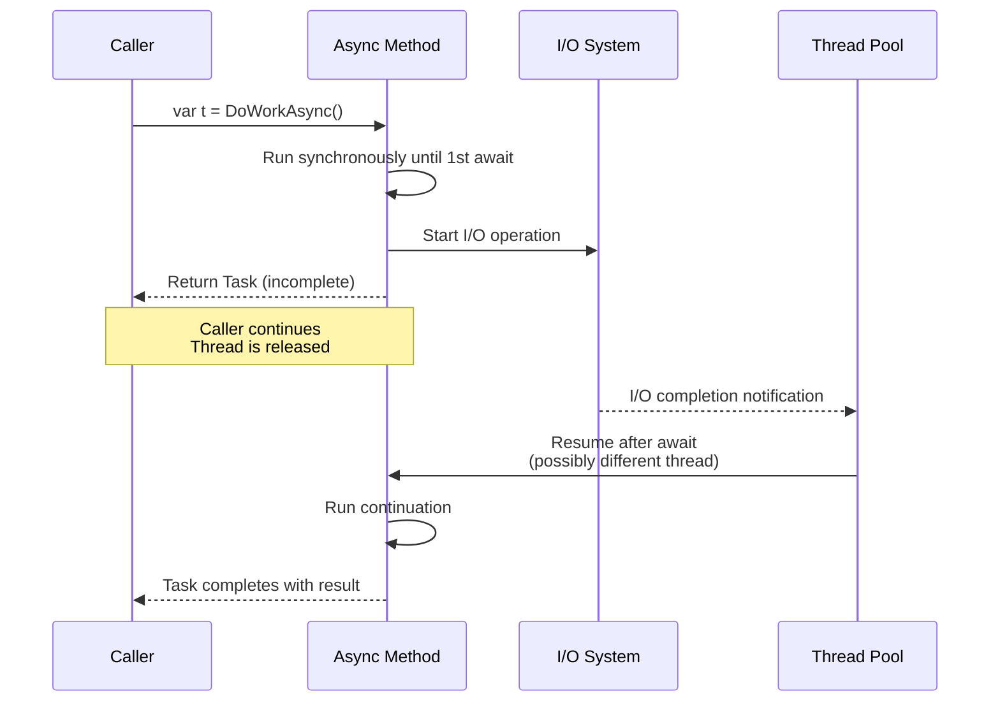

# Async and Await

> **One-liner**: `async`/`await` is non-blocking concurrency on top of `Task` — the compiler rewrites your method into a state machine that releases the thread while waiting for I/O, then resumes when the result is ready.

---

## Quick Reference

| Concept | Notes |
|---------|-------|
| `Task` | Represents a future `void` operation |
| `Task<T>` | Future operation returning `T` |
| `ValueTask<T>` | Allocation-free for sync-completed paths |
| `async` | Marks method as containing `await` |
| `await` | Suspends until awaitable completes |
| `Task.Run(f)` | Schedule CPU work on thread pool |
| `Task.WhenAll(...)` | Wait for all to finish |
| `Task.WhenAny(...)` | Wait for first to finish |
| `Task.Delay(ms)` | Async sleep |
| `Task.FromResult(v)` | Already-completed task |
| `Task.CompletedTask` | Already-completed `void` task |
| `CancellationToken` | Cooperative cancellation |
| `IAsyncEnumerable<T>` | Async stream (`await foreach`) |
| `ConfigureAwait(false)` | Don't capture sync context (lib code) |

---

## Core Concept

`async`/`await` does **not** create threads. When you `await` an I/O operation, the current thread is released back to the thread pool; when the I/O completes, a thread (often a different one) resumes the method right after the `await`.

**Concurrency** = many things in flight at once. **Parallelism** = many things executing simultaneously on different cores. Async gives you concurrency cheaply (good for I/O-bound work). Parallelism uses threads/`Parallel.For` (good for CPU-bound work — see [[10 - Parallel and Dataflow]]).

The compiler rewrites your `async` method into a **state machine**: each `await` is a state, and the runtime advances the machine when its awaitable completes. The pre-`await` code runs synchronously up to the first incomplete `await`.

---

## Diagram



---

## Syntax & API

### Basic async method
```csharp
public async Task<string> FetchAsync(string url)
{
    using var client = new HttpClient();
    string body = await client.GetStringAsync(url);    // await — releases thread
    return body.ToUpperInvariant();
}

// Caller
string text = await FetchAsync("https://example.com");
```

### Run multiple in parallel
```csharp
// Sequentially — slow
var a = await FetchAsync(url1);
var b = await FetchAsync(url2);
var c = await FetchAsync(url3);
// total ≈ a + b + c

// In parallel
Task<string> ta = FetchAsync(url1);     // starts immediately
Task<string> tb = FetchAsync(url2);
Task<string> tc = FetchAsync(url3);
await Task.WhenAll(ta, tb, tc);
// total ≈ max(a, b, c)

string[] all = await Task.WhenAll(urls.Select(FetchAsync));
```

### WhenAny — first to finish
```csharp
var fast = FetchAsync("https://fast.example");
var slow = FetchAsync("https://slow.example");

Task<string> winner = await Task.WhenAny(fast, slow);
string result = await winner;       // unwrap value
```

### Cancellation
```csharp
public async Task<string> FetchAsync(string url, CancellationToken ct)
{
    using var client = new HttpClient();
    return await client.GetStringAsync(url, ct);
}

using var cts = new CancellationTokenSource(TimeSpan.FromSeconds(5));
try
{
    var result = await FetchAsync(url, cts.Token);
}
catch (OperationCanceledException)
{
    // timed out or cancelled
}
```

### IAsyncEnumerable — async stream
```csharp
public async IAsyncEnumerable<string> StreamLinesAsync(
    string path, [EnumeratorCancellation] CancellationToken ct = default)
{
    using var reader = new StreamReader(path);
    string? line;
    while ((line = await reader.ReadLineAsync(ct)) != null)
    {
        yield return line;
    }
}

await foreach (var line in StreamLinesAsync("big.log").WithCancellation(ct))
{
    Console.WriteLine(line);
}
```

### ValueTask for hot paths
```csharp
private string? _cached;

public ValueTask<string> GetAsync()
{
    if (_cached is not null) return new ValueTask<string>(_cached);
    return new ValueTask<string>(LoadAsync());
}

async Task<string> LoadAsync()
{
    _cached = await ReadFromDiskAsync();
    return _cached;
}
```

### ConfigureAwait(false) in libraries
```csharp
public async Task<string> LibraryMethodAsync()
{
    var data = await DownloadAsync().ConfigureAwait(false);
    var processed = await ProcessAsync(data).ConfigureAwait(false);
    return processed;
    // No SynchronizationContext capture — avoids deadlocks in old WinForms/WPF callers
}
```

---

## Common Patterns

```csharp
// Pattern: timeout via WhenAny
public async Task<T?> WithTimeoutAsync<T>(Task<T> task, TimeSpan timeout)
{
    var delay = Task.Delay(timeout);
    var done = await Task.WhenAny(task, delay);
    return done == task ? await task : default;
}
```

```csharp
// Pattern: retry with exponential backoff
public async Task<T> RetryAsync<T>(Func<Task<T>> action, int maxAttempts = 5)
{
    for (int attempt = 0; ; attempt++)
    {
        try { return await action(); }
        catch when (attempt < maxAttempts - 1)
        {
            await Task.Delay(TimeSpan.FromMilliseconds(100 * Math.Pow(2, attempt)));
        }
    }
}
```

```csharp
// Pattern: producer/consumer with cancellation
public async Task ProcessAsync(IAsyncEnumerable<Item> items, CancellationToken ct)
{
    await foreach (var item in items.WithCancellation(ct))
    {
        ct.ThrowIfCancellationRequested();
        await HandleAsync(item, ct);
    }
}
```

---

## Gotchas & Tips

- **Never `async void`** except for event handlers — exceptions crash the process and you can't `await` them.
- **Don't block on async** — `task.Result` or `task.Wait()` deadlocks in UI/ASP.NET Framework contexts and wastes threads everywhere. If you must, you've designed it wrong.
- **`async` doesn't make code parallel** — three sequential `await`s run one after another. Use `Task.WhenAll` to overlap.
- **CPU-bound work needs `Task.Run`** — `async` only buys you thread release on I/O. Wrapping pure computation in `async` doesn't speed it up.
- **`ConfigureAwait(false)` everywhere in libraries** to avoid deadlocks in legacy callers (UI/old ASP.NET). In ASP.NET Core (and console/services) it's a no-op — but still applied for portability.
- **`CancellationToken` flows manually** — pass it to every async call. Forgetting to forward `ct` is the #1 cancellation bug.
- **Exceptions in `Task.WhenAll`** — only the first is rethrown; access `.Exception.InnerExceptions` for the rest.
- **`ValueTask` rules**: don't await twice, don't `Task.WhenAll(ValueTask...)`. Convert with `.AsTask()` if you need flexibility.

---

## See Also

- [[07 - Threading and Concurrency]]
- [[08 - Synchronization Primitives]]
- [[09 - Channels and Pipelines]]
- [[10 - Parallel and Dataflow]]
- [[14 - ASP.NET Core Basics]]
