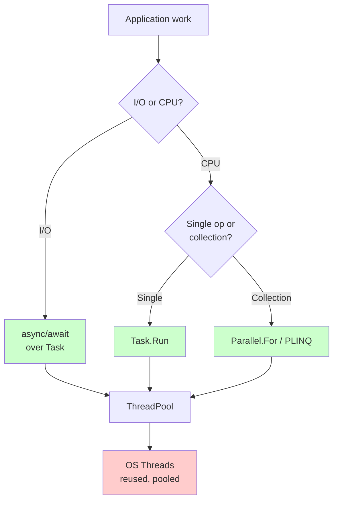

# Threading and Concurrency

> **One-liner**: A **thread** is an OS-level execution unit; a **Task** is a higher-level work item scheduled on the thread pool — modern .NET strongly favors `Task` and `async` over manual thread management.

---

## Quick Reference

| Type | Cost | Use for |
|------|------|---------|
| `Thread` | Heavy (~1 MB stack, OS handle) | Almost never directly — legacy / interop |
| `Thread` (background) | Heavy | Long-lived blocking work that must not prevent app exit |
| `ThreadPool` | Reused threads | Short bursts; managed by `Task` automatically |
| `Task` | Lightweight wrapper | Default for everything async/parallel |
| `Task.Run` | Schedules on pool | CPU-bound work from sync code |
| `Parallel.For/ForEach` | Pool-backed loop | Embarrassingly-parallel data |
| `PLINQ` (`AsParallel`) | Pool-backed query | Parallel LINQ over big data |

| Term | Meaning |
|------|---------|
| **Concurrency** | Many tasks in flight (interleaved) |
| **Parallelism** | Many tasks executing simultaneously |
| **Race condition** | Outcome depends on thread interleaving |
| **Deadlock** | Two threads each waiting for the other |
| **Livelock** | Threads active but making no progress |
| **Thread-safe** | Correct under concurrent access |

---

## Core Concept

A **thread** is the OS unit of scheduling — created by the OS, costly (a couple MB of stack, a kernel handle). The **thread pool** maintains a small set of reusable worker threads to avoid that cost.

A **`Task`** is a .NET-level abstraction over "some work to be done". The default scheduler runs Tasks on the thread pool. `await` releases the current thread and resumes the Task on a thread pool thread when the awaitable completes — see [[06 - Async and Await]].

**Race conditions** happen when two threads read+modify shared state without synchronization. The fix is either (a) avoid sharing (immutable data, message passing), or (b) synchronize (locks, atomic ops — see [[08 - Synchronization Primitives]]).

I/O-bound? Use **async**. CPU-bound? Use **Task.Run / Parallel.For / PLINQ**. Don't create raw `Thread` objects in modern code unless you have a specific reason.

---

## Diagram



---

## Syntax & API

### Raw Thread (legacy — avoid)
```csharp
var t = new Thread(() =>
{
    Console.WriteLine($"On thread {Environment.CurrentManagedThreadId}");
});
t.IsBackground = true;     // doesn't prevent app exit
t.Start();
t.Join();                  // wait for it
```

### Task — preferred
```csharp
// Fire-and-forget on pool
Task.Run(() => DoCpuWork());

// Schedule + await result
var task = Task.Run(() => ComputeHash(data));
byte[] hash = await task;

// CPU-bound multi-return
Task<int>[] tasks = Enumerable.Range(0, 10).Select(i => Task.Run(() => Compute(i))).ToArray();
int[] results = await Task.WhenAll(tasks);
```

### Parallel.For / ForEach
```csharp
// Synchronous parallel loop — blocks until done
Parallel.For(0, 1_000_000, i =>
{
    results[i] = Compute(i);
});

Parallel.ForEach(items, item =>
{
    Process(item);
});

// Async parallel (.NET 6+)
await Parallel.ForEachAsync(urls, async (url, ct) =>
{
    await DownloadAsync(url, ct);
}, new ParallelOptions { MaxDegreeOfParallelism = 8 });
```

### PLINQ
```csharp
var primes = numbers
    .AsParallel()
    .Where(IsPrime)
    .ToList();

// Order matters? Add AsOrdered()
var firstHundredPrimes = numbers
    .AsParallel()
    .AsOrdered()
    .Where(IsPrime)
    .Take(100)
    .ToList();
```

### Race condition (BAD)
```csharp
int counter = 0;

Parallel.For(0, 1000, _ =>
{
    counter++;     // ❌ NOT thread-safe — read, increment, write is 3 ops
});

Console.WriteLine(counter);   // < 1000, varies each run
```

### Fix with Interlocked
```csharp
int counter = 0;

Parallel.For(0, 1000, _ =>
{
    Interlocked.Increment(ref counter);   // ✅ atomic
});
// counter == 1000
```

### CancellationToken in parallel loop
```csharp
using var cts = new CancellationTokenSource(TimeSpan.FromSeconds(2));

try
{
    Parallel.ForEach(items,
        new ParallelOptions { CancellationToken = cts.Token },
        item => Process(item));
}
catch (OperationCanceledException) { /* ... */ }
```

### Thread-local data
```csharp
var threadLocal = new ThreadLocal<int>(() => 0);

Parallel.For(0, 1000, _ =>
{
    threadLocal.Value++;        // each thread has its own counter
});

int total = threadLocal.Values.Sum();
```

---

## Common Patterns

```csharp
// Pattern: batched parallel processing with bounded concurrency
await Parallel.ForEachAsync(urls,
    new ParallelOptions { MaxDegreeOfParallelism = 10 },
    async (url, ct) =>
    {
        var data = await DownloadAsync(url, ct);
        await SaveAsync(data, ct);
    });
```

```csharp
// Pattern: CPU-bound task wrapped for async caller
public Task<long> ChecksumAsync(byte[] data) =>
    Task.Run(() => ComputeChecksum(data));     // uses pool
```

```csharp
// Pattern: avoid sharing — return per-iteration result
var sums = Enumerable.Range(0, files.Length).AsParallel()
    .Select(i => SumFile(files[i]))
    .ToArray();

long total = sums.Sum();    // single-threaded final reduce
```

---

## Gotchas & Tips

- **`Task.Run` from async code is usually wrong** — `async` already releases threads on I/O. Wrapping I/O in `Task.Run` just costs a thread switch.
- **Async methods on the thread pool can starve the pool** if blocked synchronously — never call `.Result` on a Task inside async-running code.
- **`Parallel.ForEach` blocks** the calling thread. From async code use `Parallel.ForEachAsync`.
- **CPU count limits speedup** — `MaxDegreeOfParallelism` defaults to `Environment.ProcessorCount`. Going higher hurts.
- **Random shared state is the enemy** — captured variables, statics, fields are all shared. If you can avoid sharing, do.
- **`Thread.Sleep` blocks the thread** — in async code use `Task.Delay`.
- **`Thread.CurrentThread.ManagedThreadId`** is the .NET ID, not the OS thread ID. Same OS thread can have different .NET IDs over time (rare).
- **Thread starvation**: if all pool threads are blocked synchronously, async work cannot resume. Symptom: requests pile up, latency spikes, no CPU usage.

---

## See Also

- [[06 - Async and Await]]
- [[08 - Synchronization Primitives]]
- [[10 - Parallel and Dataflow]]
- [[09 - Channels and Pipelines]]
- [[06 - Performance Optimization]]
