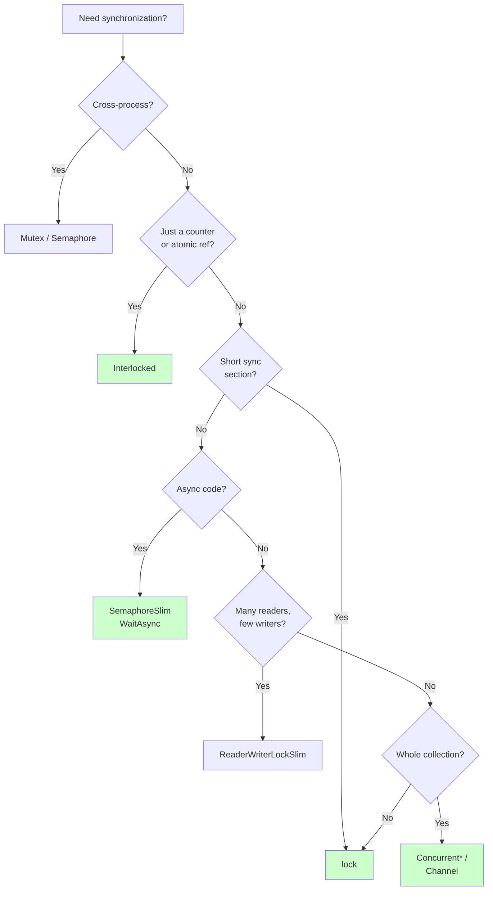

# Synchronization Primitives

> **One-liner**: When threads share state, you need synchronization — pick the **lightest tool** that does the job: `Interlocked` < `lock` < `SemaphoreSlim` < `ReaderWriterLockSlim` < concurrent collections.

---

## Quick Reference

| Primitive | Use for | Cost |
|-----------|---------|------|
| `Interlocked` | Atomic int/long/ref ops (counter, CAS) | very low |
| `lock` (`Monitor`) | Short critical sections, single process | low |
| `Mutex` | Cross-process exclusion | high (kernel) |
| `SemaphoreSlim` | Bounded concurrency, **async-friendly** | low–medium |
| `Semaphore` | Cross-process bounded concurrency | high |
| `ReaderWriterLockSlim` | Many readers, few writers | medium |
| `ManualResetEventSlim` | Signal one-or-many waiters | low |
| `AutoResetEvent` | Signal one waiter, auto-reset | medium |
| `CountdownEvent` | Wait until N signals | medium |
| `Barrier` | Phase-synchronize multiple workers | medium |
| `ConcurrentDictionary<K,V>` | Thread-safe dictionary | low |
| `ConcurrentQueue<T>` | Thread-safe FIFO | low |
| `ConcurrentBag<T>` | Thread-safe unordered, per-thread optimized | low |
| `ConcurrentStack<T>` | Thread-safe LIFO | low |
| `Channel<T>` | Async producer/consumer (preferred over Bag/Queue for new code) | low |

---

## Core Concept

The cheapest synchronization is **none**: prefer immutable data, message passing (channels), or per-thread state. When sharing is unavoidable, escalate gradually:

1. Single counter or reference? **`Interlocked`**
2. Short critical section, sync code? **`lock`**
3. Need to throttle async work? **`SemaphoreSlim`**
4. Reads vastly outnumber writes? **`ReaderWriterLockSlim`**
5. Whole collection? **`Concurrent*`** types

**Never** `lock` inside async — `lock` doesn't release on `await`, blocking other threads. Use `SemaphoreSlim.WaitAsync()` instead.

**Avoid `Mutex`** unless you need cross-process — it's much slower than `lock` because it's kernel-mode.

---

## Diagram



---

## Syntax & API

### Interlocked
```csharp
int counter = 0;
Parallel.For(0, 1000, _ => Interlocked.Increment(ref counter));

// Compare-and-swap (CAS) — lock-free state update
int original;
int updated;
do
{
    original = state;
    updated = original + 1;
} while (Interlocked.CompareExchange(ref state, updated, original) != original);

// Atomic add returns new value
long total = Interlocked.Add(ref _bytes, length);

// Atomic exchange of reference
var prev = Interlocked.Exchange(ref _current, newInstance);
```

### lock (Monitor)
```csharp
private readonly object _lock = new();      // dedicated private lock object
private List<int> _items = new();

public void Add(int x)
{
    lock (_lock)
    {
        _items.Add(x);
    }
}

public IReadOnlyList<int> Snapshot()
{
    lock (_lock)
    {
        return _items.ToList();    // copy under lock
    }
}
```

### SemaphoreSlim — async-friendly
```csharp
private readonly SemaphoreSlim _gate = new(initialCount: 5, maxCount: 5);

public async Task<string> CallApiAsync(string url)
{
    await _gate.WaitAsync();
    try
    {
        return await _http.GetStringAsync(url);
    }
    finally
    {
        _gate.Release();
    }
}
// Limits concurrent API calls to 5 — no thread blocking
```

### Mutex (cross-process)
```csharp
using var mutex = new Mutex(initiallyOwned: false, name: "Global\\MyApp_singleton");

if (!mutex.WaitOne(TimeSpan.Zero))
{
    Console.WriteLine("Already running");
    return;
}
try { /* singleton work */ }
finally { mutex.ReleaseMutex(); }
```

### ReaderWriterLockSlim
```csharp
private readonly ReaderWriterLockSlim _rw = new();
private Dictionary<string, int> _cache = new();

public int? Read(string key)
{
    _rw.EnterReadLock();
    try { return _cache.TryGetValue(key, out var v) ? v : null; }
    finally { _rw.ExitReadLock(); }
}

public void Write(string key, int value)
{
    _rw.EnterWriteLock();
    try { _cache[key] = value; }
    finally { _rw.ExitWriteLock(); }
}
```

### ConcurrentDictionary
```csharp
var dict = new ConcurrentDictionary<string, int>();

dict.TryAdd("alice", 30);
dict.AddOrUpdate("alice", 1, (_, old) => old + 1);

int v = dict.GetOrAdd("bob", _ => ExpensiveCompute());

if (dict.TryRemove("alice", out var removed)) { /* ... */ }
```

### Channel (preferred for producer/consumer)
```csharp
var channel = Channel.CreateUnbounded<WorkItem>();

// Producer
_ = Task.Run(async () =>
{
    foreach (var w in items) await channel.Writer.WriteAsync(w);
    channel.Writer.Complete();
});

// Consumer(s)
await foreach (var w in channel.Reader.ReadAllAsync())
    Process(w);
```
*(Full coverage in [[09 - Channels and Pipelines]].)*

---

## Common Patterns

```csharp
// Pattern: lazy thread-safe init
public sealed class Service
{
    private static readonly Lazy<Service> _instance =
        new(() => new Service(), LazyThreadSafetyMode.ExecutionAndPublication);

    public static Service Instance => _instance.Value;
    private Service() { }
}
```

```csharp
// Pattern: throttled parallel HTTP
private readonly SemaphoreSlim _gate = new(10);

public async Task<string[]> FetchManyAsync(string[] urls)
{
    var tasks = urls.Select(async url =>
    {
        await _gate.WaitAsync();
        try { return await _http.GetStringAsync(url); }
        finally { _gate.Release(); }
    });
    return await Task.WhenAll(tasks);
}
```

```csharp
// Pattern: copy-on-write for read-heavy state
private volatile ImmutableDictionary<string, int> _config =
    ImmutableDictionary<string, int>.Empty;

public int Get(string key) => _config[key];   // lock-free read

public void Update(string key, int value)
{
    ImmutableDictionary<string, int> snapshot, updated;
    do
    {
        snapshot = _config;
        updated = snapshot.SetItem(key, value);
    }
    while (Interlocked.CompareExchange(ref _config, updated, snapshot) != snapshot);
}
```

---

## Gotchas & Tips

- **Never `lock` on `this`, on a `Type`, or on a string** — these are public/shared and may collide with other code. Always use a private `object _lock = new();`.
- **`lock` inside `async` is a bug** — locks are tied to the thread, but `await` may resume on a different one. Use `SemaphoreSlim.WaitAsync()`.
- **`SemaphoreSlim` is not reentrant** — same thread can't acquire it twice. Don't call a method that also waits on the same semaphore.
- **`Interlocked` operates only on `int`/`long`/reference** — for richer atomics use `lock` or immutable + CAS.
- **`ConcurrentDictionary.GetOrAdd` may run the factory twice** if two threads race — make the factory idempotent or wrap with `Lazy<T>`.
- **`ConcurrentBag` is optimized for same-thread add+remove** — for cross-thread use prefer `ConcurrentQueue` or `Channel`.
- **`volatile` is rarely what you want** — it gives weaker guarantees than most people expect. Prefer `Interlocked` or `lock`.
- **Dispose `SemaphoreSlim`/`Mutex`/`ReaderWriterLockSlim`** — they hold OS handles or wait counters.

---

## See Also

- [[07 - Threading and Concurrency]]
- [[06 - Async and Await]]
- [[09 - Channels and Pipelines]]
- [[06 - Collections]]
