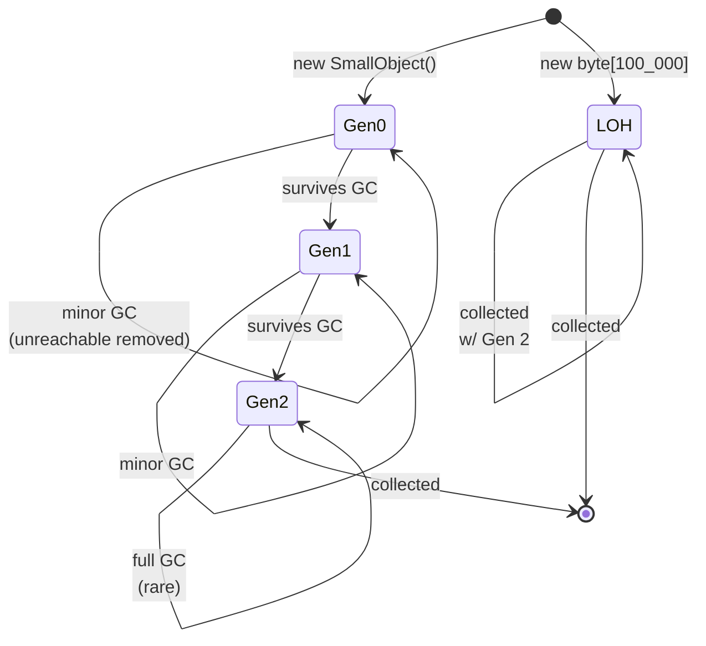

# Memory Management and GC

> **One-liner**: .NET is **garbage-collected** — value types live on the stack (or inline), reference types live on the **managed heap** in generational regions (Gen 0/1/2/LOH/POH); the GC reclaims unreachable objects.

---

## Quick Reference

| Region | Holds | Reclaimed |
|--------|-------|-----------|
| Stack | locals, params, value types | LIFO at scope end |
| Gen 0 (heap) | brand-new objects | every GC |
| Gen 1 (heap) | survived 1 GC | when Gen 1 fills |
| Gen 2 (heap) | survived 2+ GCs (long-lived) | rarely (full GC) |
| LOH (Large Object Heap) | objects ≥ 85 KB | with Gen 2 (compacts only on demand) |
| POH (Pinned Object Heap) | objects pinned for native interop | rare |

| Concept | Meaning |
|---------|---------|
| **Roots** | Statics, locals, CPU registers — anchor reachability |
| **Reachable** | Has a chain of references from a root |
| **Mark phase** | GC walks references from roots |
| **Sweep / compact** | Reclaim unreachable, move survivors |
| **Workstation GC** | Default for desktop/console |
| **Server GC** | Multi-thread, multi-heap (one per CPU) — set via `<ServerGarbageCollection>true</ServerGarbageCollection>` |
| **Background GC** | Gen 2 collected concurrently (default since .NET 4.5) |

---

## Core Concept

Every `new` for a class allocates on the **heap**. Locals and method parameters live on the **stack** (cheap, automatically released). Value types (`struct`, primitives) embed in their containing place — on the stack if local, on the heap if a field of a class.

The GC organizes the heap into **generations**: Gen 0 is small and collected often; survivors get **promoted** to Gen 1, then Gen 2. Most objects die young, so most collections only touch Gen 0 — that's why GC is fast.

**Large objects (≥ 85 KB)** go to the **LOH**. The LOH is collected only with full Gen 2 GCs and is not compacted by default — it can fragment.

GC is non-deterministic but **reachable objects are never collected**. The fix for memory leaks isn't "freeing memory" — it's **breaking references** so objects become unreachable. See [[07 - Memory Leaks and Profiling]].

---

## Diagram



---

## Syntax & API

### Stack vs heap
```csharp
public class User { public string Name = ""; }   // class → heap

void Demo()
{
    int x = 42;                    // stack
    User u = new() { Name = "A" }; // u (reference) on stack, object on heap
}
// when Demo returns: x and u (the references) are gone
// the User object becomes unreachable → GC will collect it eventually
```

### Forcing a GC (rare, mostly for tests)
```csharp
GC.Collect();                     // collect all generations
GC.WaitForPendingFinalizers();
GC.Collect();                     // again to catch resurrections

// Examine
Console.WriteLine($"Gen 0: {GC.CollectionCount(0)}");
Console.WriteLine($"Gen 1: {GC.CollectionCount(1)}");
Console.WriteLine($"Gen 2: {GC.CollectionCount(2)}");
Console.WriteLine($"Total bytes: {GC.GetTotalMemory(forceFullCollection: false):N0}");
```

### Allocate on stack (avoid heap)
```csharp
// Span-backed stackalloc (no heap allocation)
Span<byte> buffer = stackalloc byte[256];
buffer[0] = 0xFF;
// freed at scope end, no GC pressure
```

### GC notifications / metrics
```csharp
// .NET 5+: subscribe to GC events
GC.RegisterForFullGCNotification(maxGenerationThreshold: 10, largeObjectHeapThreshold: 10);

var info = GC.GetGCMemoryInfo();
Console.WriteLine($"Heap size: {info.HeapSizeBytes:N0}");
Console.WriteLine($"Last GC pause: {info.PauseDurations[0]}");
```

### Server vs Workstation GC
```xml
<!-- in .csproj for server-class apps -->
<PropertyGroup>
  <ServerGarbageCollection>true</ServerGarbageCollection>
  <ConcurrentGarbageCollection>true</ConcurrentGarbageCollection>
</PropertyGroup>
```

### Reference types — pass cost
```csharp
public class BigData { public byte[] Buffer = new byte[10_000]; }

void TakeByValue(BigData d)   { /* d holds a reference — only 8 bytes copied */ }
void TakeByRef(ref BigData d) { /* same — but caller can swap d's reference */ }
```

### Value types — pass cost
```csharp
public struct Point { public double X, Y, Z; }   // 24 bytes

void TakeByValue(Point p)    { /* COPIES 24 bytes */ }
void TakeByIn(in Point p)    { /* readonly reference — no copy */ }
void TakeByRef(ref Point p)  { /* mutable reference — no copy */ }
```

### Pinning (native interop)
```csharp
// fixed pins a managed object so its address is stable
fixed (byte* p = buffer)
{
    NativeMethod(p);
}
// after fixed: GC may move it
```

---

## Common Patterns

```csharp
// Pattern: avoid LOH allocations — pool large arrays
private static readonly ArrayPool<byte> Pool = ArrayPool<byte>.Shared;

byte[] rented = Pool.Rent(100_000);
try { /* use rented */ }
finally { Pool.Return(rented, clearArray: true); }
```

```csharp
// Pattern: prefer struct for small short-lived data
public readonly record struct Point(double X, double Y);   // value type, no GC pressure

var points = new List<Point>(1_000_000);   // contiguous block in List<>'s array
```

```csharp
// Pattern: avoid hidden allocations in hot paths
// Bad: Concat boxes/copies
foreach (var s in items) result += s;

// Good: StringBuilder grows a single buffer
var sb = new StringBuilder();
foreach (var s in items) sb.Append(s);
```

---

## Gotchas & Tips

- **You cannot "free" memory in C#** — only break references and let the GC reclaim. Setting locals to `null` rarely helps; they're already collectible at scope end.
- **`GC.Collect()` is almost always wrong** — the GC heuristics know better than you.
- **Long-lived objects are expensive** — they get to Gen 2 and stay; full GCs become more frequent. Watch for caches that never expire.
- **Boxing** turns a value type into a heap object — happens silently when assigning a `struct` to `object` or non-generic collection. Generic collections (`List<int>`) avoid this.
- **Strings are heap objects** — concatenation in a loop creates many garbage strings. Use `StringBuilder`.
- **Closures capture by reference** — long-lived event handler that captures `this` keeps `this` alive forever (classic leak — see [[07 - Memory Leaks and Profiling]]).
- **Server GC trades RAM for throughput** — uses one heap per CPU, reducing pause times under load. Default for ASP.NET Core; opt-in for console apps.
- **Don't write finalizers** unless you wrap a native handle — they make objects survive an extra GC cycle and run on a single thread. See [[10 - IDisposable and Resource Mgmt]].

---

## See Also

- [[10 - IDisposable and Resource Mgmt]]
- [[07 - Memory Leaks and Profiling]]
- [[08 - Span and Memory Types]]
- [[06 - Performance Optimization]]
