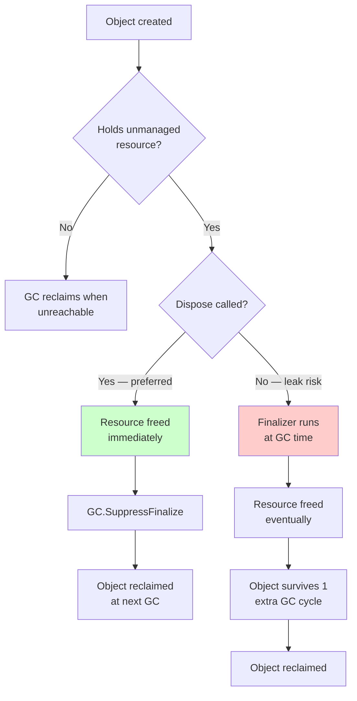

# IDisposable and Resource Mgmt

> **One-liner**: GC handles **memory** but not **unmanaged resources** (file handles, sockets, DB connections, native pointers) — `IDisposable` + `using` is the deterministic-cleanup contract; `IAsyncDisposable` is its async sibling.

---

## Quick Reference

| Construct | Purpose |
|-----------|---------|
| `IDisposable.Dispose()` | Sync cleanup, idempotent |
| `IAsyncDisposable.DisposeAsync()` | Async cleanup |
| `using (var x = ...) { }` | Statement scope dispose |
| `using var x = ...;` | Declaration scope dispose (C# 8+) |
| `await using var x = ...;` | Async dispose (C# 8+) |
| `~ClassName()` | Finalizer (last-resort backup, GC-driven) |
| `GC.SuppressFinalize(this)` | Skip finalizer when `Dispose` ran |

---

## Core Concept

The GC eventually reclaims unreachable objects, but it doesn't know **when** unmanaged resources should be released. A `FileStream` holds an OS file handle that other processes can't use until released. Waiting for GC to notice could be milliseconds or seconds — too late.

`IDisposable` is the contract: "I hold something that must be released; call `Dispose()` and I'll release it now." The `using` statement guarantees this happens, even on exceptions.

A **finalizer** (`~ClassName()`) is a backup the GC calls before reclaiming an object whose `Dispose` was never called. Finalizers are expensive and unreliable — they exist only to wrap unmanaged handles. Modern code uses `SafeHandle` derivatives, which have built-in finalizers, so your own classes almost never need a finalizer.

The **dispose pattern** (with the protected `Dispose(bool disposing)` overload) exists for classes that hold both managed and unmanaged resources AND can be inherited. For most classes — sealed, holding only managed `IDisposable` fields — a one-line `Dispose` is fine.

---

## Diagram



---

## Syntax & API

### Consuming IDisposable
```csharp
// Statement form — explicit scope
using (var stream = File.OpenRead("a.txt"))
{
    // ... use stream
}   // Dispose() called here, even on exception

// Declaration form — disposes at enclosing scope end (C# 8+)
public void Process()
{
    using var stream = File.OpenRead("a.txt");
    using var reader = new StreamReader(stream);
    // ... use reader
}   // reader.Dispose() then stream.Dispose() — reverse order

// Async dispose
public async Task ProcessAsync()
{
    await using var conn = new SqlConnection(_cs);
    await conn.OpenAsync();
    // ...
}   // await conn.DisposeAsync()
```

### Implementing IDisposable — simple, sealed
```csharp
public sealed class TempFile : IDisposable
{
    public string Path { get; }
    private bool _disposed;

    public TempFile() { Path = System.IO.Path.GetTempFileName(); }

    public void Dispose()
    {
        if (_disposed) return;
        _disposed = true;
        try { File.Delete(Path); } catch { /* swallow */ }
    }
}
```

### Implementing IAsyncDisposable
```csharp
public sealed class HttpUploader : IAsyncDisposable
{
    private readonly HttpClient _http = new();
    private readonly Stream _uploadStream;
    private bool _disposed;

    public HttpUploader(Stream uploadStream) => _uploadStream = uploadStream;

    public async ValueTask DisposeAsync()
    {
        if (_disposed) return;
        _disposed = true;
        await _uploadStream.DisposeAsync();
        _http.Dispose();         // sync dispose still ok
    }
}
```

### Full dispose pattern (for inheritable types holding native handles)
```csharp
public class NativeWrapper : IDisposable
{
    private IntPtr _handle;
    private bool _disposed;

    public NativeWrapper() { _handle = NativeMethods.Allocate(); }

    public void Dispose()
    {
        Dispose(disposing: true);
        GC.SuppressFinalize(this);    // skip finalizer
    }

    protected virtual void Dispose(bool disposing)
    {
        if (_disposed) return;
        if (disposing)
        {
            // dispose managed IDisposable fields here
        }
        if (_handle != IntPtr.Zero)
        {
            NativeMethods.Free(_handle);
            _handle = IntPtr.Zero;
        }
        _disposed = true;
    }

    ~NativeWrapper() => Dispose(disposing: false);   // finalizer backup
}
```

### Better: use SafeHandle (no finalizer needed)
```csharp
public sealed class FileHandle : SafeHandleZeroOrMinusOneIsInvalid
{
    public FileHandle() : base(ownsHandle: true) { }

    protected override bool ReleaseHandle()
    {
        return NativeMethods.CloseHandle(handle);
    }
}

public sealed class FileWrapper : IDisposable
{
    private readonly FileHandle _h = NativeMethods.OpenFile(...);
    public void Dispose() => _h.Dispose();
}
```

---

## Common Patterns

```csharp
// Pattern: dispose multiple resources in reverse order
public void Demo()
{
    using var a = new ResourceA();
    using var b = new ResourceB();
    using var c = new ResourceC();
    // Disposed order: c, then b, then a
}
```

```csharp
// Pattern: optional resource — store null-conditional
private IDisposable? _subscription;

public void Subscribe(Source s) => _subscription = s.Subscribe(this);

public void Dispose()
{
    _subscription?.Dispose();
    _subscription = null;
}
```

```csharp
// Pattern: wrap unsafe try/finally as a using
public readonly struct Scope : IDisposable
{
    private readonly Action _onExit;
    public Scope(Action enter, Action exit) { enter(); _onExit = exit; }
    public void Dispose() => _onExit();
}

using var _ = new Scope(() => Logger.Info("enter"), () => Logger.Info("exit"));
```

---

## Gotchas & Tips

- **Forgetting `using` on a `FileStream` / `HttpResponseMessage` / DB connection** is the most common production leak. Static analyzers (CA2000) catch most cases.
- **Implement `IAsyncDisposable` AND `IDisposable`** if you have async cleanup but want to support both `using` and `await using`. Or implement only `IAsyncDisposable` and require `await using`.
- **Don't `Dispose()` then use** — `IDisposable` types should throw `ObjectDisposedException` after disposal.
- **Idempotency** — `Dispose()` must be safe to call multiple times. Guard with a `_disposed` flag.
- **Finalizers run on a single thread** — slow ones cause backlogs. Avoid finalizers entirely if you can.
- **`using` on a `null` is fine** — it just skips the dispose. No NRE.
- **DI container manages disposal** — services registered as scoped/transient with the container are disposed when the scope ends. Don't dispose them yourself.
- **`HttpClient`** is the famous exception — disposing it eagerly causes socket exhaustion. Use `IHttpClientFactory` (see [[14 - ASP.NET Core Basics]]).

---

## See Also

- [[09 - Memory Management and GC]]
- [[07 - Memory Leaks and Profiling]]
- [[08 - Exception Handling]]
- [[09 - File IO]]
