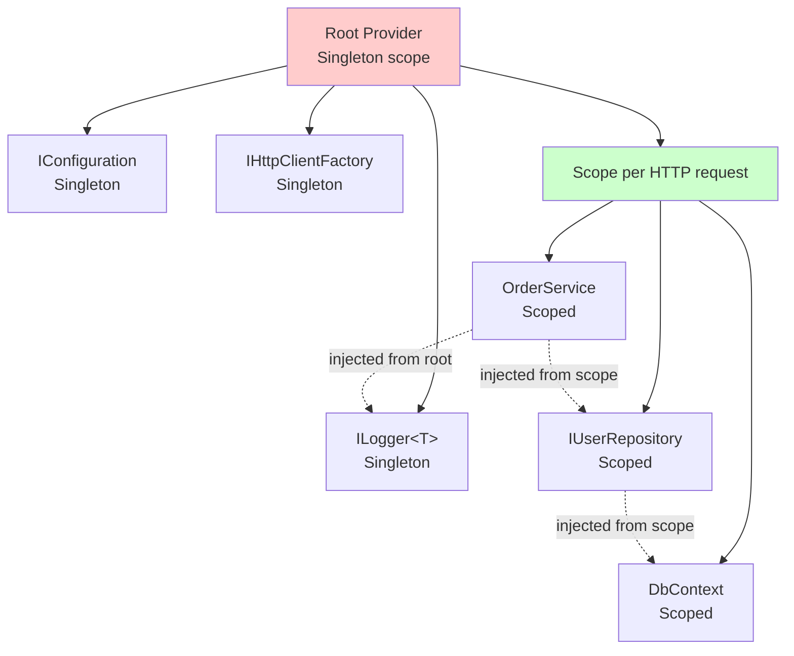

# Dependency Injection

> **One-liner**: .NET ships a built-in DI container (`IServiceCollection` → `IServiceProvider`) — register services with a **lifetime**, then constructor-inject them; the container resolves graphs automatically.

---

## Quick Reference

| Lifetime | Created | Disposed | Use for |
|----------|---------|----------|---------|
| **Singleton** | once per app | at app shutdown | stateless services, caches, `IHttpClientFactory` |
| **Scoped** | once per scope (request) | at scope end | DbContext, per-request state |
| **Transient** | every resolution | at scope end (if `IDisposable`) | lightweight stateless |

| Method | Purpose |
|--------|---------|
| `services.AddSingleton<IFoo, Foo>()` | Register interface → impl |
| `services.AddScoped<IFoo, Foo>()` | Per-scope |
| `services.AddTransient<IFoo, Foo>()` | New each time |
| `services.AddSingleton<IFoo>(sp => new Foo(...))` | Factory |
| `services.AddSingleton<Foo>()` | Self-bind concrete |
| `services.AddSingleton(instance)` | Use a specific instance |
| `services.AddKeyedSingleton<IFoo, Foo>("key")` | Keyed (.NET 8+) |
| `services.TryAddSingleton<...>()` | Add only if missing |
| `services.AddHttpClient<MyClient>()` | Typed HttpClient |
| `services.AddOptions<T>()` | Bind config to options |

---

## Core Concept

**Dependency Injection** = your class declares what it needs (constructor params) instead of `new`-ing things itself. The DI container builds the object graph.

A **lifetime** controls *when* an instance is reused:
- **Singleton** — one instance for the entire process. Must be thread-safe.
- **Scoped** — one per "scope". In ASP.NET Core, a scope is an HTTP request. Most app services are scoped.
- **Transient** — fresh instance every time someone asks. Cheap to create, no shared state.

The container resolves recursively: ask for `OrderService`, container sees its constructor needs `IRepo` and `ILogger`, builds those (and their dependencies), passes them in.

---

## Diagram



---

## Syntax & API

### Registration (in Program.cs)
```csharp
var builder = WebApplication.CreateBuilder(args);

// Self-bound (no interface)
builder.Services.AddSingleton<EmailService>();

// Interface → implementation
builder.Services.AddScoped<IUserRepository, UserRepository>();

// Multiple implementations of the same interface
builder.Services.AddTransient<INotifier, EmailNotifier>();
builder.Services.AddTransient<INotifier, SmsNotifier>();
// inject as IEnumerable<INotifier>

// Factory
builder.Services.AddSingleton<IClock>(sp => new SystemClock(TimeZoneInfo.Utc));

// Specific instance
builder.Services.AddSingleton(new AppMetadata { Version = "1.2.3" });

// Conditional / replace
builder.Services.TryAddSingleton<ICache, MemoryCache>();   // only if no ICache yet
builder.Services.Replace(ServiceDescriptor.Singleton<ICache, RedisCache>());
```

### Constructor injection
```csharp
public class OrderService
{
    private readonly IUserRepository _users;
    private readonly ILogger<OrderService> _log;

    public OrderService(IUserRepository users, ILogger<OrderService> log)
    {
        _users = users;
        _log = log;
    }

    public async Task PlaceAsync(int userId, OrderDto order)
    {
        var user = await _users.GetByIdAsync(userId);
        _log.LogInformation("Placing order for {User}", user?.Email);
    }
}
```

### Keyed services (.NET 8+)
```csharp
builder.Services.AddKeyedSingleton<INotifier, EmailNotifier>("email");
builder.Services.AddKeyedSingleton<INotifier, SmsNotifier>("sms");

public class AlertService
{
    public AlertService([FromKeyedServices("sms")] INotifier sms,
                         [FromKeyedServices("email")] INotifier email)
    { /* ... */ }
}
```

### Manual scope (background work)
```csharp
public class WorkerService(IServiceProvider sp) : BackgroundService
{
    protected override async Task ExecuteAsync(CancellationToken ct)
    {
        while (!ct.IsCancellationRequested)
        {
            using var scope = sp.CreateScope();
            var repo = scope.ServiceProvider.GetRequiredService<IUserRepository>();
            await repo.SyncAsync(ct);
            await Task.Delay(TimeSpan.FromMinutes(1), ct);
        }
    }
}
```

### Options pattern
```csharp
// appsettings.json: { "Smtp": { "Host": "...", "Port": 587 } }

public class SmtpOptions
{
    public string Host { get; set; } = "";
    public int Port { get; set; }
}

builder.Services.Configure<SmtpOptions>(builder.Configuration.GetSection("Smtp"));

public class Mailer
{
    private readonly SmtpOptions _opts;
    public Mailer(IOptions<SmtpOptions> opts) => _opts = opts.Value;
}
```

### Typed HttpClient
```csharp
builder.Services.AddHttpClient<GitHubClient>(c =>
{
    c.BaseAddress = new Uri("https://api.github.com");
    c.DefaultRequestHeaders.Add("User-Agent", "myapp");
});

public class GitHubClient(HttpClient http)
{
    public Task<string> GetUserAsync(string login) => http.GetStringAsync($"/users/{login}");
}
```

---

## Common Patterns

```csharp
// Pattern: factory by name (without keyed services)
public interface INotifierFactory
{
    INotifier Create(string channel);
}

public class NotifierFactory(IServiceProvider sp) : INotifierFactory
{
    public INotifier Create(string channel) => channel switch
    {
        "email" => sp.GetRequiredService<EmailNotifier>(),
        "sms"   => sp.GetRequiredService<SmsNotifier>(),
        _ => throw new ArgumentException(channel)
    };
}
```

```csharp
// Pattern: decorator via Scrutor (popular DI extension)
services.AddScoped<IRepo, UserRepository>();
services.Decorate<IRepo, CachingRepo>();        // wraps the inner
services.Decorate<IRepo, LoggingRepo>();        // wraps the cache
// Resolved order: Logging -> Caching -> User
```

```csharp
// Pattern: validate options on startup
builder.Services.AddOptions<SmtpOptions>()
    .Bind(builder.Configuration.GetSection("Smtp"))
    .ValidateDataAnnotations()
    .ValidateOnStart();
```

---

## Gotchas & Tips

- **Captive dependencies**: a singleton injecting a scoped service captures it forever. The container detects and throws on `BuildServiceProvider(validateScopes: true)` (the default in dev).
- **DbContext is scoped** — never inject into a singleton.
- **`IHttpClientFactory` solves HttpClient lifetime issues** — disposing `HttpClient` per use exhausts sockets; the factory pools handlers.
- **Singletons must be thread-safe** — they're shared across all requests.
- **`IEnumerable<T>` injection** gives all registered impls — order is registration order. Use it for plug-in patterns.
- **Don't use the service locator pattern** — `sp.GetService<T>()` outside of a factory hides dependencies. Inject what you need.
- **Constructor too big?** That's a code smell, not a DI problem. Split the class.
- **`AddHostedService<T>`** is singleton by lifetime but not via `AddSingleton` — use `AddHostedService` so the host runs it.
- **Validate options at startup** with `.ValidateOnStart()` to fail fast on bad config.

---

## See Also

- [[14 - ASP.NET Core Basics]]
- [[17 - Configuration]]
- [[12 - Background Services]]
- [[02 - Clean Architecture]]
