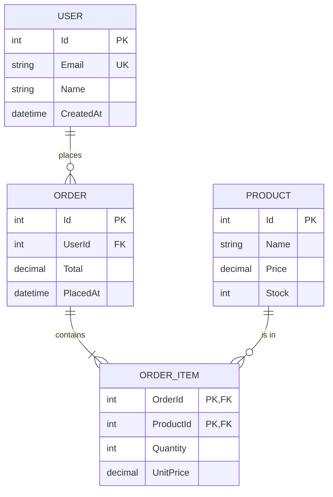

# Entity Framework Core

> **One-liner**: EF Core is .NET's official ORM — model your domain as classes, define a `DbContext`, query with LINQ; EF translates LINQ to SQL, tracks changes, and generates migrations.

---

## Quick Reference

| Concept | API |
|---------|-----|
| `DbContext` | unit of work, query gateway |
| `DbSet<T>` | table |
| `[Key]`, `[Required]`, `[MaxLength]` | data annotations |
| `OnModelCreating` | fluent config |
| `Add` / `Update` / `Remove` | track changes |
| `SaveChanges` / `SaveChangesAsync` | flush to DB |
| `ToListAsync` / `FirstOrDefaultAsync` / `AnyAsync` | execute query |
| `Include(x => x.Nav)` | eager-load related |
| `ThenInclude(...)` | nested include |
| `AsNoTracking()` | read-only queries (faster) |
| `AsSplitQuery()` | split JOINs into multiple queries |
| `FromSqlInterpolated($"...")` | safe raw SQL |
| `dotnet ef migrations add NAME` | create migration |
| `dotnet ef database update` | apply migrations |

---

## Core Concept

EF Core maps **entities** (POCOs) to **rows**. The `DbContext` is the **unit of work**: it tracks every entity you load (or attach), and on `SaveChanges` writes all changes in a transaction.

LINQ queries on `DbSet<T>` are `IQueryable<T>` — they're **not** executed until you enumerate (`ToListAsync`, `FirstAsync`, `Count`, `foreach`). EF walks the expression tree, builds SQL, runs it, and materializes objects.

**Tracking** is on by default — entities returned from queries are watched for changes. For read-only paths use `AsNoTracking()` to skip the bookkeeping (faster, less memory).

**Migrations** are versioned schema changes. You change a model, run `dotnet ef migrations add Foo`, EF compares to the snapshot and writes a migration class. Apply with `database update`.

---

## Diagram



---

## Syntax & API

### Models + DbContext
```csharp
public class User
{
    public int Id { get; set; }
    public string Email { get; set; } = "";
    public string Name { get; set; } = "";
    public List<Order> Orders { get; set; } = new();
}

public class Order
{
    public int Id { get; set; }
    public int UserId { get; set; }
    public User User { get; set; } = null!;
    public decimal Total { get; set; }
    public List<OrderItem> Items { get; set; } = new();
}

public class ShopContext : DbContext
{
    public ShopContext(DbContextOptions<ShopContext> opts) : base(opts) { }

    public DbSet<User>      Users     => Set<User>();
    public DbSet<Order>     Orders    => Set<Order>();
    public DbSet<OrderItem> OrderItems => Set<OrderItem>();

    protected override void OnModelCreating(ModelBuilder b)
    {
        b.Entity<User>().HasIndex(u => u.Email).IsUnique();
        b.Entity<User>().Property(u => u.Email).HasMaxLength(200).IsRequired();

        b.Entity<OrderItem>().HasKey(oi => new { oi.OrderId, oi.ProductId });
        b.Entity<Order>().Property(o => o.Total).HasPrecision(18, 2);
    }
}
```

### Register in DI
```csharp
builder.Services.AddDbContext<ShopContext>(opts =>
    opts.UseNpgsql(builder.Configuration.GetConnectionString("Default")));
// Use UseSqlServer / UseSqlite / UseInMemoryDatabase as needed
```

### Querying
```csharp
// Read all
var users = await db.Users.ToListAsync();

// Filter + project
var emails = await db.Users
    .Where(u => u.Name.StartsWith("A"))
    .Select(u => u.Email)
    .ToListAsync();

// First or null
var user = await db.Users.FirstOrDefaultAsync(u => u.Id == 42);

// Eager load related
var withOrders = await db.Users
    .Include(u => u.Orders).ThenInclude(o => o.Items)
    .ToListAsync();

// Read-only — faster, no tracking
var readOnly = await db.Users.AsNoTracking().ToListAsync();
```

### Insert / update / delete
```csharp
var u = new User { Email = "a@b.com", Name = "Alice" };
db.Users.Add(u);
await db.SaveChangesAsync();
// u.Id is populated

// Update via tracking
var existing = await db.Users.FirstAsync(x => x.Id == 1);
existing.Name = "Renamed";
await db.SaveChangesAsync();

// Delete
db.Users.Remove(existing);
await db.SaveChangesAsync();

// Bulk (.NET 7+) — translates to single SQL UPDATE/DELETE, no tracking
await db.Users.Where(u => u.IsInactive).ExecuteDeleteAsync();
await db.Users.Where(u => u.IsInactive).ExecuteUpdateAsync(s =>
    s.SetProperty(u => u.IsArchived, true));
```

### Transactions
```csharp
await using var tx = await db.Database.BeginTransactionAsync();
try
{
    db.Users.Add(user);
    db.Orders.Add(order);
    await db.SaveChangesAsync();
    await tx.CommitAsync();
}
catch
{
    await tx.RollbackAsync();
    throw;
}
```

### Raw SQL (parameterized)
```csharp
var users = await db.Users
    .FromSqlInterpolated($"SELECT * FROM users WHERE name = {name}")
    .ToListAsync();

var rows = await db.Database.ExecuteSqlInterpolatedAsync(
    $"UPDATE users SET active = {true} WHERE id = {id}");
```

### Migrations CLI
```bash
dotnet tool install -g dotnet-ef

dotnet ef migrations add InitialCreate
dotnet ef migrations add AddOrders
dotnet ef migrations remove                  # undo last (if not applied)

dotnet ef database update                    # apply pending
dotnet ef database update PreviousMigration  # rollback to a point

dotnet ef migrations script                  # SQL output
```

### Configure relationship explicitly
```csharp
b.Entity<Order>()
 .HasOne(o => o.User)
 .WithMany(u => u.Orders)
 .HasForeignKey(o => o.UserId)
 .OnDelete(DeleteBehavior.Restrict);
```

---

## Common Patterns

```csharp
// Pattern: repository thin layer (optional — DbContext IS a repository)
public class UserRepository(ShopContext db)
{
    public Task<User?> GetByIdAsync(int id) =>
        db.Users.AsNoTracking().FirstOrDefaultAsync(u => u.Id == id);

    public async Task<User> CreateAsync(User u)
    {
        db.Users.Add(u);
        await db.SaveChangesAsync();
        return u;
    }
}
```

```csharp
// Pattern: split query for big graphs (avoids cartesian explosion)
var users = await db.Users
    .Include(u => u.Orders).ThenInclude(o => o.Items)
    .AsSplitQuery()
    .ToListAsync();
```

```csharp
// Pattern: shadow timestamps via interceptor
public class TimestampInterceptor : SaveChangesInterceptor
{
    public override ValueTask<InterceptionResult<int>> SavingChangesAsync(
        DbContextEventData ed, InterceptionResult<int> r, CancellationToken ct = default)
    {
        foreach (var entry in ed.Context!.ChangeTracker.Entries<IAuditable>())
        {
            if (entry.State == EntityState.Added)
                entry.Entity.CreatedAt = DateTime.UtcNow;
            if (entry.State == EntityState.Modified)
                entry.Entity.UpdatedAt = DateTime.UtcNow;
        }
        return base.SavingChangesAsync(ed, r, ct);
    }
}
```

---

## Gotchas & Tips

- **N+1 problem**: iterating users and accessing `user.Orders` triggers a query per user. Eager-load with `Include` or use a projection.
- **`AsNoTracking()` for read-only paths** — saves ~20–40% memory and CPU. Default in some apps via `db.ChangeTracker.QueryTrackingBehavior = NoTracking`.
- **Don't use `Find` if you have an Id query** — `Find` only checks the cache + a single-column lookup. `FirstOrDefaultAsync` lets you Include/project.
- **Lazy loading is off by default** — and that's good. Lazy loading hides N+1 problems behind property accesses.
- **`SaveChanges` is in a transaction** — multiple `Add`/`Update` are atomic.
- **Migrations are checked-in source** — never edit applied migrations; create a new one.
- **Don't share DbContext across threads** — it's not thread-safe. Use `IDbContextFactory<T>` for parallel work.
- **`Include` everything you need before projection** — `Select` can break tracking and cause extra round-trips.
- **Watch the SQL** — `db.Database.LogTo(Console.WriteLine, LogLevel.Information)` in dev. Or use MiniProfiler.
- **Use `DateTimeOffset` over `DateTime`** for timestamps — preserves zone, fewer surprises.

---

## See Also

- [[10 - LINQ Basics]]
- [[05 - LINQ Advanced]]
- [[13 - Dependency Injection]]
- [[02 - Clean Architecture]]
