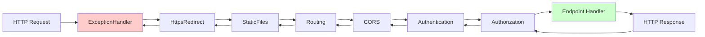

# Middleware

> **One-liner**: Middleware = a chain of components that each see the request, may modify it, may call `next` to pass it on, and may modify the response on the way back — the order you `app.Use(...)` is the order they execute.

---

## Quick Reference

| API | Purpose |
|-----|---------|
| `app.Use(async (ctx, next) => ...)` | Inline middleware |
| `app.Run(async ctx => ...)` | Terminal — never calls `next` |
| `app.Map("/admin", branch => ...)` | Branch by path |
| `app.MapWhen(ctx => ..., branch)` | Branch by predicate |
| `app.UseWhen(...)` | Conditional middleware (rejoins after) |
| `app.UseMiddleware<T>()` | Class-based middleware |

| Built-in | Order |
|----------|-------|
| `UseExceptionHandler` | 1 — catches downstream exceptions |
| `UseHsts` | 2 — HSTS header |
| `UseHttpsRedirection` | 3 |
| `UseStaticFiles` | 4 |
| `UseRouting` | 5 — match endpoint |
| `UseCors` | 6 |
| `UseAuthentication` | 7 |
| `UseAuthorization` | 8 |
| endpoints (`MapXxx`, `MapControllers`) | 9 |

---

## Core Concept

The pipeline is a **stack of nested calls**: each middleware does some work, calls `await next()` (which runs the rest of the pipeline), then runs more code on the way back. So `Use` blocks effectively wrap the rest like try/finally.

This means logging/timing middleware should:
1. Capture start info BEFORE `next()`
2. `await next()` to run the rest
3. Log the result AFTER `next()` returns

Order is critical: `UseAuthentication` must come before `UseAuthorization` (you can't authorize what you haven't authenticated). `UseExceptionHandler` should come **first** so it can catch failures from any later middleware.

---

## Diagram



---

## Syntax & API

### Inline middleware
```csharp
app.Use(async (ctx, next) =>
{
    // before
    var sw = Stopwatch.StartNew();

    await next();   // run the rest of the pipeline

    // after
    sw.Stop();
    ctx.Response.Headers["X-Elapsed-Ms"] = sw.ElapsedMilliseconds.ToString();
});
```

### Class-based middleware
```csharp
public class TimingMiddleware
{
    private readonly RequestDelegate _next;
    private readonly ILogger<TimingMiddleware> _log;

    public TimingMiddleware(RequestDelegate next, ILogger<TimingMiddleware> log)
    {
        _next = next;
        _log = log;
    }

    public async Task InvokeAsync(HttpContext ctx)
    {
        var sw = Stopwatch.StartNew();
        try
        {
            await _next(ctx);
        }
        finally
        {
            sw.Stop();
            _log.LogInformation("{Method} {Path} → {Status} in {Ms} ms",
                ctx.Request.Method, ctx.Request.Path, ctx.Response.StatusCode, sw.ElapsedMilliseconds);
        }
    }
}

app.UseMiddleware<TimingMiddleware>();
```

### Factory-style middleware (DI per request)
```csharp
public class TenantMiddleware : IMiddleware
{
    private readonly ITenantResolver _resolver;
    public TenantMiddleware(ITenantResolver r) => _resolver = r;

    public async Task InvokeAsync(HttpContext ctx, RequestDelegate next)
    {
        var tenant = _resolver.Resolve(ctx);
        ctx.Items["Tenant"] = tenant;
        await next(ctx);
    }
}

builder.Services.AddTransient<TenantMiddleware>();   // factory needs registration
app.UseMiddleware<TenantMiddleware>();
```

### Branching
```csharp
// Map: path-based branch (path prefix is stripped)
app.Map("/admin", admin =>
{
    admin.UseAuthentication();
    admin.UseAuthorization();
    admin.Run(async ctx => await ctx.Response.WriteAsync("admin"));
});

// MapWhen: predicate-based branch
app.MapWhen(ctx => ctx.Request.Headers.ContainsKey("X-Internal"), internalApp =>
{
    internalApp.Run(async ctx => await ctx.Response.WriteAsync("internal"));
});

// UseWhen: rejoin pipeline after
app.UseWhen(ctx => ctx.Request.Path.StartsWithSegments("/api"),
    apiBranch => apiBranch.UseRequestTimeouts());
```

### Short-circuit
```csharp
app.Use(async (ctx, next) =>
{
    if (ctx.Request.Headers["X-Maintenance"] == "1")
    {
        ctx.Response.StatusCode = 503;
        await ctx.Response.WriteAsync("Down for maintenance");
        return;     // do NOT call next — short-circuit
    }
    await next();
});
```

### Exception handling
```csharp
app.UseExceptionHandler(eh => eh.Run(async ctx =>
{
    var feat = ctx.Features.Get<IExceptionHandlerPathFeature>();
    var ex = feat?.Error;
    ctx.Response.StatusCode = StatusCodes.Status500InternalServerError;
    await ctx.Response.WriteAsJsonAsync(new
    {
        title = "Server error",
        detail = app.Environment.IsDevelopment() ? ex?.ToString() : null
    });
}));
```

### Endpoint filters (per-endpoint, minimal API only)
```csharp
app.MapPost("/orders", CreateOrder)
   .AddEndpointFilter(async (ctx, next) =>
   {
       var sw = Stopwatch.StartNew();
       var result = await next(ctx);
       sw.Stop();
       Console.WriteLine($"order took {sw.ElapsedMilliseconds}ms");
       return result;
   });
```

---

## Common Patterns

```csharp
// Pattern: request/response logging with body capture (DEV ONLY — perf)
app.Use(async (ctx, next) =>
{
    ctx.Request.EnableBuffering();
    using var reader = new StreamReader(ctx.Request.Body, leaveOpen: true);
    var body = await reader.ReadToEndAsync();
    ctx.Request.Body.Position = 0;
    Logger.Info("REQ {Method} {Path} {Body}", ctx.Request.Method, ctx.Request.Path, body);
    await next();
});
```

```csharp
// Pattern: correlation ID
app.Use(async (ctx, next) =>
{
    var id = ctx.Request.Headers["X-Correlation-Id"].FirstOrDefault()
          ?? Guid.NewGuid().ToString("N");
    ctx.Response.Headers["X-Correlation-Id"] = id;
    using (Logger.BeginScope(new Dictionary<string, object> { ["CorrelationId"] = id }))
    {
        await next();
    }
});
```

```csharp
// Pattern: API key gating
app.Use(async (ctx, next) =>
{
    if (!ctx.Request.Path.StartsWithSegments("/api"))
    {
        await next(); return;
    }
    if (ctx.Request.Headers["X-Api-Key"] != ExpectedKey)
    {
        ctx.Response.StatusCode = 401;
        return;
    }
    await next();
});
```

---

## Gotchas & Tips

- **Order is everything** — `UseRouting` must precede `UseAuthorization` (so route metadata is available); endpoints must be last.
- **`Run` is terminal** — it doesn't take `next`. Misusing `Run` instead of `Use` cuts off the rest of the pipeline silently.
- **Don't read the request body twice** — by default streams are forward-only. Call `Request.EnableBuffering()` first if you need to.
- **Don't write response after another middleware did** — once headers are sent, you can't change status. Add `OnStarting` callbacks to defer.
- **Class-based middleware is singleton** unless registered with `IMiddleware`. Don't inject scoped services into the constructor — inject them into `InvokeAsync` instead.
- **Endpoint filters are cheaper than middleware** for per-endpoint cross-cutting (validation, logging) in minimal APIs.
- **`UseStaticFiles` short-circuits** for matched files — put it before authentication if you don't want auth on assets.
- **Exceptions are caught only by middleware before** the throwing one. `UseExceptionHandler` must be the outermost.

---

## See Also

- [[14 - ASP.NET Core Basics]]
- [[15 - REST API]]
- [[05 - Security and Auth]]
- [[18 - Logging]]
