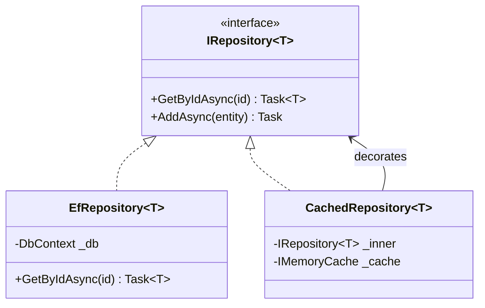

# Design Patterns

> **One-liner**: Reusable solutions to recurring design problems — in .NET the most-used are **Repository**, **Mediator (MediatR)**, **CQRS**, **Factory**, **Decorator**, **Strategy**, and **Options**.

---

## Quick Reference

| Pattern | Solves | Idiomatic .NET vehicle |
|---------|--------|-------------------------|
| Repository | Decouple business logic from persistence | Interface + EF Core implementation |
| Unit of Work | Atomic multi-repo write | `DbContext` itself |
| Mediator | Decouple sender from handlers | `MediatR`, `IRequest<T>` |
| CQRS | Separate read & write models | Query/Command handlers via MediatR |
| Factory | Hide construction complexity | `IServiceProvider`, factory delegates |
| Decorator | Add behavior without subclassing | DI registration `Decorate<T>()` (Scrutor) |
| Strategy | Pick algorithm at runtime | Interface + keyed DI services (.NET 8+) |
| Options | Strongly-typed config | `IOptions<T>`, `IOptionsMonitor<T>` |
| Specification | Composable query criteria | `Expression<Func<T,bool>>` |
| Pipeline / Chain | Sequential request processing | ASP.NET middleware, MediatR behaviors |
| Observer | Pub-sub | `IObservable<T>`, `event`, channels |
| Result | Avoid exceptions for expected failures | `OneOf<TSuccess, TError>`, `Result<T>` |

---

## Core Concept

Design patterns are *named conventions*, not libraries. They give you and your team a vocabulary so "wrap that in a Decorator" is instantly understood. .NET's framework features already implement most patterns — DI is a Service Locator + Factory, ASP.NET middleware is Chain of Responsibility, `IObservable<T>` is Observer.

The patterns that matter most in modern .NET are the ones that **cooperate with DI**: Repository, Mediator, Strategy, Decorator. They all rely on registering interfaces with the container so behavior can be swapped or composed without touching call sites.

Avoid pattern fetishism — a Repository wrapping `DbContext` for trivial CRUD is pure ceremony. Use a pattern when it *removes* a problem (testability, swapping implementations, isolation), not because the textbook says so.

---

## Diagram



---

## Syntax & API

### Repository + Unit of Work
```csharp
public interface IUserRepository
{
    Task<User?> GetByIdAsync(int id, CancellationToken ct = default);
    Task AddAsync(User user, CancellationToken ct = default);
}

public sealed class EfUserRepository(ShopContext db) : IUserRepository
{
    public Task<User?> GetByIdAsync(int id, CancellationToken ct) =>
        db.Users.FirstOrDefaultAsync(u => u.Id == id, ct);

    public async Task AddAsync(User user, CancellationToken ct) =>
        await db.Users.AddAsync(user, ct);
}

// DbContext IS the Unit of Work — call SaveChangesAsync once at end of request.
```

### Mediator (MediatR)
```csharp
// Command
public record PlaceOrder(int UserId, decimal Total) : IRequest<int>;

public sealed class PlaceOrderHandler(ShopContext db) : IRequestHandler<PlaceOrder, int>
{
    public async Task<int> Handle(PlaceOrder cmd, CancellationToken ct)
    {
        var order = new Order { UserId = cmd.UserId, Total = cmd.Total };
        db.Orders.Add(order);
        await db.SaveChangesAsync(ct);
        return order.Id;
    }
}

// Caller
public class OrdersController(IMediator mediator) : ControllerBase
{
    [HttpPost]
    public Task<int> Place(PlaceOrder cmd) => mediator.Send(cmd);
}
```

### Pipeline behavior (cross-cutting via Mediator)
```csharp
public sealed class LoggingBehavior<TReq, TResp>(ILogger<LoggingBehavior<TReq, TResp>> log)
    : IPipelineBehavior<TReq, TResp> where TReq : notnull
{
    public async Task<TResp> Handle(TReq req, RequestHandlerDelegate<TResp> next, CancellationToken ct)
    {
        log.LogInformation("Handling {Req}", typeof(TReq).Name);
        var sw = Stopwatch.StartNew();
        var result = await next();
        log.LogInformation("Handled {Req} in {Ms} ms", typeof(TReq).Name, sw.ElapsedMilliseconds);
        return result;
    }
}
```

### Decorator with Scrutor
```csharp
services.AddScoped<IUserRepository, EfUserRepository>();
services.Decorate<IUserRepository, CachedUserRepository>();   // wraps the previous registration

public sealed class CachedUserRepository(IUserRepository inner, IMemoryCache cache) : IUserRepository
{
    public Task<User?> GetByIdAsync(int id, CancellationToken ct) =>
        cache.GetOrCreateAsync($"user:{id}", e =>
        {
            e.AbsoluteExpirationRelativeToNow = TimeSpan.FromMinutes(5);
            return inner.GetByIdAsync(id, ct);
        });

    public Task AddAsync(User user, CancellationToken ct) => inner.AddAsync(user, ct);
}
```

### Strategy via keyed services (.NET 8+)
```csharp
public interface IPriceCalculator { decimal Price(Order o); }

public sealed class StandardPricing  : IPriceCalculator { public decimal Price(Order o) => o.Total; }
public sealed class PremiumPricing   : IPriceCalculator { public decimal Price(Order o) => o.Total * 0.9m; }

services.AddKeyedScoped<IPriceCalculator, StandardPricing>("standard");
services.AddKeyedScoped<IPriceCalculator, PremiumPricing>("premium");

public class CheckoutService([FromKeyedServices("premium")] IPriceCalculator calc) { /* ... */ }
```

### Factory delegate
```csharp
services.AddTransient<Func<string, IPriceCalculator>>(sp => key => sp.GetRequiredKeyedService<IPriceCalculator>(key));
```

### Specification
```csharp
public sealed record ActiveUsersOlderThan(int Age) : Specification<User>
{
    public override Expression<Func<User, bool>> ToExpression() =>
        u => u.IsActive && u.Age > Age;
}

var users = await db.Users.Where(new ActiveUsersOlderThan(18).ToExpression()).ToListAsync();
```

### Result type (avoid exceptions for expected failures)
```csharp
public abstract record Result<T>
{
    public sealed record Ok(T Value) : Result<T>;
    public sealed record Err(string Message) : Result<T>;
}

public Result<User> Find(int id) =>
    _repo.Find(id) is { } u ? new Result<User>.Ok(u) : new Result<User>.Err("Not found");
```

---

## Common Patterns

```csharp
// Pattern: CQRS — separate read and write
public record GetUserById(int Id) : IRequest<UserDto>;

public sealed class GetUserByIdHandler(ShopContext db) : IRequestHandler<GetUserById, UserDto>
{
    public Task<UserDto> Handle(GetUserById q, CancellationToken ct) =>
        db.Users
          .AsNoTracking()
          .Where(u => u.Id == q.Id)
          .Select(u => new UserDto(u.Id, u.Name, u.Email))
          .FirstAsync(ct);
}
```

```csharp
// Pattern: Options — strongly-typed config
public sealed class JwtOptions
{
    public const string Section = "Jwt";
    public required string Issuer { get; init; }
    public required string SigningKey { get; init; }
}

builder.Services.AddOptions<JwtOptions>()
    .Bind(builder.Configuration.GetSection(JwtOptions.Section))
    .ValidateDataAnnotations()
    .ValidateOnStart();

public sealed class TokenService(IOptions<JwtOptions> opts) { /* opts.Value.Issuer */ }
```

```csharp
// Pattern: Chain of Responsibility — middleware
app.Use(async (ctx, next) =>
{
    if (ctx.Request.Headers["X-API-Key"] != "secret") { ctx.Response.StatusCode = 401; return; }
    await next();
});
```

---

## Gotchas & Tips

- **Don't repository-wrap EF Core blindly** — `DbContext` already implements UoW + Repository. Wrap only if you need a swap target (e.g. Dapper for hot paths) or testability beyond `EF.InMemory`.
- **MediatR is overkill for small apps** — for 5 endpoints, a service class is simpler. Reach for it when you want pipeline behaviors (logging, validation, transactions) for free across all handlers.
- **Decorator vs middleware** — middleware works in HTTP only; decorator works for any DI'd service. Use decorator for caching, retries, telemetry on internal services.
- **Singleton pattern is rarely correct in .NET** — DI gives you singletons via `AddSingleton` and they're testable. The static `Instance` form fights the container.
- **Service Locator anti-pattern**: don't pass `IServiceProvider` into business code. Inject the specific dependency. The container is for the composition root only.
- **Specification + EF**: only `Expression<Func<T,bool>>` translates to SQL. A `Func<T,bool>` runs in memory after fetching everything.
- **Result types vs exceptions**: use exceptions for *exceptional* (program bugs, infrastructure failures), Result for *expected* outcomes (validation, not-found). Mixing both is fine.
- **Pipelines compose** — Logging → Validation → Transaction → Handler is a clean chain that beats inheritance.

---

## See Also

- [[02 - Clean Architecture]]
- [[03 - Domain-Driven Design]]
- [[13 - Dependency Injection]]
- [[19 - Middleware]]
