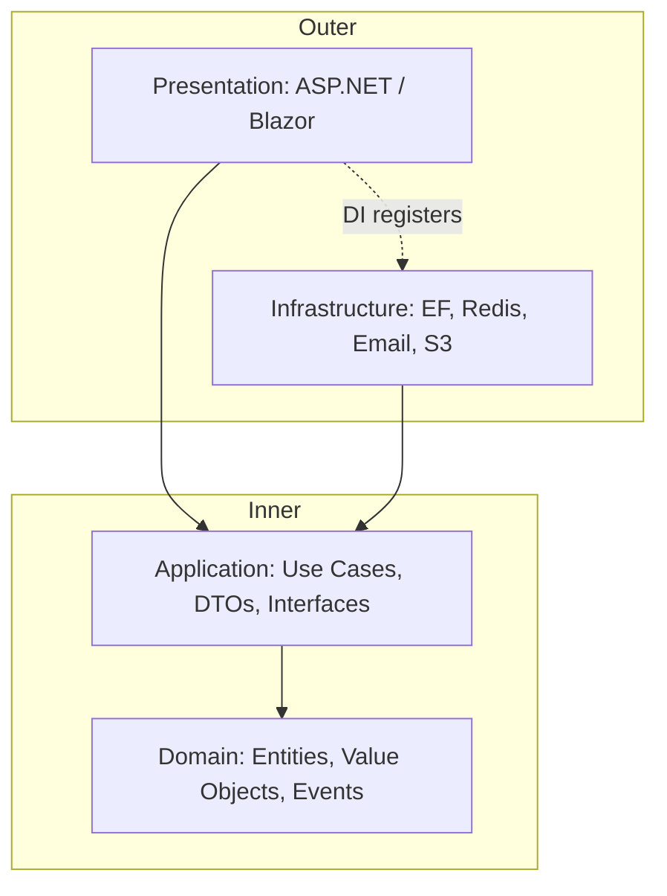

# Clean Architecture

> **One-liner**: Organize a solution into concentric layers (Domain → Application → Infrastructure → Presentation) where **dependencies always point inward** — frameworks and databases are details, not the core.

---

## Quick Reference

| Layer | Knows about | Contains |
|-------|-------------|----------|
| **Domain** | nothing | Entities, Value Objects, Domain Events, business rules |
| **Application** | Domain | Use cases (commands/queries), interfaces for I/O (`IRepository`, `IEmailSender`), DTOs |
| **Infrastructure** | Domain + Application | EF Core, HTTP clients, file system, message bus — concrete implementations |
| **Presentation** | Application (and DI-wires Infrastructure) | ASP.NET controllers, minimal APIs, Blazor pages |

| Rule | Phrasing |
|------|----------|
| **Dependency Rule** | source code dependencies point only inward |
| **Stable abstractions** | inner layers expose interfaces; outer layers implement them |
| **Frameworks at edges** | EF, ASP.NET, MediatR live in outer rings |
| **Testability** | inner layers have *no* framework dependencies — pure C# |

---

## Core Concept

The point of Clean Architecture is to make business rules independent of *how* the app is delivered (web, CLI, gRPC) and *where* the data lives (SQL, NoSQL, REST). The Domain layer is just C# — no `using Microsoft.EntityFrameworkCore;`, no `using Microsoft.AspNetCore;`. That makes it portable and testable in milliseconds.

The **Application** layer orchestrates use cases — "place order" — by combining domain objects and calling **interfaces** for I/O. It defines `IUserRepository` but doesn't know about EF; the Infrastructure layer provides `EfUserRepository`. This is the **Dependency Inversion Principle** at the architectural scale.

In .NET, the typical solution layout is four projects: `Shop.Domain`, `Shop.Application`, `Shop.Infrastructure`, `Shop.Web`. Project references go: Web → Application → Domain, and Infrastructure → Application → Domain. Web also references Infrastructure *only at the composition root* (Program.cs) for DI registration.

---

## Diagram



---

## Syntax & API

### Solution layout
```bash
dotnet new sln -n Shop
dotnet new classlib -n Shop.Domain
dotnet new classlib -n Shop.Application
dotnet new classlib -n Shop.Infrastructure
dotnet new web      -n Shop.Web

dotnet sln add Shop.Domain Shop.Application Shop.Infrastructure Shop.Web

dotnet add Shop.Application reference   Shop.Domain
dotnet add Shop.Infrastructure reference Shop.Application
dotnet add Shop.Web reference            Shop.Application Shop.Infrastructure
```

### Domain (zero dependencies)
```csharp
// Shop.Domain/Orders/Order.cs
namespace Shop.Domain.Orders;

public sealed class Order
{
    public OrderId Id { get; }
    public UserId UserId { get; }
    public Money Total { get; private set; }
    public OrderStatus Status { get; private set; }
    private readonly List<OrderLine> _lines = new();
    public IReadOnlyList<OrderLine> Lines => _lines;

    public Order(OrderId id, UserId userId)
    {
        Id = id;
        UserId = userId;
        Total = Money.Zero;
        Status = OrderStatus.Draft;
    }

    public void AddLine(ProductId p, int qty, Money price)
    {
        if (Status != OrderStatus.Draft) throw new InvalidOperationException("Cannot edit submitted order.");
        _lines.Add(new OrderLine(p, qty, price));
        Total += price * qty;
    }

    public void Submit()
    {
        if (_lines.Count == 0) throw new InvalidOperationException("Empty order.");
        Status = OrderStatus.Submitted;
    }
}

public readonly record struct OrderId(Guid Value);
public readonly record struct UserId(int Value);
public readonly record struct ProductId(int Value);
public enum OrderStatus { Draft, Submitted, Shipped, Cancelled }
```

### Application (use cases + interfaces)
```csharp
// Shop.Application/Orders/SubmitOrder.cs
namespace Shop.Application.Orders;

public record SubmitOrderCommand(Guid OrderId) : IRequest;

public interface IOrderRepository
{
    Task<Order?> GetAsync(OrderId id, CancellationToken ct);
    Task SaveAsync(Order order, CancellationToken ct);
}

public sealed class SubmitOrderHandler(IOrderRepository repo) : IRequestHandler<SubmitOrderCommand>
{
    public async Task Handle(SubmitOrderCommand cmd, CancellationToken ct)
    {
        var order = await repo.GetAsync(new OrderId(cmd.OrderId), ct)
                    ?? throw new NotFoundException($"Order {cmd.OrderId}");
        order.Submit();
        await repo.SaveAsync(order, ct);
    }
}
```

### Infrastructure (EF Core, concrete impls)
```csharp
// Shop.Infrastructure/Persistence/EfOrderRepository.cs
namespace Shop.Infrastructure.Persistence;

public sealed class EfOrderRepository(ShopContext db) : IOrderRepository
{
    public Task<Order?> GetAsync(OrderId id, CancellationToken ct) =>
        db.Orders.Include(o => o.Lines).FirstOrDefaultAsync(o => o.Id == id, ct);

    public async Task SaveAsync(Order order, CancellationToken ct)
    {
        db.Orders.Update(order);
        await db.SaveChangesAsync(ct);
    }
}
```

### Web (composition root)
```csharp
// Shop.Web/Program.cs
var b = WebApplication.CreateBuilder(args);

b.Services.AddDbContext<ShopContext>(o => o.UseNpgsql(b.Configuration.GetConnectionString("Default")));
b.Services.AddScoped<IOrderRepository, EfOrderRepository>();
b.Services.AddMediatR(cfg => cfg.RegisterServicesFromAssembly(typeof(SubmitOrderHandler).Assembly));

var app = b.Build();

app.MapPost("/api/orders/{id:guid}/submit", async (Guid id, IMediator m) =>
{
    await m.Send(new SubmitOrderCommand(id));
    return Results.NoContent();
});

app.Run();
```

### Project file — enforce inward references
```xml
<!-- Shop.Domain.csproj — no PackageReferences to EF, ASP.NET, etc -->
<Project Sdk="Microsoft.NET.Sdk">
  <PropertyGroup>
    <TargetFramework>net9.0</TargetFramework>
    <Nullable>enable</Nullable>
    <ImplicitUsings>enable</ImplicitUsings>
  </PropertyGroup>
</Project>
```

---

## Common Patterns

```csharp
// Pattern: result DTO instead of leaking domain entities to the API
public record OrderDto(Guid Id, decimal Total, string Status, IReadOnlyList<LineDto> Lines);
public record LineDto(int ProductId, int Qty, decimal UnitPrice);

public sealed class OrderMapper
{
    public static OrderDto ToDto(Order o) =>
        new(o.Id.Value, o.Total.Amount, o.Status.ToString(),
            o.Lines.Select(l => new LineDto(l.ProductId.Value, l.Qty, l.UnitPrice.Amount)).ToList());
}
```

```csharp
// Pattern: Application defines the port, Infra owns the adapter
public interface IEmailSender   // Application
{
    Task SendAsync(string to, string subject, string body, CancellationToken ct);
}

public sealed class SendgridEmailSender(SendGridClient client) : IEmailSender { /* ... */ }   // Infrastructure
```

```csharp
// Pattern: ArchUnit-style guard test — domain stays clean
[Fact]
public void Domain_does_not_reference_EF()
{
    var domain = typeof(Order).Assembly;
    domain.GetReferencedAssemblies()
          .Should().NotContain(a => a.Name!.StartsWith("Microsoft.EntityFrameworkCore"));
}
```

---

## Gotchas & Tips

- **Don't put EF entities directly in Domain** — annotations and `DbContext` knowledge bleeds the framework into the core. Use plain POCOs in Domain and configure mapping via `IEntityTypeConfiguration<T>` in Infrastructure.
- **DTO mapping is worth the cost** — leaking `Order` to `[HttpGet]` couples your wire format to your model. Future schema changes break clients.
- **One handler per use case** — fat "service" classes drift. A `SubmitOrderHandler` is unambiguous.
- **Avoid the "Anemic Domain"** — entities with only getters/setters and all logic in services means you have a Transaction Script, not a Domain Model. Move behavior onto the entity.
- **Application layer is the right place for transactions** — wrap the handler in a `IUnitOfWork` or rely on `DbContext`'s implicit one-per-request UoW.
- **Test pyramid maps to layers** — Domain has unit tests (no I/O), Application has integration tests against in-memory or Testcontainers DB, Web has end-to-end with `WebApplicationFactory`.
- **Don't fight the framework when it pays** — if your "app" is a CRUD admin panel, four projects is overkill. Use Clean Architecture when business logic is rich enough to deserve isolation.
- **Vertical slices are an alternative** — group all layers of a feature into one folder (`Features/Orders/SubmitOrder/`). Same dependency rule, less cross-folder navigation.

---

## See Also

- [[01 - Design Patterns]]
- [[03 - Domain-Driven Design]]
- [[13 - Dependency Injection]]
- [[20 - Testing]]
