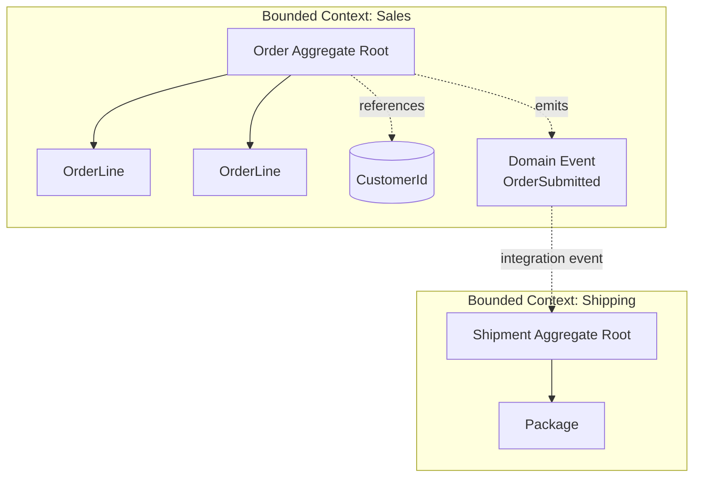

# Domain-Driven Design

> **One-liner**: Model software around the **business domain** using a shared **Ubiquitous Language**, with **Aggregates** as consistency boundaries, **Value Objects** for concepts without identity, **Domain Events** for state-change announcements, and **Bounded Contexts** to isolate models.

---

## Quick Reference

| Building block | What it is | C# vehicle |
|----------------|------------|------------|
| **Entity** | Object with identity that persists over time | class with `Id` |
| **Value Object** | Defined entirely by its attributes | `readonly record struct` / `record` |
| **Aggregate** | Cluster of entities with one root, one transactional boundary | class hierarchy under an "Aggregate Root" |
| **Aggregate Root** | The only entry point for outside code | the root class |
| **Domain Event** | Something significant that happened | `record OrderSubmitted(...)` |
| **Repository** | Loads/saves whole aggregates | `IOrderRepository` |
| **Domain Service** | Logic that doesn't fit on a single entity | stateless class in Domain layer |
| **Bounded Context** | Explicit model boundary with its own language | separate project / module |
| **Ubiquitous Language** | Shared vocabulary between dev and business | reflected in code names |

| Tactical rule | Phrasing |
|---------------|----------|
| Aggregates are loaded and saved as one unit | one transaction per aggregate |
| Reference other aggregates by ID, not navigation | `UserId` not `User` |
| Aggregates publish events; handlers cross aggregate boundaries | eventual consistency |
| Value Objects are immutable | "change" returns a new instance |

---

## Core Concept

DDD is about modeling **the business** in code, not the database. The domain expert and the developer share one **Ubiquitous Language** — if accountants say "settlement", the code uses `Settlement`, never `OrderConfirmation`.

The **Aggregate** is the most important tactical pattern: a cluster of objects that change together. `Order` (root) + its `OrderLine` children form an aggregate. The root protects invariants — you can't add a line directly to the database; you call `order.AddLine(...)` which validates and emits events. Each transaction modifies **exactly one aggregate**.

**Bounded Contexts** acknowledge that one universal model is a fantasy. "Customer" in Sales (with credit limit) is not "Customer" in Shipping (with address). Two contexts, two models, an integration layer (REST, events) between them. In .NET this maps to one project (or one assembly) per context.

DDD is heavy machinery — overkill for CRUD. It pays off when business logic is **rich and changing** (insurance, banking, logistics).

---

## Diagram



---

## Syntax & API

### Value Object (record struct)
```csharp
public readonly record struct Money(decimal Amount, string Currency)
{
    public static Money Zero { get; } = new(0, "USD");

    public static Money operator +(Money a, Money b)
    {
        if (a.Currency != b.Currency) throw new InvalidOperationException("Currency mismatch.");
        return new Money(a.Amount + b.Amount, a.Currency);
    }

    public static Money operator *(Money a, int qty) => new(a.Amount * qty, a.Currency);
}

public readonly record struct EmailAddress
{
    public string Value { get; }
    public EmailAddress(string value)
    {
        if (!value.Contains('@')) throw new ArgumentException("Invalid email", nameof(value));
        Value = value;
    }
}
```

### Aggregate Root
```csharp
public sealed class Order
{
    private readonly List<OrderLine> _lines = new();
    private readonly List<IDomainEvent> _events = new();

    public OrderId Id { get; }
    public CustomerId CustomerId { get; }
    public OrderStatus Status { get; private set; }
    public Money Total { get; private set; } = Money.Zero;
    public IReadOnlyList<OrderLine> Lines => _lines;
    public IReadOnlyList<IDomainEvent> Events => _events;

    public Order(OrderId id, CustomerId customerId)
    {
        Id = id;
        CustomerId = customerId;
        Status = OrderStatus.Draft;
    }

    public void AddLine(ProductId product, int qty, Money unitPrice)
    {
        EnsureDraft();
        if (qty <= 0) throw new ArgumentException("Qty must be positive.");
        _lines.Add(new OrderLine(product, qty, unitPrice));
        Total += unitPrice * qty;
    }

    public void Submit()
    {
        EnsureDraft();
        if (_lines.Count == 0) throw new InvalidOperationException("Cannot submit empty order.");
        Status = OrderStatus.Submitted;
        _events.Add(new OrderSubmitted(Id, CustomerId, Total, DateTime.UtcNow));
    }

    public void ClearEvents() => _events.Clear();

    private void EnsureDraft()
    {
        if (Status != OrderStatus.Draft)
            throw new InvalidOperationException($"Order is {Status}, not editable.");
    }
}
```

### Domain Event
```csharp
public interface IDomainEvent
{
    DateTime OccurredOn { get; }
}

public record OrderSubmitted(OrderId OrderId, CustomerId CustomerId, Money Total, DateTime OccurredOn)
    : IDomainEvent;
```

### Repository (Application layer interface)
```csharp
public interface IOrderRepository
{
    Task<Order?> GetAsync(OrderId id, CancellationToken ct);
    Task AddAsync(Order order, CancellationToken ct);
    Task SaveAsync(Order order, CancellationToken ct);
}
```

### Dispatching Domain Events on save
```csharp
public sealed class ShopContext(IPublisher mediator) : DbContext
{
    public DbSet<Order> Orders => Set<Order>();

    public override async Task<int> SaveChangesAsync(CancellationToken ct = default)
    {
        var entitiesWithEvents = ChangeTracker.Entries<Order>()
            .Where(e => e.Entity.Events.Count > 0)
            .Select(e => e.Entity)
            .ToList();

        var result = await base.SaveChangesAsync(ct);

        foreach (var entity in entitiesWithEvents)
        {
            foreach (var ev in entity.Events) await mediator.Publish(ev, ct);
            entity.ClearEvents();
        }
        return result;
    }
}
```

### Domain Service (logic spanning aggregates)
```csharp
public sealed class CreditCheckService(ICustomerRepository customers)
{
    public async Task<bool> CanAfford(CustomerId id, Money amount, CancellationToken ct)
    {
        var customer = await customers.GetAsync(id, ct);
        return customer is not null && customer.CreditLimit >= amount;
    }
}
```

### Strongly-typed IDs
```csharp
public readonly record struct OrderId(Guid Value)
{
    public static OrderId New() => new(Guid.NewGuid());
    public override string ToString() => Value.ToString();
}
```

---

## Common Patterns

```csharp
// Pattern: factory method for invariant-respecting creation
public static class OrderFactory
{
    public static Order CreateDraft(CustomerId customerId) => new(OrderId.New(), customerId);
}
```

```csharp
// Pattern: reference other aggregates by ID
public sealed class Shipment
{
    public ShipmentId Id { get; }
    public OrderId OrderId { get; }   // ID, not Order navigation
    // ...
}
```

```csharp
// Pattern: integration event vs domain event
public record OrderSubmitted(OrderId OrderId, ...) : IDomainEvent;             // in-process
public record OrderPlacedIntegration(Guid OrderId, decimal Total, ...);        // serialized to bus
```

```csharp
// Pattern: validate at construction, never let an invalid object exist
public readonly record struct PostalCode
{
    public string Value { get; }
    public PostalCode(string value)
    {
        if (string.IsNullOrWhiteSpace(value) || value.Length > 10)
            throw new ArgumentException("Bad postal code");
        Value = value;
    }
}
```

---

## Gotchas & Tips

- **Aggregates should be small** — fewer entities, smaller transactions, less contention. If `Order` has 100 lines, you may need a different boundary.
- **Don't navigate across aggregate roots in queries** — use Read Models (CQRS) for cross-aggregate views. Domain models are for writes.
- **Events are commitments** — if `OrderSubmitted` is published, downstream systems will react. Don't add fields like `MaybeIfApproved`. Name them in past tense (`Submitted`, not `Submitting`).
- **Value Objects are great for primitives** — `EmailAddress` and `Money` prevent passing a `string` where a domain concept is expected. Use records to get equality and immutability for free.
- **EF Core supports VOs** — use `OwnsOne`/`HasConversion` to map them to columns. Strongly-typed IDs need `HasConversion` too.
- **Domain layer is pure** — no `DateTime.UtcNow` calls (inject `IClock`), no random GUIDs in deep logic (inject `IIdGenerator`). Makes tests deterministic.
- **Don't anemic** — getters/setters with no behavior is a Transaction Script, not a Domain Model. The whole point is *behavior on entities*.
- **One model fits one context** — `Customer` in CRM ≠ `Customer` in Billing. If you can't, split the aggregate.
- **Eventual consistency between aggregates** — within an aggregate: ACID. Across aggregates: events + retries. Trying to make two aggregates atomic is a sign of wrong boundaries.

---

## See Also

- [[02 - Clean Architecture]]
- [[01 - Design Patterns]]
- [[04 - Microservices]]
- [[16 - Entity Framework Core]]
