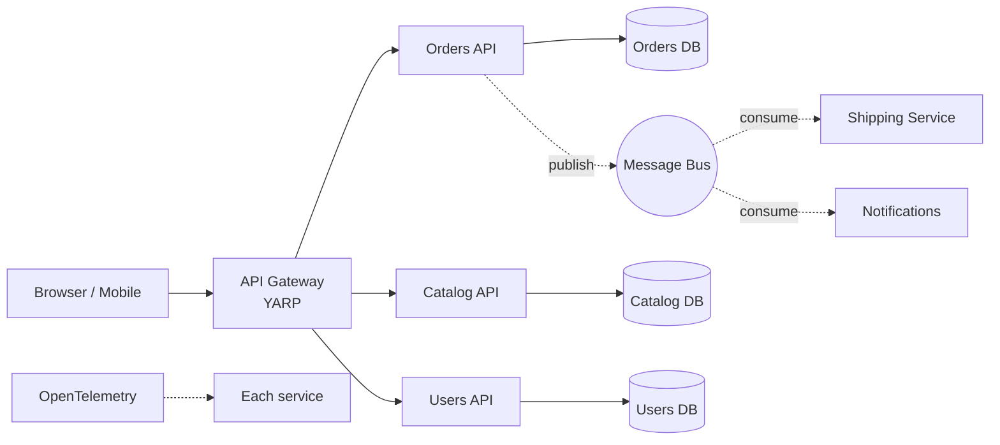

# Microservices

> **One-liner**: Decompose a system into **small, independently deployable** services that communicate over the network — in .NET this typically means **ASP.NET Core APIs + a gateway (YARP) + a message bus (RabbitMQ/Azure Service Bus) + .NET Aspire** for orchestration.

---

## Quick Reference

| Concern | Common .NET stack |
|---------|--------------------|
| Service runtime | ASP.NET Core (Kestrel) |
| Sync inter-service calls | HTTP/gRPC + `HttpClientFactory` + Polly |
| Async messaging | RabbitMQ, Azure Service Bus, Kafka via MassTransit |
| API gateway | **YARP** (Yet Another Reverse Proxy), Ocelot, or cloud (APIM, AWS APIGW) |
| Service discovery | DNS (Kubernetes), Consul, .NET Aspire service discovery |
| Config & secrets | Azure App Configuration, AWS Parameter Store, K8s Secrets |
| Observability | OpenTelemetry → Prometheus + Grafana, Application Insights |
| Local orchestration | **.NET Aspire**, docker-compose |
| Resilience | **Polly** (retry, circuit breaker, timeout, bulkhead) |
| Distributed tracing | OpenTelemetry, W3C Trace Context |
| Health checks | `Microsoft.Extensions.Diagnostics.HealthChecks` |

---

## Core Concept

Microservices solve **organizational scaling**: independent teams own independent services, each shipping on its own cadence. Each service has its **own database**, its **own data model**, and its **own deployment unit**. Cross-service queries go through the network — never JOIN across service DBs.

Communication splits into two patterns:
- **Synchronous (HTTP/gRPC)** — request/response, latency-coupled, simple but fragile.
- **Asynchronous (events on a bus)** — fire-and-forget, durable, eventual consistency, but harder to reason about.

The **API Gateway** is the front door for clients — it routes, authenticates, and aggregates. **YARP** is Microsoft's reverse-proxy library that lets you build a custom gateway in C#. **.NET Aspire** (.NET 8+) is a developer-first stack that wires up services, dependencies (Redis, Postgres), telemetry, and dashboards from a single AppHost project.

The biggest tax is **distributed-systems pain**: partial failures, network latency, eventual consistency, debugging across many logs. Don't go microservices for a small team or simple domain — start with a well-structured monolith and split when the pain demands it.

---

## Diagram



---

## Syntax & API

### Minimal service
```csharp
// orders/Program.cs
var b = WebApplication.CreateBuilder(args);
b.Services.AddDbContext<OrdersDbContext>(o => o.UseNpgsql(b.Configuration.GetConnectionString("Default")));
b.Services.AddHealthChecks().AddDbContextCheck<OrdersDbContext>();

var app = b.Build();
app.MapGet("/orders/{id:guid}", (Guid id, OrdersDbContext db) => db.Orders.FindAsync(id));
app.MapHealthChecks("/health");
app.Run();
```

### YARP gateway
```csharp
// gateway/Program.cs
var b = WebApplication.CreateBuilder(args);
b.Services.AddReverseProxy().LoadFromConfig(b.Configuration.GetSection("ReverseProxy"));

var app = b.Build();
app.MapReverseProxy();
app.Run();
```

```json
// gateway/appsettings.json
"ReverseProxy": {
  "Routes": {
    "orders": { "ClusterId": "orders", "Match": { "Path": "/api/orders/{**rest}" } },
    "catalog": { "ClusterId": "catalog", "Match": { "Path": "/api/catalog/{**rest}" } }
  },
  "Clusters": {
    "orders":  { "Destinations": { "d1": { "Address": "http://orders:8080/" } } },
    "catalog": { "Destinations": { "d1": { "Address": "http://catalog:8080/" } } }
  }
}
```

### HttpClient with Polly resilience
```csharp
b.Services.AddHttpClient<CatalogClient>(c => c.BaseAddress = new Uri("http://catalog/"))
    .AddStandardResilienceHandler();   // .NET 8 — retry + circuit breaker + timeout

public sealed class CatalogClient(HttpClient http)
{
    public Task<Product?> GetAsync(int id, CancellationToken ct) =>
        http.GetFromJsonAsync<Product>($"/products/{id}", ct);
}
```

### MassTransit + RabbitMQ (async events)
```csharp
b.Services.AddMassTransit(cfg =>
{
    cfg.AddConsumer<OrderSubmittedConsumer>();
    cfg.UsingRabbitMq((ctx, rmq) =>
    {
        rmq.Host("rabbitmq", h => { h.Username("guest"); h.Password("guest"); });
        rmq.ConfigureEndpoints(ctx);
    });
});

public record OrderSubmitted(Guid OrderId, decimal Total);

public sealed class OrderSubmittedConsumer(IShipmentService shipping) : IConsumer<OrderSubmitted>
{
    public Task Consume(ConsumeContext<OrderSubmitted> ctx) =>
        shipping.ScheduleAsync(ctx.Message.OrderId, ctx.CancellationToken);
}
```

### OpenTelemetry
```csharp
b.Services.AddOpenTelemetry()
    .WithTracing(t => t.AddAspNetCoreInstrumentation()
                       .AddHttpClientInstrumentation()
                       .AddNpgsql()
                       .AddOtlpExporter())
    .WithMetrics(m => m.AddAspNetCoreInstrumentation()
                       .AddRuntimeInstrumentation()
                       .AddOtlpExporter());
```

### .NET Aspire AppHost
```csharp
// AppHost/Program.cs
var builder = DistributedApplication.CreateBuilder(args);

var rabbit  = builder.AddRabbitMQ("rabbit");
var pgOrders = builder.AddPostgres("pg-orders").AddDatabase("orders");

var orders = builder.AddProject<Projects.Orders>("orders")
    .WithReference(pgOrders)
    .WithReference(rabbit);

var catalog = builder.AddProject<Projects.Catalog>("catalog");

builder.AddProject<Projects.Gateway>("gateway")
    .WithReference(orders)
    .WithReference(catalog);

builder.Build().Run();
```

### gRPC inter-service call
```csharp
// catalog client
b.Services.AddGrpcClient<Catalog.CatalogClient>(o => o.Address = new Uri("https://catalog"));
```

---

## Common Patterns

```csharp
// Pattern: outbox — atomic DB write + reliable event publish
public sealed class OrdersDbContext : DbContext
{
    public DbSet<Order> Orders => Set<Order>();
    public DbSet<OutboxMessage> Outbox => Set<OutboxMessage>();
}

public sealed record OutboxMessage(Guid Id, string Type, string Payload, DateTime OccurredOn, DateTime? ProcessedOn);

// In handler:
db.Orders.Add(order);
db.Outbox.Add(new OutboxMessage(Guid.NewGuid(), nameof(OrderSubmitted),
    JsonSerializer.Serialize(@event), DateTime.UtcNow, null));
await db.SaveChangesAsync();   // atomic

// Background worker drains Outbox → bus, marks ProcessedOn.
```

```csharp
// Pattern: idempotent consumer
public sealed class OrderSubmittedConsumer(IIdempotencyStore store) : IConsumer<OrderSubmitted>
{
    public async Task Consume(ConsumeContext<OrderSubmitted> ctx)
    {
        if (await store.HasProcessed(ctx.MessageId!.Value)) return;
        // do the work
        await store.Mark(ctx.MessageId!.Value);
    }
}
```

```csharp
// Pattern: API Composition (read across services)
app.MapGet("/api/orders/{id:guid}/full", async (Guid id, OrdersClient o, CatalogClient c) =>
{
    var order = await o.GetAsync(id);
    var products = await Task.WhenAll(order.Lines.Select(l => c.GetAsync(l.ProductId)));
    return new { order, products };
});
```

---

## Gotchas & Tips

- **Don't share a database** — that's a distributed monolith with worse coupling than a real monolith. Each service owns its data.
- **Network is not free** — every hop adds latency and a failure mode. Aggregating on the gateway can fan out 20 calls per request; cache or denormalize.
- **Eventual consistency is the price of admission** — embrace it (sagas, outbox) rather than fight it (distributed transactions, two-phase commit).
- **Versioned events** — once `OrderSubmitted v1` is on the wire, you cannot break consumers. Add fields, never remove or repurpose; introduce `v2` for breaking changes.
- **Use `HttpClientFactory`** — direct `new HttpClient()` leaks sockets. The factory rotates handlers and integrates with Polly.
- **Health checks are mandatory** — `/health/ready` for orchestrator probes (K8s readiness), `/health/live` for liveness, plus dependency checks.
- **Distributed tracing first** — OpenTelemetry on day one. Without trace IDs, debugging a multi-hop request is archaeology.
- **Start with a modular monolith** — well-bounded modules in one process, splittable later. Microservices upfront is "Conway's law speedrun".
- **.NET Aspire is for dev/local** — production still runs on Kubernetes/ACA/EKS. Aspire generates manifests but is not a runtime.
- **Auth at the gateway** — terminate JWT once, forward identity downstream via headers. Don't make every service revalidate the token from scratch (some prefer this for defense in depth — pick one consciously).

---

## See Also

- [[02 - Clean Architecture]]
- [[05 - Security and Auth]]
- [[14 - gRPC]]
- [[17 - Docker and Containers]]
