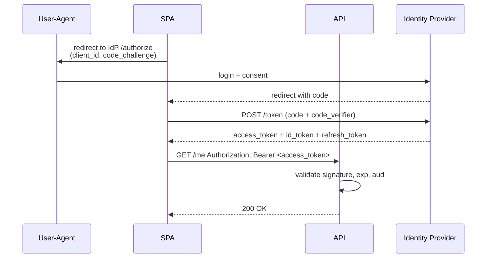

# Security and Auth

> **One-liner**: ASP.NET Core handles **authentication** (who you are) via JWT/OIDC/cookie schemes and **authorization** (what you can do) via policies, roles, and claims — pair with HTTPS, anti-forgery, CORS, and rate limiting.

---

## Quick Reference

| Concept | API |
|---------|-----|
| Authentication scheme | `services.AddAuthentication("Bearer").AddJwtBearer(...)` |
| Authorization | `services.AddAuthorization(o => o.AddPolicy(...))` |
| Pipeline | `app.UseAuthentication(); app.UseAuthorization();` (in that order) |
| Protect endpoint | `[Authorize]`, `[Authorize(Policy="Admin")]`, `.RequireAuthorization()` |
| Allow anonymous | `[AllowAnonymous]` |
| HTTPS | `app.UseHttpsRedirection()`, HSTS in prod |
| CORS | `services.AddCors(...)`, `app.UseCors("policyName")` |
| Anti-forgery | `services.AddAntiforgery()` (auto for MVC/Razor) |
| Rate limiting | `services.AddRateLimiter(...)` (.NET 7+) |
| Data protection | `services.AddDataProtection()` for cookie/token encryption |
| Hashing passwords | `IPasswordHasher<TUser>` (PBKDF2, 100k iter) |

| Standard | What it is |
|----------|------------|
| **JWT** | Compact, self-contained signed token (header.payload.signature) |
| **OAuth 2.0** | Authorization framework (delegated access) |
| **OIDC** | Identity layer on top of OAuth (adds id_token) |
| **PKCE** | Required flow for SPAs/mobile (Auth Code + Proof Key) |
| **Refresh token** | Long-lived token to mint new access tokens |

---

## Core Concept

**Authentication** establishes identity. The middleware reads a token/cookie/header, validates it, and attaches a `ClaimsPrincipal` to `HttpContext.User`. **Authorization** runs after — checks policies, roles, claims, or custom requirements.

In modern .NET APIs you almost always use **JWT Bearer**: the client sends `Authorization: Bearer <token>`. The token is signed by the auth server (your app, IdentityServer, Auth0, Entra ID) — your API only validates the signature and claims; it doesn't issue tokens itself in production.

For server-rendered apps (Razor/Blazor Server), use **cookie auth**. Cookies are HttpOnly+Secure+SameSite, encrypted by Data Protection. For SPAs and mobile, use **OIDC + PKCE** with a real Identity Provider.

The middleware order is fixed: `UseRouting → UseCors → UseAuthentication → UseAuthorization → UseEndpoints`. Authorization without prior authentication is meaningless; CORS before auth so preflights aren't blocked.

---

## Diagram



---

## Syntax & API

### JWT bearer
```csharp
var b = WebApplication.CreateBuilder(args);

b.Services.AddAuthentication("Bearer")
    .AddJwtBearer("Bearer", o =>
    {
        o.Authority = "https://auth.example.com";   // OIDC discovery
        o.Audience  = "api";
        o.TokenValidationParameters = new TokenValidationParameters
        {
            ValidateIssuer = true,
            ValidateAudience = true,
            ValidateLifetime = true,
            ValidateIssuerSigningKey = true,
            ClockSkew = TimeSpan.FromSeconds(30),
        };
    });

b.Services.AddAuthorization(o =>
{
    o.AddPolicy("Admin", p => p.RequireRole("admin"));
    o.AddPolicy("OrdersRead", p => p.RequireClaim("scope", "orders.read"));
});

var app = b.Build();
app.UseAuthentication();
app.UseAuthorization();
app.MapGet("/orders", () => "secret").RequireAuthorization("OrdersRead");
app.Run();
```

### Cookie auth (server-rendered apps)
```csharp
b.Services.AddAuthentication(CookieAuthenticationDefaults.AuthenticationScheme)
    .AddCookie(o =>
    {
        o.Cookie.HttpOnly = true;
        o.Cookie.SecurePolicy = CookieSecurePolicy.Always;
        o.Cookie.SameSite = SameSiteMode.Lax;
        o.LoginPath = "/login";
        o.ExpireTimeSpan = TimeSpan.FromHours(1);
        o.SlidingExpiration = true;
    });

app.MapPost("/login", async (HttpContext ctx, LoginDto dto, IUserService users) =>
{
    var user = await users.AuthenticateAsync(dto.Email, dto.Password);
    if (user is null) return Results.Unauthorized();

    var claims = new[] { new Claim(ClaimTypes.NameIdentifier, user.Id.ToString()),
                          new Claim(ClaimTypes.Email, user.Email) };
    var identity = new ClaimsIdentity(claims, CookieAuthenticationDefaults.AuthenticationScheme);
    await ctx.SignInAsync(new ClaimsPrincipal(identity));
    return Results.Ok();
});
```

### Custom authorization requirement
```csharp
public sealed record MinAge(int Years) : IAuthorizationRequirement;

public sealed class MinAgeHandler : AuthorizationHandler<MinAge>
{
    protected override Task HandleRequirementAsync(AuthorizationHandlerContext ctx, MinAge req)
    {
        var birthClaim = ctx.User.FindFirst("birthdate")?.Value;
        if (DateTime.TryParse(birthClaim, out var dob) && DateTime.Today.Year - dob.Year >= req.Years)
            ctx.Succeed(req);
        return Task.CompletedTask;
    }
}

b.Services.AddAuthorization(o => o.AddPolicy("18+", p => p.AddRequirements(new MinAge(18))));
b.Services.AddSingleton<IAuthorizationHandler, MinAgeHandler>();
```

### CORS
```csharp
b.Services.AddCors(o => o.AddPolicy("spa",
    p => p.WithOrigins("https://app.example.com")
          .AllowAnyHeader()
          .AllowAnyMethod()
          .AllowCredentials()));

app.UseCors("spa");
```

### Rate limiting (.NET 7+)
```csharp
b.Services.AddRateLimiter(o =>
{
    o.AddFixedWindowLimiter("api", w =>
    {
        w.PermitLimit = 100;
        w.Window = TimeSpan.FromMinutes(1);
        w.QueueLimit = 0;
    });
    o.RejectionStatusCode = 429;
});

app.UseRateLimiter();
app.MapGet("/api/x", () => "ok").RequireRateLimiting("api");
```

### ASP.NET Core Identity
```csharp
b.Services.AddDbContext<AuthDbContext>(o => o.UseNpgsql(b.Configuration.GetConnectionString("Default")));
b.Services.AddIdentityCore<ApplicationUser>(o =>
{
    o.Password.RequireDigit = true;
    o.Password.RequiredLength = 12;
    o.User.RequireUniqueEmail = true;
})
.AddRoles<IdentityRole>()
.AddEntityFrameworkStores<AuthDbContext>()
.AddDefaultTokenProviders();

// .NET 8+: built-in Identity API endpoints
b.Services.AddAuthentication().AddBearerToken(IdentityConstants.BearerScheme);
b.Services.AddIdentityApiEndpoints<ApplicationUser>();   // exposes /register, /login, /refresh
app.MapIdentityApi<ApplicationUser>();
```

### HTTPS + HSTS
```csharp
if (!app.Environment.IsDevelopment())
{
    app.UseHsts();   // Strict-Transport-Security header
}
app.UseHttpsRedirection();
```

### Issuing your own JWT (for testing — prefer a real IdP in prod)
```csharp
var key = new SymmetricSecurityKey(Encoding.UTF8.GetBytes(b.Configuration["Jwt:Key"]!));
var creds = new SigningCredentials(key, SecurityAlgorithms.HmacSha256);

var token = new JwtSecurityToken(
    issuer: "myapp",
    audience: "api",
    claims: new[] { new Claim(ClaimTypes.NameIdentifier, userId.ToString()) },
    expires: DateTime.UtcNow.AddMinutes(15),
    signingCredentials: creds);

var jwt = new JwtSecurityTokenHandler().WriteToken(token);
```

---

## Common Patterns

```csharp
// Pattern: extract current user
public static class UserExtensions
{
    public static int GetUserId(this ClaimsPrincipal user) =>
        int.Parse(user.FindFirstValue(ClaimTypes.NameIdentifier)!);
}

app.MapGet("/me", (ClaimsPrincipal user) => new { Id = user.GetUserId(), Email = user.FindFirstValue(ClaimTypes.Email) })
   .RequireAuthorization();
```

```csharp
// Pattern: resource-based authorization
[HttpDelete("/orders/{id:guid}")]
public async Task<IResult> Delete(Guid id, IAuthorizationService auth, ClaimsPrincipal user, OrdersDb db)
{
    var order = await db.Orders.FindAsync(id);
    if (order is null) return Results.NotFound();

    var result = await auth.AuthorizeAsync(user, order, "OrderOwner");
    if (!result.Succeeded) return Results.Forbid();
    db.Remove(order); await db.SaveChangesAsync();
    return Results.NoContent();
}
```

```csharp
// Pattern: secrets out of source — User Secrets in dev, Key Vault in prod
b.Configuration.AddUserSecrets<Program>(optional: true);
b.Configuration.AddAzureKeyVault(new Uri(b.Configuration["KeyVault:Uri"]!), new DefaultAzureCredential());
```

---

## Gotchas & Tips

- **Order matters**: `UseAuthentication` MUST come before `UseAuthorization`. Both must come after `UseRouting`.
- **Don't roll your own JWT issuance for production** — use IdentityServer/Duende, Auth0, Entra ID, or Keycloak. Token rotation, key rotation, and revocation are easy to get wrong.
- **JWTs cannot be revoked** mid-life. Keep access tokens short (5–15 min) and use refresh tokens (rotating, single-use).
- **Never store JWTs in `localStorage`** for SPAs — XSS-readable. Use HttpOnly cookies (BFF pattern) or short-lived in-memory tokens.
- **Always set `[Authorize]` at the controller/group level** and use `[AllowAnonymous]` for exceptions — opt-out is safer than opt-in.
- **Validate `aud` and `iss`** — without them, any signed token from your IdP authenticates everywhere.
- **CORS isn't security** — it only protects browsers. Servers/curl ignore it. Don't rely on CORS to keep an API "private".
- **Hash passwords with PBKDF2/bcrypt/argon2** (Identity does PBKDF2 by default) — never plain SHA256.
- **Anti-forgery for cookie-auth** — cookie endpoints that mutate state must check anti-forgery tokens; Bearer-token APIs are immune (no automatic credentials).
- **Production HTTPS only** — `UseHttpsRedirection` and HSTS. Cookies/tokens over plain HTTP are sniffable.
- **Data Protection keys must persist across restarts** — by default they go to a local folder. In K8s/Docker, mount a volume or use Azure Blob/Redis storage. Otherwise all cookies invalidate on every redeploy.

---

## See Also

- [[14 - ASP.NET Core Basics]]
- [[15 - REST API]]
- [[19 - Middleware]]
- [[17 - Configuration]]
