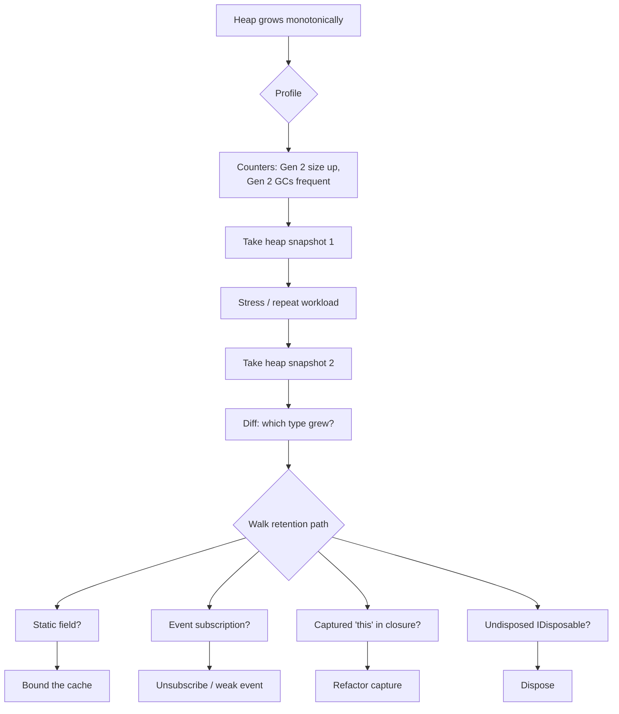

# Memory Leaks and Profiling

> **One-liner**: A managed "leak" means **objects stay reachable** when they shouldn't — the GC won't collect them. The four big causes are **events**, **statics**, **closures**, and **uncancelled timers/tasks** — diagnose with `dotnet-counters`, `dotnet-dump`, dotMemory, or PerfView.

---

## Quick Reference

| Tool | Use |
|------|-----|
| `dotnet-counters` | Live perf counters: heap size, Gen 0/1/2 collections, exceptions/sec |
| `dotnet-dump` | Full process dump for offline forensics with `dotnet-dump analyze` |
| `dotnet-trace` | EventPipe sampling — CPU + GC events, → SpeedScope/PerfView |
| `dotnet-gcdump` | Lightweight heap snapshot — no full dump needed |
| **JetBrains dotMemory** | GUI heap analyzer — diff snapshots, retention paths |
| **PerfView** | Windows ETW analysis — heap, allocations, locks |
| **Visual Studio Diagnostic Tools** | Live snapshot/diff during debug sessions |

| Common leak source | Fix |
|--------------------|-----|
| Event handlers never unsubscribed | unsubscribe in `Dispose`, weak-event pattern, `WeakReference` |
| Static collection growing forever | bounded cache, `MemoryCache` with eviction |
| Captured `this` in long-lived lambda | capture local copy, or break the closure |
| Long-lived `IDisposable` not disposed (sockets, file handles) | `using`, sane lifetimes |
| Uncancelled `Task.Delay`/`Timer` | `CancellationToken`, `ITimer` (`PeriodicTimer`) |
| `HttpClient` constructed per-request | `IHttpClientFactory` |
| EF `DbContext` lifetime too long (singleton scope) | scoped or short-lived |
| LOH fragmentation | pool large arrays, avoid arrays ≥ 85 KB |

---

## Core Concept

In .NET there's no `delete`. The GC reclaims unreachable objects automatically — so a "leak" is when something keeps an object **reachable** indefinitely. The classic giveaway: heap grows monotonically over time and Gen 2 collections rise without recovery.

Diagnosis is a **two-step process**: (1) detect with live counters or memory graphs, (2) take a heap snapshot or dump and walk the **retention path** — what root chain keeps the suspected object alive? `!gcroot` in WinDbg/SOS or "GC Roots" in dotMemory shows exactly which static field, event, or thread-local owns the chain.

The fix is almost never `GC.Collect()` — that wastes CPU; the GC is already trying. The fix is to **break the reference**: unsubscribe, dispose, expire, weaken.

---

## Diagram



---

## Syntax & API

### Reproduce a leak (event handler never unsubscribed)
```csharp
public sealed class Publisher
{
    public event EventHandler? Changed;
    public void Raise() => Changed?.Invoke(this, EventArgs.Empty);
}

public sealed class Subscriber : IDisposable
{
    private readonly Publisher _pub;
    public Subscriber(Publisher pub)
    {
        _pub = pub;
        _pub.Changed += OnChanged;   // strong reference: pub → this
    }
    private void OnChanged(object? s, EventArgs e) { /* keeps `this` alive */ }

    public void Dispose() => _pub.Changed -= OnChanged;   // ← required
}
```

### Live counters
```bash
dotnet-counters monitor -p 1234 \
  System.Runtime[gen-0-gc-count,gen-1-gc-count,gen-2-gc-count,gc-heap-size,exception-count,monitor-lock-contention-count]
```

### Capture a heap snapshot
```bash
dotnet-gcdump collect -p 1234
# → 1234.gcdump  (open in dotMemory, PerfView, or VS)
```

### Full process dump
```bash
dotnet-dump collect -p 1234
dotnet-dump analyze core_xxx
> dumpheap -stat                    # types by count/size
> dumpheap -type Subscriber         # instances of suspect type
> gcroot 0x000001234567890         # who keeps this address alive
```

### dotnet-trace + GC events
```bash
dotnet-trace collect -p 1234 \
  --providers Microsoft-Windows-DotNETRuntime:0x1:5 \
  --duration 00:01:00
```

### Reproduce in a unit test
```csharp
[Fact]
public void Subscriber_Disposed_IsCollected()
{
    var pub = new Publisher();
    var weak = AttachAndForget(pub);

    GC.Collect();
    GC.WaitForPendingFinalizers();
    GC.Collect();

    weak.IsAlive.Should().BeFalse();   // fails if leaking
}

private static WeakReference AttachAndForget(Publisher pub)
{
    var sub = new Subscriber(pub);
    sub.Dispose();                    // try with and without
    return new WeakReference(sub);
}
```

### Weak-event pattern
```csharp
// Use a weak reference so the publisher doesn't anchor the subscriber
public sealed class WeakEventListener<TArgs> where TArgs : EventArgs
{
    private readonly WeakReference<EventHandler<TArgs>> _handler;
    public WeakEventListener(EventHandler<TArgs> handler) => _handler = new(handler);

    public void OnEvent(object? s, TArgs e)
    {
        if (_handler.TryGetTarget(out var h)) h(s, e);
    }
}
```

### Bounded static cache
```csharp
// Bad — unbounded
private static readonly Dictionary<string, byte[]> Cache = new();

// Good — eviction-aware
private static readonly MemoryCache Cache =
    new(new MemoryCacheOptions { SizeLimit = 50_000 });
Cache.Set(key, value, new MemoryCacheEntryOptions
{
    Size = value.Length,
    AbsoluteExpirationRelativeToNow = TimeSpan.FromMinutes(15),
});
```

### Cancel long-running tasks
```csharp
var cts = new CancellationTokenSource();
var task = Task.Run(async () =>
{
    while (!cts.Token.IsCancellationRequested)
    {
        await Task.Delay(1000, cts.Token);
        // work
    }
}, cts.Token);

// On shutdown
cts.Cancel();
await task;
```

---

## Common Patterns

```csharp
// Pattern: dispose-on-scope for an event subscription
public sealed class EventSubscription : IDisposable
{
    private readonly Action _unsubscribe;
    public EventSubscription(Action subscribe, Action unsubscribe)
    {
        subscribe();
        _unsubscribe = unsubscribe;
    }
    public void Dispose() => _unsubscribe();
}

using var _ = new EventSubscription(
    () => pub.Changed += OnChanged,
    () => pub.Changed -= OnChanged);
```

```csharp
// Pattern: avoid capturing `this` in long-lived lambdas
// Bad
_timer = new Timer(_ => DoWork(), null, 0, 1000);   // captures `this`

// Better — use a static-like signature
_timer = new Timer(static state => ((MyService)state!).DoWork(), this, 0, 1000);
```

```csharp
// Pattern: avoid LOH fragmentation — pool large arrays
private static readonly ArrayPool<byte> Pool = ArrayPool<byte>.Shared;
byte[] big = Pool.Rent(200_000);
try { /* use */ } finally { Pool.Return(big); }
```

---

## Gotchas & Tips

- **Heap grows ≠ leak** — services often have a steady-state working set. Watch for **monotonic** growth across hours/days, not minutes.
- **Generations matter**: leaks promote into Gen 2 and stay. A growing Gen 2 is the strongest signal.
- **Events are the #1 cause** — UI frameworks especially (WPF, WinForms). The publisher outlives subscribers and holds them via the multicast delegate.
- **Async + statics** — `static Task<T>` cached forever holds onto its captured state.
- **`HttpClient.Dispose` doesn't matter for sockets** — they're held by `SocketsHttpHandler` rotation. Use `IHttpClientFactory`.
- **`IDisposable` not always memory** — file handles, sockets, kernel objects can leak even when GC eventually runs. Always `using`.
- **WeakReference is a tool, not a default** — use only when ownership semantics actually require it; misuse leads to mysterious nulls.
- **`GC.Collect()` only proves a leak in tests** — never in production code as a "fix".
- **dotMemory diff snapshots** is the fastest way to find the leak: snapshot, exercise feature, snapshot, diff retained types.
- **Native-side leaks** (P/Invoke, GDI handles) are invisible to managed tools. Use `!handle` in WinDbg or OS-level tools (Sysinternals, Valgrind).
- **Container OOM ≠ managed leak** — the runtime might be sized larger than your container limit. Set `DOTNET_GCHeapHardLimit` or `<GCHeapHardLimitPercent>` for K8s.

---

## See Also

- [[09 - Memory Management and GC]]
- [[10 - IDisposable and Resource Mgmt]]
- [[06 - Performance Optimization]]
- [[08 - Span and Memory Types]]
