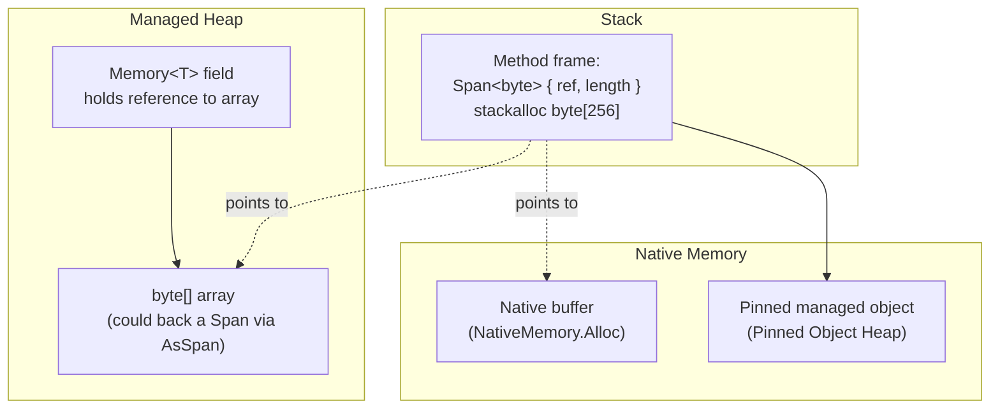

# Span and Memory Types

> **One-liner**: `Span<T>` and `ReadOnlySpan<T>` are stack-only views over contiguous memory (managed array, native pointer, or `stackalloc`) — they enable **zero-allocation** slicing and parsing, which is why hot-path APIs in modern .NET take them everywhere.

---

## Quick Reference

| Type | Backing | Storage | Heap allocation? |
|------|---------|---------|------------------|
| `Span<T>` | array, pointer, `stackalloc` | **stack only** (`ref struct`) | **No** |
| `ReadOnlySpan<T>` | same, but immutable view | stack only | No |
| `Memory<T>` | array or owner | **heap** (regular struct) | Holds heap reference |
| `ReadOnlyMemory<T>` | same, immutable | heap | Holds heap reference |
| `Span<char>` over `string` | `string.AsSpan()` | stack | No |
| `ArraySegment<T>` | array + offset/count | stack | No |
| `ReadOnlySequence<T>` | linked spans | varies | Used by Pipelines |

| Limitation of `Span<T>` (because `ref struct`) |
|-------------------------------------------------|
| Cannot be a field of a class |
| Cannot be captured by a lambda or async method |
| Cannot be boxed |
| Cannot be in arrays (`Span<T>[]` illegal) |
| Cannot cross `await` |

---

## Core Concept

`Span<T>` is a **window** into existing memory: it stores a managed reference (or pointer) plus a length. Slicing returns a new span pointing into the same buffer — no copy. Because spans can refer to *stack* memory, the C# compiler makes `Span<T>` a `ref struct`: the language enforces that it never escapes the stack.

`Memory<T>` is the heap-storable counterpart: a regular struct with an owner reference (`T[]`, `MemoryManager<T>`, or `IMemoryOwner<T>`) plus offset/length. You can store it in fields, pass across `await`, capture in lambdas — but only get to a `Span<T>` synchronously inside a method.

The `Span` API was designed for **zero-alloc parsing and I/O**. `Stream.Read(Span<byte>)`, `Encoding.UTF8.GetString(ReadOnlySpan<byte>)`, `int.Parse(ReadOnlySpan<char>)`, JSON readers, regex — all take spans now. Combined with `stackalloc` and `ArrayPool`, you can do high-throughput work without touching the GC.

---

## Diagram



---

## Syntax & API

### Creation
```csharp
// Over an array
int[] arr = { 1, 2, 3, 4, 5 };
Span<int> span = arr;                         // implicit
ReadOnlySpan<int> ro = arr.AsSpan(1, 3);      // {2,3,4}

// Over stack
Span<byte> buffer = stackalloc byte[256];     // no heap

// Over a string (read-only)
ReadOnlySpan<char> text = "hello".AsSpan();
ReadOnlySpan<char> hi = text.Slice(0, 2);     // "he"

// Over native memory (.NET 6+)
unsafe
{
    byte* p = (byte*)NativeMemory.Alloc(1024);
    Span<byte> native = new(p, 1024);
    NativeMemory.Free(p);
}
```

### Slicing — no allocation
```csharp
ReadOnlySpan<char> input = "2026-04-28";
int year  = int.Parse(input.Slice(0, 4));     // no string allocation
int month = int.Parse(input.Slice(5, 2));
int day   = int.Parse(input.Slice(8, 2));
```

### Span-aware APIs
```csharp
Span<byte> dst = stackalloc byte[64];
ReadOnlySpan<char> src = "hello";
int written = Encoding.UTF8.GetBytes(src, dst);

// Stream
await stream.ReadAsync(dst);                  // overloads accept Memory<byte>
```

### Memory<T> — heap-storable, async-safe
```csharp
public sealed class Reader
{
    private Memory<byte> _buffer = new byte[8192];   // fields cannot be Span<T>

    public async Task FillAsync(Stream s, CancellationToken ct)
    {
        int n = await s.ReadAsync(_buffer, ct);
        Process(_buffer.Span.Slice(0, n));    // get a Span only inside the sync portion
    }

    private void Process(ReadOnlySpan<byte> chunk) { /* ... */ }
}
```

### IMemoryOwner — pooled rentable memory
```csharp
using IMemoryOwner<byte> owner = MemoryPool<byte>.Shared.Rent(8192);
Memory<byte> mem = owner.Memory;
// use; returned to pool on Dispose
```

### `ref struct` rules
```csharp
public ref struct LineEnumerator
{
    private ReadOnlySpan<char> _remaining;
    public LineEnumerator(ReadOnlySpan<char> input) => _remaining = input;

    public bool MoveNext(out ReadOnlySpan<char> line)
    {
        var idx = _remaining.IndexOf('\n');
        if (idx < 0) { line = _remaining; _remaining = default; return _remaining.Length > 0; }
        line = _remaining.Slice(0, idx);
        _remaining = _remaining.Slice(idx + 1);
        return true;
    }
}
// CANNOT: store as a field of a class, await across, capture in lambda
```

### `scoped` parameters (.NET 7+)
```csharp
// `scoped` means the Span doesn't escape — improves overload resolution and safety
public static int CountDigits(scoped ReadOnlySpan<char> s)
{
    int c = 0; foreach (var ch in s) if (char.IsDigit(ch)) c++;
    return c;
}
```

### Stack vs heap allocation comparison
```csharp
// Heap (allocates)
byte[] heap = new byte[256];

// Stack (no allocation, freed at scope end)
Span<byte> stack = stackalloc byte[256];   // ≤ ~1 KB rule of thumb to avoid stack overflow
```

### Conversions
```csharp
Memory<byte> mem = new byte[100];
Span<byte> span = mem.Span;                 // valid only inside sync method

ReadOnlyMemory<byte> ro = mem;              // implicit upcast

ArraySegment<byte> seg = new byte[100];
Span<byte> s = seg.AsSpan();
```

---

## Common Patterns

```csharp
// Pattern: zero-alloc CSV parser
public static int SumColumn(ReadOnlySpan<char> line, int colIndex)
{
    int col = 0, start = 0;
    for (int i = 0; i <= line.Length; i++)
    {
        bool atEnd = i == line.Length;
        if (atEnd || line[i] == ',')
        {
            if (col == colIndex) return int.Parse(line.Slice(start, i - start));
            col++; start = i + 1;
        }
    }
    return 0;
}
```

```csharp
// Pattern: rent → fill → return
byte[] buf = ArrayPool<byte>.Shared.Rent(8192);
try
{
    var read = await stream.ReadAsync(buf.AsMemory(0, 8192), ct);
    Process(buf.AsSpan(0, read));
}
finally { ArrayPool<byte>.Shared.Return(buf); }
```

```csharp
// Pattern: span-based hashing (System.IO.Hashing)
ReadOnlySpan<byte> data = Encoding.UTF8.GetBytes("hello").AsSpan();
ulong hash = XxHash3.HashToUInt64(data);
```

```csharp
// Pattern: avoid string.Split allocations
foreach (var range in "a,b,c".AsSpan().Split(','))
{
    var token = "a,b,c".AsSpan(range);   // .NET 8+: MemoryExtensions.Split for spans
}
```

---

## Gotchas & Tips

- **`Span<T>` cannot cross `await`** — it's a `ref struct`. If you need to hold memory across an `await`, use `Memory<T>` and call `.Span` after the await.
- **`stackalloc` size discipline** — keep it under ~1 KB per frame, or use the **`stackalloc` + `ArrayPool` fallback** pattern: stack for small inputs, pool for large.
- **`Span<byte>` over `string` doesn't exist** — strings are UTF-16 (`char`). Use `MemoryMarshal.AsBytes(string.AsSpan())` if you need raw bytes.
- **Span equality is value equality** for `SequenceEqual` only. `==` compares references — surprising; the compiler warns.
- **`ref struct` viral** — once a method takes/returns a `Span`, callers also can't be async without conversion.
- **`Memory<T>` underlies async I/O** — `Stream.ReadAsync(Memory<byte>)` is the modern overload. The old `byte[]+offset+count` overload is going away.
- **`SearchValues<T>` (.NET 8)** beats `IndexOfAny` for repeated multi-needle searches: `SearchValues.Create("aeiou")`.
- **`stackalloc` initialization is undefined** unless you write `stackalloc byte[256] { 0, ... }` or the JIT zero-inits (it does for managed types). Defensive: `buffer.Clear()`.
- **Pinning is invisible with Spans over arrays** — the JIT pins for the duration of the slice. For long-lived native interop, use the **Pinned Object Heap** (`GC.AllocateUninitializedArray<byte>(N, pinned: true)`).
- **Don't over-Span** — if you don't have a perf problem, `string` and `byte[]` are still readable and fine. Spans pay off in tight inner loops.

---

## See Also

- [[09 - Memory Management and GC]]
- [[06 - Performance Optimization]]
- [[09 - Channels and Pipelines]]
- [[16 - Native Interop and AOT]]
