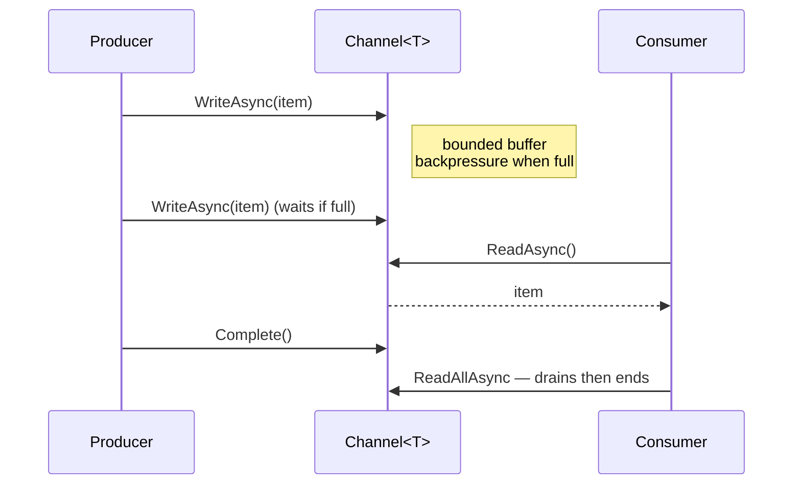

# Channels and Pipelines

> **One-liner**: **`System.Threading.Channels`** is the modern producer/consumer queue (typed, async, bounded), and **`System.IO.Pipelines`** is the high-performance byte-stream API used by Kestrel — both eliminate unnecessary buffering, copying, and allocations.

---

## Quick Reference

| Type | Purpose |
|------|---------|
| `Channel<T>` | Async typed queue (one or many producers/consumers) |
| `Channel.CreateUnbounded<T>()` | Unlimited buffer |
| `Channel.CreateBounded<T>(N)` | Limited buffer with backpressure |
| `ChannelWriter<T>` | Producer side: `WriteAsync`, `TryWrite`, `Complete` |
| `ChannelReader<T>` | Consumer side: `ReadAsync`, `ReadAllAsync`, `WaitToReadAsync` |
| `BoundedChannelFullMode` | Wait / DropOldest / DropNewest / DropWrite |
| `Pipe` | Single-producer/single-consumer byte pipe |
| `PipeReader` / `PipeWriter` | I/O without `Stream` ceremony |
| `ReadOnlySequence<byte>` | Multi-segment buffer view used by Pipelines |

---

## Core Concept

A **Channel** is the .NET answer to a thread-safe async queue. One or more producers call `WriteAsync`; one or more consumers call `ReadAsync` or iterate `ReadAllAsync`. Bounded channels apply **backpressure** — producers wait when the buffer is full, which keeps memory bounded under load. This replaces home-grown `BlockingCollection` + `SemaphoreSlim` patterns.

**Pipelines** (`System.IO.Pipelines`) is a different beast: it's a high-throughput byte stream optimized for parsing protocols (HTTP, gRPC, redis). Instead of copying into your own buffer, the Pipe gives you a `ReadOnlySequence<byte>` — possibly across multiple memory segments — and you tell it how much you consumed and how much you "examined" (so it knows whether to read more from the source). It's what powers Kestrel's request reading.

Use Channels for **work-queue patterns** (background processing, fan-out). Use Pipelines for **byte-streaming hot paths** (custom protocols, parsers). Don't reach for either when a simple `IAsyncEnumerable<T>` or `Stream` will do.

---

## Diagram



---

## Syntax & API

### Bounded channel — producer/consumer
```csharp
var channel = Channel.CreateBounded<WorkItem>(new BoundedChannelOptions(capacity: 100)
{
    FullMode = BoundedChannelFullMode.Wait,
    SingleReader = true,
    SingleWriter = false,
});

// Producer
_ = Task.Run(async () =>
{
    foreach (var item in source)
        await channel.Writer.WriteAsync(item);
    channel.Writer.Complete();
});

// Consumer
await foreach (var item in channel.Reader.ReadAllAsync())
{
    await Process(item);
}
```

### Multiple consumers (workers)
```csharp
var channel = Channel.CreateBounded<int>(50);

var workers = Enumerable.Range(0, 4).Select(_ => Task.Run(async () =>
{
    await foreach (var item in channel.Reader.ReadAllAsync())
        await Process(item);
})).ToArray();

for (int i = 0; i < 1_000; i++) await channel.Writer.WriteAsync(i);
channel.Writer.Complete();
await Task.WhenAll(workers);
```

### Drop-oldest backpressure
```csharp
var ch = Channel.CreateBounded<MetricSample>(new BoundedChannelOptions(1000)
{
    FullMode = BoundedChannelFullMode.DropOldest,   // never block — keep latest 1000 samples
});
```

### Inside a BackgroundService
```csharp
public sealed class EmailQueue : BackgroundService
{
    private readonly Channel<EmailMessage> _channel = Channel.CreateUnbounded<EmailMessage>();
    public ChannelWriter<EmailMessage> Writer => _channel.Writer;

    protected override async Task ExecuteAsync(CancellationToken ct)
    {
        await foreach (var msg in _channel.Reader.ReadAllAsync(ct))
        {
            try { await SendAsync(msg, ct); }
            catch (Exception ex) { _log.LogError(ex, "send failed"); }
        }
    }
}

// Producer side — anywhere via DI
app.MapPost("/notify", (EmailMessage m, EmailQueue q) => q.Writer.WriteAsync(m).AsTask());
```

### Channel as `IAsyncEnumerable`
```csharp
public IAsyncEnumerable<int> Stream() => _channel.Reader.ReadAllAsync();
```

### Pipelines — read from a stream
```csharp
public static async Task<int> CountLinesAsync(Stream stream, CancellationToken ct)
{
    var reader = PipeReader.Create(stream);
    int lines = 0;

    while (true)
    {
        ReadResult result = await reader.ReadAsync(ct);
        ReadOnlySequence<byte> buffer = result.Buffer;

        while (TryReadLine(ref buffer, out _)) lines++;

        reader.AdvanceTo(buffer.Start, buffer.End);   // consumed up to .Start, examined up to .End

        if (result.IsCompleted) break;
    }
    await reader.CompleteAsync();
    return lines;
}

static bool TryReadLine(ref ReadOnlySequence<byte> buffer, out ReadOnlySequence<byte> line)
{
    SequencePosition? eol = buffer.PositionOf((byte)'\n');
    if (eol is null) { line = default; return false; }
    line = buffer.Slice(0, eol.Value);
    buffer = buffer.Slice(buffer.GetPosition(1, eol.Value));
    return true;
}
```

### Pipe (in-process, two halves)
```csharp
var pipe = new Pipe();

// writer — produces bytes
_ = Task.Run(async () =>
{
    Memory<byte> mem = pipe.Writer.GetMemory(64);
    int n = await source.ReadAsync(mem);
    pipe.Writer.Advance(n);
    await pipe.Writer.FlushAsync();
    await pipe.Writer.CompleteAsync();
});

// reader
while (true)
{
    var r = await pipe.Reader.ReadAsync();
    Process(r.Buffer);
    pipe.Reader.AdvanceTo(r.Buffer.End);
    if (r.IsCompleted) break;
}
await pipe.Reader.CompleteAsync();
```

---

## Common Patterns

```csharp
// Pattern: parallel pipeline — N stages with bounded channels in between
async Task PipelineAsync(IAsyncEnumerable<string> urls, int parallelism = 8)
{
    var fetched = Channel.CreateBounded<string>(parallelism * 2);

    var producer = Task.Run(async () =>
    {
        await foreach (var url in urls)
            await fetched.Writer.WriteAsync(url);
        fetched.Writer.Complete();
    });

    var workers = Enumerable.Range(0, parallelism).Select(_ => Task.Run(async () =>
    {
        await foreach (var url in fetched.Reader.ReadAllAsync())
        {
            var html = await DownloadAsync(url);
            await StoreAsync(html);
        }
    })).ToArray();

    await Task.WhenAll(workers.Append(producer));
}
```

```csharp
// Pattern: shutdown via CancellationToken
private readonly CancellationTokenSource _cts = new();
public async Task DrainAsync()
{
    _writer.Complete();
    await _consumerTask;
}
public void Shutdown() => _cts.Cancel();
```

```csharp
// Pattern: pump bytes from a TCP socket via PipeReader
var stream = client.GetStream();
var reader = PipeReader.Create(stream);
// Same protocol-parse loop as the file example above
```

---

## Gotchas & Tips

- **Always `Complete()` the writer** when no more items will arrive — readers iterate forever otherwise.
- **`TryWrite` returns false on a full bounded channel** — use `await WriteAsync` for backpressure semantics.
- **`SingleReader/SingleWriter = true`** unlocks faster code paths in the channel implementation. Set them when truthful.
- **Channels don't have priority** — use multiple channels and select via `WaitToReadAsync` if you need it.
- **`AdvanceTo(consumed, examined)`** is subtle: `consumed` is what you fully processed; `examined` is how far you peeked. Setting them equal forces another read of unseen data.
- **Pipelines avoid copying** because `ReadOnlySequence<byte>` may be multi-segment. Don't `ToArray()` it casually.
- **Channels are not durable** — process restart loses queued items. For durability, use a real broker (RabbitMQ, Service Bus).
- **Fan-out concurrency** of channels does NOT preserve order across consumers. If order matters, use a single consumer or sequence numbers.
- **Don't share a single channel across unrelated work** — separate channels per workload give you independent backpressure.
- **`IAsyncEnumerable<T>` may be enough** — if you produce + consume in the same method, skip the channel.
- **Pipelines beats Stream for parsers**, but typical app code (read JSON, write response) is fine with `Stream` + `JsonSerializer`. Reach for Pipelines when you're writing the framework, not the app.

---

## See Also

- [[06 - Async and Await]]
- [[10 - Parallel and Dataflow]]
- [[12 - Background Services]]
- [[08 - Span and Memory Types]]
