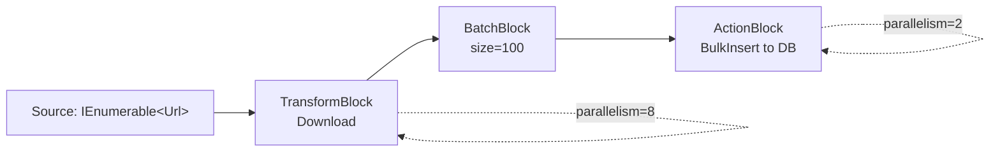

# Parallel and Dataflow

> **One-liner**: For **CPU-bound** loops use `Parallel.For/ForEach` (or PLINQ); for **async fan-out** use `Parallel.ForEachAsync` (.NET 6+); for complex **multi-stage pipelines** with backpressure use **TPL Dataflow** blocks.

---

## Quick Reference

| API | Use case |
|-----|----------|
| `Parallel.For` / `Parallel.ForEach` | CPU-bound loop over a known range/collection |
| `Parallel.ForEachAsync` (.NET 6+) | Async fan-out with `MaxDegreeOfParallelism` |
| `Parallel.Invoke` | Run a small set of independent actions in parallel |
| `PLINQ` (`AsParallel()`) | Parallel LINQ — declarative, partitions input |
| `Task.WhenAll(tasks)` | Many already-running tasks — no concurrency limit |
| **Dataflow** `ActionBlock<T>` | Concurrent consumer with bounded queue |
| **Dataflow** `TransformBlock<TIn,TOut>` | Stage that maps input to output |
| **Dataflow** `BroadcastBlock<T>` | Fan-out with at-most-one buffered |
| **Dataflow** `BatchBlock<T>` | Group N items before forwarding |
| **Dataflow** `BufferBlock<T>` | Queue with multiple consumers |

| Knob | Where |
|------|-------|
| `MaxDegreeOfParallelism` | `ParallelOptions`, `DataflowBlockOptions` |
| `BoundedCapacity` | Dataflow — backpressure |
| `EnsureOrdered` | Dataflow — preserve input order in output |
| `CancellationToken` | All of the above |

---

## Core Concept

`Parallel.For` partitions a range across `ThreadPool` threads and runs the body in parallel. It blocks the calling thread until done — so it's for CPU-bound work in **synchronous** code paths. PLINQ does the same for LINQ pipelines: `arr.AsParallel().Where(...).Select(...).ToArray()`.

For async, **don't** use `Parallel.ForEach(items, async i => await Foo(i))` — the lambda is `async void` to `Parallel.ForEach`, which fires-and-forgets. Use **`Parallel.ForEachAsync`** (.NET 6+) which understands `Task` and respects `MaxDegreeOfParallelism`.

**TPL Dataflow** is for graph-shaped processing — multi-stage pipelines, fan-out/fan-in, batching, with bounded queues between stages providing backpressure. It overlaps with Channels, but Dataflow's strength is **composing graphs** (a `TransformBlock` linked to an `ActionBlock` linked to a `BatchBlock`).

When in doubt: a list of work + a parallel function → `Parallel.ForEachAsync`. A multi-stage pipeline → Dataflow or Channels.

---

## Diagram



---

## Syntax & API

### Parallel.For
```csharp
double[] data = new double[1_000_000];
Parallel.For(0, data.Length, i =>
{
    data[i] = Math.Sqrt(i);
});
```

### Parallel.ForEach with options
```csharp
var opts = new ParallelOptions
{
    MaxDegreeOfParallelism = Environment.ProcessorCount,
    CancellationToken = ct,
};

Parallel.ForEach(items, opts, item => ProcessCpuBound(item));
```

### Parallel.ForEachAsync (.NET 6+)
```csharp
await Parallel.ForEachAsync(urls,
    new ParallelOptions { MaxDegreeOfParallelism = 8, CancellationToken = ct },
    async (url, token) =>
    {
        var html = await http.GetStringAsync(url, token);
        await SaveAsync(html, token);
    });
```

### Parallel.Invoke
```csharp
Parallel.Invoke(
    () => RebuildIndexA(),
    () => RebuildIndexB(),
    () => RebuildIndexC());
```

### PLINQ
```csharp
var primes = Enumerable.Range(2, 1_000_000)
    .AsParallel()
    .Where(IsPrime)
    .OrderBy(x => x)        // forces ordered partition
    .ToArray();
```

### Dataflow — single block
```csharp
var block = new ActionBlock<string>(
    async url => await DownloadAndStoreAsync(url),
    new ExecutionDataflowBlockOptions
    {
        MaxDegreeOfParallelism = 8,
        BoundedCapacity = 32,
    });

foreach (var u in urls) await block.SendAsync(u);
block.Complete();
await block.Completion;
```

### Dataflow — pipeline of blocks
```csharp
var download = new TransformBlock<string, string>(
    async url => await http.GetStringAsync(url),
    new ExecutionDataflowBlockOptions { MaxDegreeOfParallelism = 8, BoundedCapacity = 16 });

var batch = new BatchBlock<string>(100);

var insert = new ActionBlock<string[]>(
    async docs => await db.BulkInsertAsync(docs),
    new ExecutionDataflowBlockOptions { MaxDegreeOfParallelism = 2, BoundedCapacity = 4 });

var link = new DataflowLinkOptions { PropagateCompletion = true };
download.LinkTo(batch, link);
batch.LinkTo(insert, link);

foreach (var u in urls) await download.SendAsync(u);
download.Complete();
await insert.Completion;
```

### Dataflow — branching
```csharp
var success = new ActionBlock<Result>(SaveSuccess);
var failed  = new ActionBlock<Result>(SaveFailure);

processor.LinkTo(success, link, r => r.IsSuccess);
processor.LinkTo(failed,  link, r => !r.IsSuccess);
processor.LinkTo(DataflowBlock.NullTarget<Result>());   // catch-all
```

### Thread-safe aggregation
```csharp
long total = 0;
Parallel.ForEach(numbers,
    () => 0L,                              // local init
    (n, _, local) => local + n,            // local body
    local => Interlocked.Add(ref total, local)); // local final
```

### Cancellation
```csharp
using var cts = new CancellationTokenSource(TimeSpan.FromSeconds(10));
try
{
    await Parallel.ForEachAsync(items, new ParallelOptions { CancellationToken = cts.Token }, ...);
}
catch (OperationCanceledException) { /* timed out */ }
```

---

## Common Patterns

```csharp
// Pattern: bounded async fan-out with SemaphoreSlim
var sem = new SemaphoreSlim(8);
var tasks = items.Select(async item =>
{
    await sem.WaitAsync();
    try { await ProcessAsync(item); } finally { sem.Release(); }
});
await Task.WhenAll(tasks);
```

```csharp
// Pattern: race tasks — first to finish wins
var winning = await Task.WhenAny(t1, t2, t3);
foreach (var t in new[] { t1, t2, t3 }) if (t != winning) cts.Cancel();
```

```csharp
// Pattern: producer/consumer with Dataflow
var queue = new BufferBlock<int>(new DataflowBlockOptions { BoundedCapacity = 100 });
var consumer = new ActionBlock<int>(Process,
    new ExecutionDataflowBlockOptions { MaxDegreeOfParallelism = 4, BoundedCapacity = 50 });
queue.LinkTo(consumer, new DataflowLinkOptions { PropagateCompletion = true });
```

```csharp
// Pattern: PLINQ partition options for fairness
var result = source
    .AsParallel()
    .WithDegreeOfParallelism(4)
    .WithExecutionMode(ParallelExecutionMode.ForceParallelism)
    .Select(Heavy);
```

---

## Gotchas & Tips

- **`Parallel.ForEach` over async lambdas is wrong** — it returns before completion. Use `Parallel.ForEachAsync` for async work.
- **`Parallel.For` is for CPU work** — for I/O you over-subscribe the thread pool. Use async + `Parallel.ForEachAsync` or Dataflow.
- **PLINQ has overhead** — under ~10k items, sequential LINQ often wins. Always benchmark.
- **Order is not preserved by default** — both `Parallel.For` and PLINQ. Use `AsOrdered()` (PLINQ) or set `EnsureOrdered = true` (Dataflow) at perf cost.
- **Don't share mutable state in the body** — race conditions guaranteed. Use `Interlocked`, thread-local accumulators (`(local) =>` overload), or concurrent collections.
- **Exceptions in `Parallel.For`** are aggregated into `AggregateException`. `Parallel.ForEachAsync` rethrows the *first*; remaining tasks are cancelled.
- **`MaxDegreeOfParallelism = -1`** means unlimited — usually a footgun. Pick a sane number (`Environment.ProcessorCount`, or low single digits for I/O).
- **Dataflow blocks are not lightweight** — overkill for a single fan-out. Reach for it when you have ≥3 stages or branching.
- **Always `PropagateCompletion = true`** when linking — otherwise downstream blocks hang.
- **Cancellation flows in**, not out — Dataflow blocks expose `Completion` as a `Task` you can `await` to know when done.
- **`SemaphoreSlim` + `Task.WhenAll`** is the most flexible bounded async — no library, full control. Reach for it before Dataflow on simple fan-out.

---

## See Also

- [[07 - Threading and Concurrency]]
- [[06 - Async and Await]]
- [[09 - Channels and Pipelines]]
- [[06 - Performance Optimization]]
