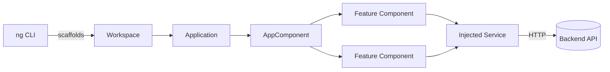

# Angular Overview

> **One-liner**: Angular is a full **framework** (not just a library) for building single-page apps — it ships components, dependency injection, routing, forms, HTTP, testing, and the CLI as one batteries-included package.

---

## Quick Reference

| Concept | What it is |
|---------|------------|
| **Angular** | Full SPA framework, built by Google, OSS since 2010 (AngularJS) / 2016 (Angular 2+) |
| **Component** | TypeScript class with a template + styles, marked with `@Component` |
| **Module** | Legacy grouping mechanism (`NgModule`); standalone components replace this |
| **Service** | Singleton class for shared logic, registered via DI |
| **DI** | Dependency injection — Angular's runtime wires services into components |
| **Signal** | Reactive primitive (Angular 16+) for synchronous derived state |
| **RxJS** | Observable library used for async streams (HTTP, router, websockets) |
| **CLI** | `ng new`, `ng generate`, `ng build`, `ng test` — the official toolchain |
| **Standalone** | Default since v19 — components import their own dependencies, no NgModule |

---

## Core Concept

**Angular is opinionated.** It picks the language (TypeScript), the build tool (Angular CLI / esbuild), the change-detection model, the router, the HTTP client, the test runner, and the dependency-injection system — and they all work together. Compared to React, where you assemble a stack, Angular hands you the stack.

You build with **components**: a TypeScript class decorated with `@Component({...})` that pairs an HTML template with styles. Components compose into a tree. Data flows down via inputs; events flow up via outputs. Anything not UI lives in a **service** — a class registered with the DI container and `inject()`-ed where needed.

For reactivity, modern Angular has **signals** (synchronous, glitch-free derived values, like spreadsheet cells) and **RxJS** (async streams — HTTP responses, router events). Use signals for local component state and derived values; reach for RxJS when you have multiple async events over time.

The framework has evolved aggressively in the last three releases: standalone components are now the default, the new control flow (`@if`, `@for`) replaces structural directives in templates, signal-based inputs/outputs are stable, and zoneless change detection is in developer preview. This vault assumes that modern surface.

---

## Diagram



---

## Syntax & API

### Hello World (Angular CLI)

```bash
npm install -g @angular/cli
ng new my-app --standalone --routing --style=scss
cd my-app
ng serve
```

### A standalone component

```ts
// src/app/hello.component.ts
import { Component } from '@angular/core';

@Component({
  selector: 'app-hello',
  standalone: true,
  template: `<h1>Hello, {{ name }}</h1>`,
  styles: [`h1 { color: steelblue; }`],
})
export class HelloComponent {
  name = 'Angular';
}
```

### Bootstrapping the app

```ts
// src/main.ts
import { bootstrapApplication } from '@angular/platform-browser';
import { HelloComponent } from './app/hello.component';

bootstrapApplication(HelloComponent);
```

---

## Common Patterns

```text
The Angular ecosystem at a glance:

Framework             → Angular (with CLI, router, forms, HTTP, animations built in)
Build tool            → Angular CLI (esbuild application builder since v17)
Language              → TypeScript (mandatory; `strict: true` recommended)
Reactivity            → Signals (sync) + RxJS (async)
State management      → Services + signals (default), NgRx for large apps
Forms                 → Reactive forms (FormGroup/FormControl) + Zod-style validators
Styling               → Component styles (encapsulated), Sass, Tailwind, Angular Material
UI primitives         → Angular CDK (overlays, a11y, drag-drop, virtual scroll)
UI library            → Angular Material (Material Design)
Testing               → Karma + Jasmine (default), Jest, Playwright for E2E
SSR                   → Angular SSR (formerly Universal) with hydration on by default
Monorepo              → Nx (most common) or Angular workspaces
```

---

## Gotchas & Tips

- **Angular ≠ AngularJS.** AngularJS (1.x) was a different framework released in 2010; Angular 2+ (2016) was a full rewrite. The two share little code or APIs.
- **Use standalone components.** `NgModule` still works but is legacy. Every example in this vault uses `standalone: true` (the default since v19).
- **Use the new control flow** (`@if`, `@for`, `@switch`) in templates. The old `*ngIf`, `*ngFor`, `*ngSwitch` still work but produce smaller bundles and better type inference with the new syntax.
- **Prefer `inject()` over constructor parameter injection** in modern code — it's required for functional guards/interceptors and reads cleaner.
- **Don't subscribe by hand if you can avoid it.** Use the `async` pipe in templates and `toSignal()` in classes — both auto-unsubscribe.
- **The CLI is your friend.** `ng generate component foo` writes the boilerplate consistently — never hand-write a component file.

---

## See Also

- [[02 - TypeScript for Angular]]
- [[03 - Components and Templates]]
- [[08 - Modules and Standalone Components]]
- [[01 - Signals]]
- [[01 - Angular Internals]]
