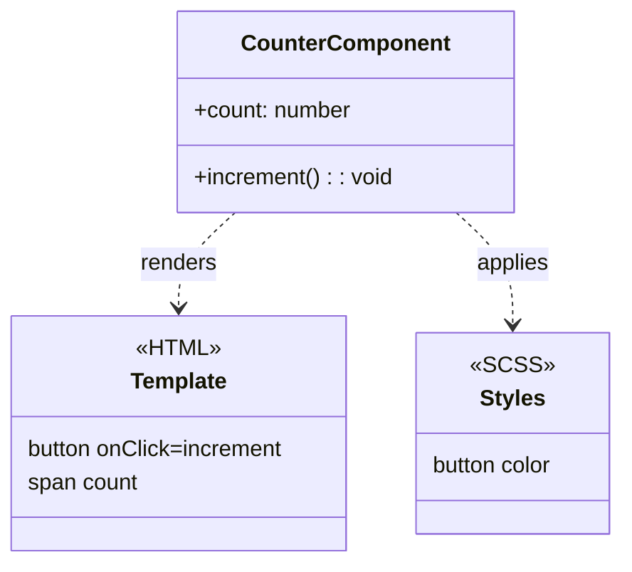

# Components and Templates

> **One-liner**: A component is a TypeScript class decorated with `@Component({...})` that pairs an HTML template with optional styles — the template is rendered in the DOM wherever the component's selector appears.

---

## Quick Reference

| Field | Purpose |
|-------|---------|
| `selector` | CSS selector that triggers the component (`app-foo`) |
| `template` / `templateUrl` | Inline HTML or path to `.html` file |
| `styles` / `styleUrls` | Inline CSS or paths to style files |
| `standalone: true` | Default since v19 — no NgModule needed |
| `imports` | Other components, directives, pipes used in the template |
| `host` | Bindings on the component's host element |
| `encapsulation` | `Emulated` (default), `ShadowDom`, or `None` |
| `changeDetection` | `Default` or `OnPush` |

---

## Core Concept

Every visible piece of an Angular app is a **component**. A component is just a class — Angular treats it specially because of the `@Component` decorator that attaches a template, styles, and metadata.

The **selector** decides where the template is rendered. If your selector is `app-counter`, then anywhere `<app-counter></app-counter>` appears in the DOM, Angular instantiates the class and renders its template into that element.

**Style scoping is automatic.** Angular gives each component's styles a unique attribute selector (`[_ngcontent-foo-1]`) so they don't leak. This is `ViewEncapsulation.Emulated` — the default. You can opt out (`None`) or in to real Shadow DOM (`ShadowDom`), but emulation is right 95% of the time.

Modern templates use the **new built-in control flow** (`@if`, `@for`, `@switch`) rather than the legacy structural directives. They're faster, smaller, and have stricter type narrowing.

---

## Diagram



---

## Syntax & API

### Inline component (everything in one file)

```ts
import { Component } from '@angular/core';

@Component({
  selector: 'app-counter',
  standalone: true,
  template: `
    <button (click)="increment()">+</button>
    <span>{{ count }}</span>
  `,
  styles: [`
    button { padding: 0.25rem 0.75rem; }
    span   { margin-left: 0.5rem; }
  `],
})
export class CounterComponent {
  count = 0;
  increment() { this.count++; }
}
```

### External template + styles

```ts
@Component({
  selector: 'app-counter',
  standalone: true,
  templateUrl: './counter.component.html',
  styleUrls: ['./counter.component.scss'],
})
export class CounterComponent { /* ... */ }
```

### Importing other components into a template

```ts
import { ButtonComponent } from './button.component';

@Component({
  selector: 'app-page',
  standalone: true,
  imports: [ButtonComponent],
  template: `<app-button>Click me</app-button>`,
})
export class PageComponent {}
```

### Host bindings

```ts
@Component({
  selector: 'app-card',
  standalone: true,
  template: `<ng-content />`,
  host: {
    'class': 'card',
    '[class.elevated]': 'elevated',
    '(click)': 'onClick()',
  },
})
export class CardComponent {
  elevated = true;
  onClick() { /* ... */ }
}
```

---

## Common Patterns

```ts
// Pattern: presentational component with OnPush + signals
import { ChangeDetectionStrategy, Component, input } from '@angular/core';

@Component({
  selector: 'app-badge',
  standalone: true,
  changeDetection: ChangeDetectionStrategy.OnPush,
  template: `<span [class]="'badge badge-' + variant()">{{ label() }}</span>`,
})
export class BadgeComponent {
  label = input.required<string>();
  variant = input<'success' | 'warn' | 'error'>('success');
}
```

```bash
# Pattern: scaffold with the CLI (writes class + template + styles + spec)
ng generate component features/counter --change-detection=OnPush
```

---

## Gotchas & Tips

- **Default `changeDetection: OnPush`** for new components — it's free performance and surfaces bugs early. Combined with signals, it's the recommended modern style.
- **Selector naming convention**: hyphenated and prefixed (`app-foo`, `feature-bar`). The CLI prefix comes from `angular.json`.
- **Inline templates over external for short ones (<20 lines)** — fewer files to jump between.
- **Styles are scoped, but global stylesheets are not.** Anything in `src/styles.scss` (or whatever you import in `angular.json`) is global.
- **`ViewEncapsulation.None` leaks styles.** Use it deliberately (e.g., for global theming) — never as a "fix" for "my styles aren't applying."
- **Component fields default to `public`.** Use `protected` for fields the template needs but external code shouldn't, and `private` for everything else.

---

## See Also

- [[04 - Data Binding]]
- [[05 - Directives]]
- [[09 - Component Communication]]
- [[10 - Lifecycle Hooks]]
- [[13 - Change Detection]]
