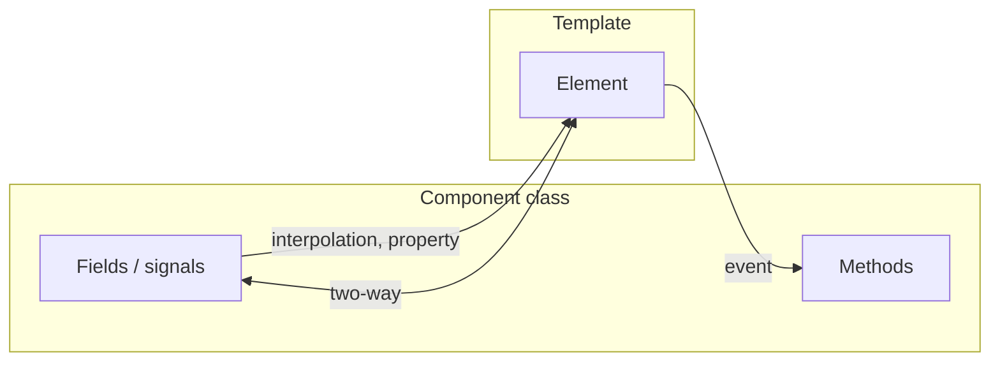

# Data Binding

> **One-liner**: Angular has four binding kinds — interpolation `{{ }}`, property `[x]`, event `(x)`, and two-way `[(x)]` — that connect your template to your component class.

---

## Quick Reference

| Kind | Syntax | Direction | Example |
|------|--------|-----------|---------|
| Interpolation | `{{ expr }}` | class → DOM (text) | `<h1>{{ title }}</h1>` |
| Property | `[prop]="expr"` | class → DOM (property) | `` |
| Attribute | `[attr.x]="expr"` | class → DOM (HTML attr) | `<td [attr.colspan]="span">` |
| Class | `[class.x]="expr"` | conditional class | `<div [class.active]="isActive">` |
| Style | `[style.x]="expr"` | conditional style | `<div [style.width.px]="w">` |
| Event | `(event)="handler($event)"` | DOM → class | `<button (click)="save()">` |
| Two-way | `[(prop)]="value"` | bidirectional | `<input [(ngModel)]="name">` |

---

## Core Concept

A binding is a **directional pipe** between your component class and the rendered DOM. Most apps use exactly four kinds:

- **Interpolation** (`{{ }}`) inserts a value as text. Good for visible content.
- **Property binding** (`[prop]`) sets a DOM **property** (not attribute) — `[src]`, `[disabled]`, `[hidden]`, `[value]`. Anything reactive lives here.
- **Event binding** (`(event)`) listens for a DOM event and runs a method. The event object is `$event`.
- **Two-way binding** (`[(x)]`) is sugar for `[x]="value"` + `(xChange)="value = $event"` — works with `ngModel` and any custom input that follows the pattern.

The distinction between **attribute** and **property** matters: HTML attributes are the static markup; DOM properties are the live JavaScript values. `[disabled]="false"` removes the attribute; `disabled="false"` (a string!) keeps it. Use `[attr.x]` only for true attributes (ARIA, `colspan`, `data-*`).

---

## Diagram



---

## Syntax & API

### Interpolation

```html
<h1>{{ title }}</h1>
<p>Total: {{ price * quantity | currency }}</p>
<p>Hello, {{ user?.name ?? 'Guest' }}</p>
```

### Property binding

```html

<button [disabled]="!form.valid">Submit</button>
<input [value]="initial" />
```

### Attribute, class, style binding

```html
<td [attr.colspan]="span" [attr.aria-label]="label"></td>

<div [class.active]="isActive" [class.disabled]="isDisabled"></div>
<div [class]="{ active: isActive, disabled: isDisabled }"></div>

<div [style.width.px]="width" [style.color]="textColor"></div>
```

### Event binding

```html
<button (click)="save()">Save</button>
<input (input)="onInput($event)" />
<form (submit)="onSubmit($event)"></form>
<a (click)="$event.preventDefault(); navigate()">Link</a>
```

```ts
onInput(e: Event) {
  const value = (e.target as HTMLInputElement).value;
  // ...
}
```

### Two-way binding

```ts
import { FormsModule } from '@angular/forms';

@Component({
  standalone: true,
  imports: [FormsModule],
  template: `<input [(ngModel)]="name" /><p>Hello, {{ name }}</p>`,
})
export class GreetingComponent {
  name = '';
}
```

### Two-way on a custom component (signal model)

```ts
import { Component, model } from '@angular/core';

@Component({
  selector: 'app-toggle',
  standalone: true,
  template: `<button (click)="checked.set(!checked())">{{ checked() ? 'On' : 'Off' }}</button>`,
})
export class ToggleComponent {
  checked = model(false); // becomes [(checked)] on the parent
}
```

```html
<!-- Parent uses it -->
<app-toggle [(checked)]="enabled" />
```

---

## Common Patterns

```html
<!-- Pattern: conditional disabled / aria-* -->
<button [disabled]="loading" [attr.aria-busy]="loading">Submit</button>

<!-- Pattern: bind to template reference variable -->
<input #email type="email" />
<button (click)="send(email.value)">Send</button>

<!-- Pattern: template reference + ngModel together -->
<input #ctl="ngModel" [(ngModel)]="email" required email />
<p *ngIf="ctl.invalid && ctl.touched">Invalid email</p>
```

---

## Gotchas & Tips

- **Property vs attribute confusion is the #1 binding bug.** `<input value="abc">` (attribute) sets the *initial* value once. `<input [value]="abc">` (property) updates it reactively. Use property bindings for anything that changes.
- **`[hidden]` is not the same as `*ngIf` / `@if`.** `hidden` toggles a CSS rule (the element stays in the DOM). `@if` adds/removes the element entirely.
- **Don't run heavy logic in templates.** `{{ expensiveCompute() }}` runs on every change-detection tick. Compute it in the class (use a `computed` signal if reactive).
- **`$event` is typed as the DOM event by default**, but TS doesn't know which kind. Cast `e.target` to the expected element type, or use template ref vars (`#input` then `input.value`).
- **Two-way binding works on any output named `<prop>Change`** — `[(value)]="x"` is sugar for `[value]="x"` + `(valueChange)="x = $event"`. The `model()` signal helper sets this up automatically.
- **Interpolation is HTML-escaped.** It's safe by default — Angular sanitizes. Use `[innerHTML]` only with trusted content (and consider `DomSanitizer`).

---

## See Also

- [[03 - Components and Templates]]
- [[05 - Directives]]
- [[09 - Component Communication]]
- [[06 - Template-Driven Forms]]
