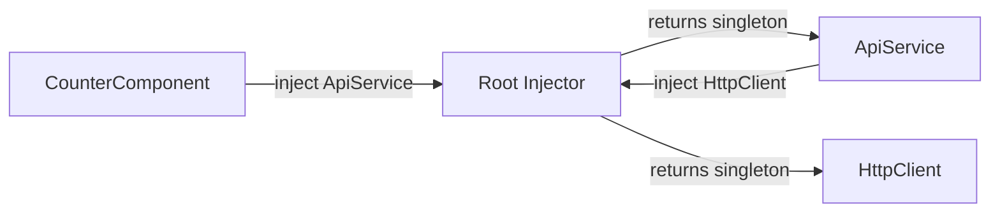

# Services and DI Basics

> **One-liner**: A service is a plain TypeScript class registered with Angular's dependency-injection container — components use `inject()` to get an instance, so business logic stays out of components.

---

## Quick Reference

| Concept | Syntax |
|---------|--------|
| Mark a class as injectable | `@Injectable({ providedIn: 'root' })` |
| Inject in modern code | `private api = inject(ApiService)` |
| Inject via constructor (legacy) | `constructor(private api: ApiService)` |
| App-wide singleton | `providedIn: 'root'` |
| Component-scoped instance | `providers: [Service]` on `@Component` |
| Route-scoped instance | `providers` on a `Route` |
| Provide a value | `{ provide: TOKEN, useValue: 42 }` |
| Provide a class alias | `{ provide: Logger, useClass: ConsoleLogger }` |
| Provide a factory | `{ provide: Foo, useFactory: () => new Foo() }` |

---

## Core Concept

A **service** is a class you write to hold business logic that doesn't belong in a component — HTTP calls, app state, validation, formatting, anything reusable. The decorator `@Injectable({ providedIn: 'root' })` tells Angular two things:

1. *This class can be injected* (Angular generates the metadata to inspect its constructor).
2. *Use a single instance app-wide* (provided in the root injector).

When a component (or another service) needs the service, it asks the **injector** for it. With modern code, you call `inject(ApiService)` inside a property initializer. Angular looks up the service in the injector tree, and if it doesn't exist, instantiates it (lazily — services are only created when first requested).

DI matters because it **decouples consumers from creation**. The component doesn't care how `ApiService` is built — it just asks for it. That makes testing trivial: provide a mock service in the test, and the component receives the mock with no code change.

---

## Diagram



---

## Syntax & API

### Defining a service

```ts
import { Injectable, inject } from '@angular/core';
import { HttpClient } from '@angular/common/http';
import { Observable } from 'rxjs';

export interface User { id: number; name: string; }

@Injectable({ providedIn: 'root' })
export class UserService {
  private http = inject(HttpClient);

  getAll(): Observable<User[]> {
    return this.http.get<User[]>('/api/users');
  }
}
```

### Injecting into a component

```ts
import { Component, inject, signal } from '@angular/core';
import { UserService } from './user.service';

@Component({
  selector: 'app-user-list',
  standalone: true,
  template: `<p>{{ users().length }} users</p>`,
})
export class UserListComponent {
  private users$ = inject(UserService);
  users = signal<User[]>([]);

  ngOnInit() {
    this.users$.getAll().subscribe(u => this.users.set(u));
  }
}
```

### Constructor injection (still valid, but inject() is preferred)

```ts
@Injectable({ providedIn: 'root' })
export class OrderService {
  constructor(private http: HttpClient, private users: UserService) {}
}
```

### Component-scoped service (one per component instance)

```ts
@Component({
  selector: 'app-cart',
  standalone: true,
  providers: [CartService], // new instance per <app-cart>
  template: `...`,
})
export class CartComponent {}
```

### Provider recipes

```ts
import { InjectionToken } from '@angular/core';

export const API_BASE_URL = new InjectionToken<string>('API_BASE_URL');

bootstrapApplication(AppComponent, {
  providers: [
    { provide: API_BASE_URL, useValue: 'https://api.example.com' },
    { provide: Logger, useClass: ConsoleLogger },
    { provide: Cache, useFactory: () => new LruCache(100) },
  ],
});

// Consume the token
@Injectable({ providedIn: 'root' })
export class ApiService {
  private url = inject(API_BASE_URL);
}
```

---

## Common Patterns

```ts
// Pattern: stateful service exposing signals
import { Injectable, signal, computed } from '@angular/core';

@Injectable({ providedIn: 'root' })
export class AuthService {
  private _user = signal<User | null>(null);
  user = this._user.asReadonly();
  isLoggedIn = computed(() => this._user() !== null);

  setUser(u: User) { this._user.set(u); }
  logout()         { this._user.set(null); }
}
```

```ts
// Pattern: facade service that hides RxJS from components
@Injectable({ providedIn: 'root' })
export class ProductsFacade {
  private api = inject(ProductsApi);
  products = toSignal(this.api.list(), { initialValue: [] as Product[] });
}
```

---

## Gotchas & Tips

- **Default to `providedIn: 'root'`.** It's tree-shakable: if no component injects the service, it's removed from the bundle.
- **`inject()` only works in injection contexts** — class field initializers, constructors, and within `runInInjectionContext()`. It does *not* work inside arbitrary methods or callbacks.
- **Don't `new` a service yourself.** Always go through the injector — otherwise you bypass DI and break testing.
- **Component-scoped providers** create a new instance per component (and per child). Useful for forms, view-models, or features that need isolation.
- **Circular dependencies** between services usually mean your design is wrong — extract a third service that both depend on.
- **Use `InjectionToken<T>` for non-class values** (config strings, base URLs, options). Don't use class names for non-class data.

---

## See Also

- [[12 - Dependency Injection Deep Dive]]
- [[04 - HttpClient]]
- [[01 - Signals]]
- [[10 - Lifecycle Hooks]]
