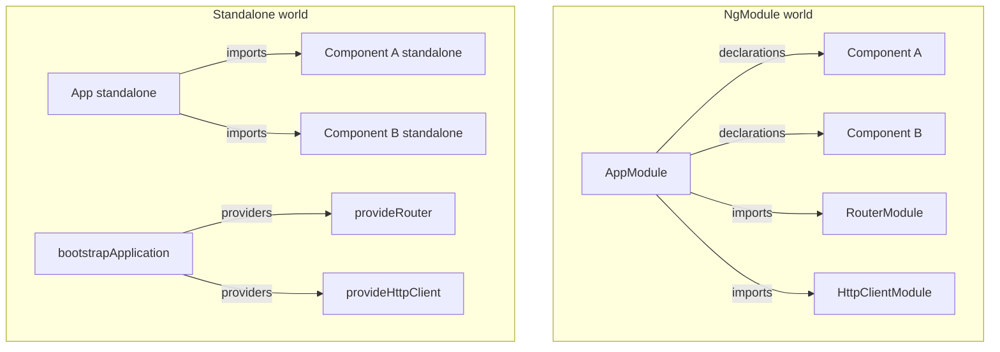

# Modules and Standalone Components

> **One-liner**: Modern Angular uses **standalone components** that import their own dependencies — `NgModule` is legacy and only appears in pre-v17 codebases.

---

## Quick Reference

| Concept | Standalone (modern) | NgModule (legacy) |
|---------|---------------------|-------------------|
| Mark component | `standalone: true` (default in v19+) | declared in a module's `declarations` |
| Import deps | `imports: [...]` on `@Component` | `imports` on `@NgModule` |
| Bootstrap | `bootstrapApplication(AppComponent, { providers })` | `platformBrowserDynamic().bootstrapModule(AppModule)` |
| Routes | `provideRouter(routes)` in providers | `RouterModule.forRoot(routes)` |
| HTTP | `provideHttpClient()` | `HttpClientModule` |
| Animations | `provideAnimations()` / `provideAnimationsAsync()` | `BrowserAnimationsModule` |
| Lazy | `loadComponent: () => import(...)` | `loadChildren: () => import(...).then(m => m.X)` |

---

## Core Concept

For most of Angular's history, every component, directive, and pipe had to be declared inside an **NgModule** — a class with `@NgModule({ declarations, imports, providers, exports })`. Modules were also where you grouped routing, registered HTTP, and shared providers.

In v14 Angular introduced **standalone components**: a component marks itself `standalone: true` and lists its template dependencies directly in its own `imports` array. No module required. In v19, standalone became the default.

The trade-off the old NgModule system tried to solve — "how do I share a set of components/directives/pipes across many places?" — is now handled by **plain ES modules**: you just `import` what you need.

For app setup, NgModules are replaced by **`provideX()` functions** (`provideRouter`, `provideHttpClient`, `provideAnimations`). They're tree-shakable, composable, and explicit.

---

## Diagram



---

## Syntax & API

### Bootstrapping a standalone app

```ts
// src/main.ts
import { bootstrapApplication } from '@angular/platform-browser';
import { provideRouter } from '@angular/router';
import { provideHttpClient, withFetch } from '@angular/common/http';
import { provideAnimationsAsync } from '@angular/platform-browser/animations/async';

import { AppComponent } from './app/app.component';
import { routes } from './app/app.routes';

bootstrapApplication(AppComponent, {
  providers: [
    provideRouter(routes),
    provideHttpClient(withFetch()),
    provideAnimationsAsync(),
  ],
}).catch(err => console.error(err));
```

### A standalone component importing dependencies

```ts
import { Component } from '@angular/core';
import { RouterLink } from '@angular/router';
import { CurrencyPipe } from '@angular/common';

import { ButtonComponent } from './button.component';

@Component({
  selector: 'app-product-card',
  standalone: true,
  imports: [RouterLink, CurrencyPipe, ButtonComponent],
  template: `
    <h3>{{ name }}</h3>
    <p>{{ price | currency }}</p>
    <a [routerLink]="['/products', id]">Details</a>
    <app-button (click)="add.emit()">Add to cart</app-button>
  `,
})
export class ProductCardComponent { /* ... */ }
```

### Lazy-loaded standalone routes

```ts
// app.routes.ts
import { Routes } from '@angular/router';

export const routes: Routes = [
  { path: '', loadComponent: () => import('./home/home.component').then(m => m.HomeComponent) },
  { path: 'admin', loadChildren: () => import('./admin/admin.routes').then(m => m.adminRoutes) },
];
```

### Legacy NgModule (for reference)

```ts
// Pre-v14 style — only when migrating
@NgModule({
  declarations: [AppComponent, NavComponent],
  imports: [BrowserModule, HttpClientModule, RouterModule.forRoot(routes)],
  providers: [],
  bootstrap: [AppComponent],
})
export class AppModule {}
```

---

## Common Patterns

```ts
// Pattern: feature directory exposes a routes array, lazy-loaded
// admin/admin.routes.ts
import { Routes } from '@angular/router';

export const adminRoutes: Routes = [
  {
    path: '',
    loadComponent: () => import('./shell/admin-shell.component').then(m => m.AdminShellComponent),
    children: [
      { path: 'users', loadComponent: () => import('./users/users.component').then(m => m.UsersComponent) },
      { path: 'roles', loadComponent: () => import('./roles/roles.component').then(m => m.RolesComponent) },
    ],
  },
];
```

```ts
// Pattern: a "shared imports" array for components that always need the same trio
// shared/common-imports.ts
import { CommonModule } from '@angular/common';
import { ReactiveFormsModule } from '@angular/forms';
import { RouterLink } from '@angular/router';

export const COMMON_IMPORTS = [CommonModule, ReactiveFormsModule, RouterLink] as const;

// Use it in a component:
@Component({
  standalone: true,
  imports: [...COMMON_IMPORTS, MyChildComponent],
  template: `...`,
})
```

---

## Gotchas & Tips

- **`standalone: true` is the default in v19+.** You can omit it. In v17–v18 you must add it explicitly.
- **Legacy `CommonModule`** exposes `NgIf`, `NgFor`, `NgSwitch`, `*ngClass`, etc. With the new control flow (`@if`, `@for`) you usually don't need it.
- **Don't import an `NgModule` from a standalone component unless you have to.** Some old libraries (e.g. older Material APIs) still expose modules — that's fine, the `imports` array accepts both.
- **Lazy loading** with standalone uses `loadComponent` (single component) or `loadChildren` returning a `Routes` array — no module needed.
- **`provideX()` functions are tree-shakable.** Only the features you use are bundled. The legacy `XModule` imports often pulled in everything.
- **Angular Material 15+** is fully standalone. Don't use the legacy `MatXxxModule` imports — import the components directly.

---

## See Also

- [[01 - Angular Overview]]
- [[03 - Components and Templates]]
- [[03 - Standalone Migration]]
- [[09 - Routing Basics]]
- [[11 - Lazy Loading]]
