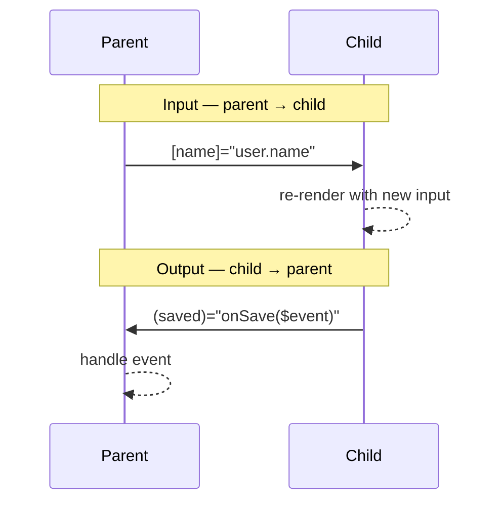

# Component Communication

> **One-liner**: Parents pass data down via **inputs** and listen for events via **outputs** — modern Angular has signal-based `input()` / `output()` / `model()` that replace decorator-based `@Input()` / `@Output()`.

---

## Quick Reference

| API | What it is | Example |
|-----|-----------|---------|
| `@Input()` | Decorator-based input (legacy) | `@Input() name = ''` |
| `@Input({ required: true })` | Required input | `@Input({ required: true }) id!: string` |
| `input<T>(default)` | Signal input | `name = input('')` |
| `input.required<T>()` | Required signal input | `id = input.required<string>()` |
| `@Output()` | Decorator output (legacy) | `@Output() saved = new EventEmitter<User>()` |
| `output<T>()` | Signal output | `saved = output<User>()` |
| `model<T>()` | Two-way bindable signal | `value = model('')` (parent: `[(value)]`) |
| Template ref | Local handle on a child | `<child #c />` then `c.method()` |
| `viewChild()` | Programmatic child reference | `child = viewChild(ChildComp)` |

---

## Core Concept

Angular's component communication has two directions and two surfaces:

- **Down the tree (parent → child): inputs.** A child declares an input; the parent binds a value to it via `[propName]="value"`. The child re-renders when the input changes.
- **Up the tree (child → parent): outputs.** A child declares an output (an event source); the parent listens with `(eventName)="handler($event)"`. Outputs don't carry data after the event — the child *emits*, the parent reacts.
- **Two-way binding** (`[(propName)]="x"`) is sugar for an input named `propName` plus an output named `propNameChange`. The `model()` helper sets this up automatically.

For data that doesn't fit parent-child (siblings, ancestors three levels up, app-wide state), don't pass it through every layer — use a **service** (see [[07 - Services and DI Basics]]).

The signal-based APIs (`input()`, `output()`, `model()`) are stable in v19 and the recommended style — they integrate cleanly with `computed()`, `effect()`, and `OnPush` change detection.

---

## Diagram



---

## Syntax & API

### Signal inputs (modern)

```ts
import { Component, input } from '@angular/core';

@Component({
  selector: 'app-greeting',
  standalone: true,
  template: `<p>Hello, {{ name() }} ({{ age() }})</p>`,
})
export class GreetingComponent {
  name = input.required<string>();
  age  = input(0); // optional with default
  // alias if the public name should differ
  // userId = input.required<number>({ alias: 'id' });
}
```

```html
<!-- Parent -->
<app-greeting [name]="user.name" [age]="user.age" />
```

### Decorator inputs (legacy, still common)

```ts
import { Component, Input } from '@angular/core';

@Component({ /* ... */ })
export class GreetingComponent {
  @Input({ required: true }) name!: string;
  @Input() age = 0;
}
```

### Signal outputs

```ts
import { Component, output } from '@angular/core';

@Component({
  selector: 'app-counter',
  standalone: true,
  template: `<button (click)="bump()">+</button>`,
})
export class CounterComponent {
  changed = output<number>();
  private n = 0;
  bump() { this.n++; this.changed.emit(this.n); }
}
```

```html
<app-counter (changed)="onChanged($event)" />
```

### Decorator outputs (legacy)

```ts
import { Component, Output, EventEmitter } from '@angular/core';

@Component({ /* ... */ })
export class CounterComponent {
  @Output() changed = new EventEmitter<number>();
}
```

### Two-way binding with `model()`

```ts
import { Component, model } from '@angular/core';

@Component({
  selector: 'app-toggle',
  standalone: true,
  template: `<button (click)="toggle()">{{ checked() ? 'On' : 'Off' }}</button>`,
})
export class ToggleComponent {
  checked = model(false);
  toggle() { this.checked.set(!this.checked()); }
}
```

```html
<app-toggle [(checked)]="enabled" />
```

### `viewChild()` / `@ViewChild()`

```ts
import { Component, viewChild } from '@angular/core';
import { ChildComponent } from './child.component';

@Component({
  standalone: true,
  imports: [ChildComponent],
  template: `<app-child /> <button (click)="ping()">Ping child</button>`,
})
export class ParentComponent {
  child = viewChild.required(ChildComponent);
  ping() { this.child().sayHi(); }
}
```

---

## Common Patterns

```ts
// Pattern: derive a computed from an input
@Component({ /* ... */ template: `<p>{{ initials() }}</p>` })
export class AvatarComponent {
  name = input.required<string>();
  initials = computed(() => this.name().split(' ').map(p => p[0]).join('').toUpperCase());
}
```

```ts
// Pattern: react to input changes with effect()
@Component({ /* ... */ })
export class SearchBoxComponent {
  query = input('');

  constructor() {
    effect(() => {
      const q = this.query();
      if (q.length > 2) this.fetchSuggestions(q);
    });
  }
}
```

---

## Gotchas & Tips

- **Signal inputs are read-only in the child.** Call them like a function: `this.name()`. To emit changes, use `output()` or `model()`.
- **`@Input()` without an initializer needs `!`** (`@Input() name!: string`) under `strictPropertyInitialization` — or mark it `required: true` and use the bang.
- **Don't mutate inputs.** They flow one-way. Mutating `this.user.name = 'x'` is hidden parent-state mutation; emit an output instead.
- **`@Output() x = new EventEmitter()` re-creates per instance** — don't share. Signal `output()` does the same automatically.
- **`model()` is for inputs that the child also writes to** (toggles, sliders). If the child only reads, use `input()`. If the child only emits, use `output()`.
- **Sibling communication** doesn't go through inputs/outputs — use a service. Inputs/outputs across more than 2 levels of nesting is a smell ("prop drilling") — lift to a service or component-scoped provider.

---

## See Also

- [[03 - Components and Templates]]
- [[04 - Data Binding]]
- [[01 - Signals]]
- [[15 - View and Content Queries]]
