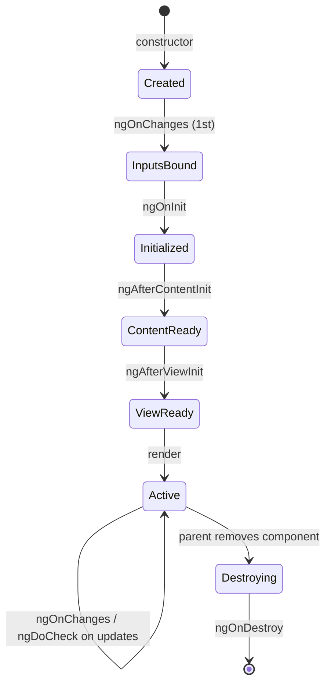

# Lifecycle Hooks

> **One-liner**: Lifecycle hooks are methods Angular calls at known points in a component's life — `ngOnInit` after the first input pass, `ngOnDestroy` before removal — and you implement only the ones you need.

---

## Quick Reference

| Hook | When it fires | Common use |
|------|--------------|------------|
| `ngOnChanges(changes)` | Before `ngOnInit` and on every input change | React to input changes (legacy; prefer `effect()` on signal inputs) |
| `ngOnInit()` | After first `ngOnChanges` | One-time initialization with input values |
| `ngDoCheck()` | Every CD cycle | Custom change detection (rare) |
| `ngAfterContentInit()` | After projected content is initialized | Use `@ContentChild` results |
| `ngAfterContentChecked()` | After every content CD | Rarely needed |
| `ngAfterViewInit()` | After view + child views initialized | Use `@ViewChild`, measure DOM |
| `ngAfterViewChecked()` | After every view CD | Rarely needed |
| `ngOnDestroy()` | Just before removal | Clean up subscriptions, timers |

---

## Core Concept

Angular controls when components are created, when their inputs are bound, when their views render, and when they're removed. **Hooks** are methods you implement on the class that Angular calls at those moments.

In modern code, the two you'll touch 95% of the time are:

- **`ngOnInit`**: a single async-friendly entry point for "the inputs are bound, do my setup."
- **`ngOnDestroy`**: clean up — unsubscribe from manual subscriptions, clear timers, detach event listeners.

The other six are mostly historical. With **signal inputs and `effect()`**, you don't need `ngOnChanges` — `effect()` runs whenever the signal it reads changes. With `viewChild()` (signal-based), you don't need `ngAfterViewInit` to wait for the child — you read it lazily inside an effect.

Modern code also has **`takeUntilDestroyed()`** from `@angular/core/rxjs-interop`, which auto-unsubscribes when the component is destroyed without writing `ngOnDestroy`.

---

## Diagram



---

## Syntax & API

### Implementing the interfaces

```ts
import { Component, OnInit, OnDestroy, inject, signal } from '@angular/core';
import { Subscription } from 'rxjs';
import { TickerService } from './ticker.service';

@Component({
  selector: 'app-clock',
  standalone: true,
  template: `<p>{{ now() }}</p>`,
})
export class ClockComponent implements OnInit, OnDestroy {
  private ticker = inject(TickerService);
  now = signal(new Date());
  private sub?: Subscription;

  ngOnInit() {
    this.sub = this.ticker.everySecond$.subscribe(() => this.now.set(new Date()));
  }

  ngOnDestroy() {
    this.sub?.unsubscribe();
  }
}
```

### Modern: `takeUntilDestroyed()`

```ts
import { Component, DestroyRef, inject, signal } from '@angular/core';
import { takeUntilDestroyed } from '@angular/core/rxjs-interop';

@Component({ /* ... */ })
export class ClockComponent {
  private ticker = inject(TickerService);
  now = signal(new Date());

  constructor() {
    this.ticker.everySecond$
      .pipe(takeUntilDestroyed())
      .subscribe(() => this.now.set(new Date()));
  }
}
```

### `ngOnChanges` with decorator inputs

```ts
import { Component, Input, OnChanges, SimpleChanges } from '@angular/core';

@Component({ /* ... */ })
export class ChartComponent implements OnChanges {
  @Input() data: Point[] = [];

  ngOnChanges(changes: SimpleChanges) {
    if (changes['data']) {
      this.redraw();
    }
  }
}
```

### Modern equivalent with signal inputs + `effect()`

```ts
import { Component, input, effect } from '@angular/core';

@Component({ /* ... */ })
export class ChartComponent {
  data = input<Point[]>([]);

  constructor() {
    effect(() => {
      this.redraw(this.data());
    });
  }

  private redraw(data: Point[]) { /* ... */ }
}
```

### `ngAfterViewInit` for DOM measurement

```ts
import { Component, ElementRef, AfterViewInit, viewChild } from '@angular/core';

@Component({
  standalone: true,
  template: `<canvas #c></canvas>`,
})
export class CanvasComponent implements AfterViewInit {
  canvas = viewChild.required<ElementRef<HTMLCanvasElement>>('c');

  ngAfterViewInit() {
    const ctx = this.canvas().nativeElement.getContext('2d')!;
    ctx.fillRect(0, 0, 100, 100);
  }
}
```

---

## Common Patterns

```ts
// Pattern: cleanup with DestroyRef.onDestroy
import { Component, DestroyRef, inject } from '@angular/core';

@Component({ /* ... */ })
export class WidgetComponent {
  constructor() {
    const id = setInterval(() => console.log('tick'), 1000);
    inject(DestroyRef).onDestroy(() => clearInterval(id));
  }
}
```

```ts
// Pattern: `toSignal` skips manual subscribe/unsubscribe entirely
import { toSignal } from '@angular/core/rxjs-interop';

@Component({ /* ... */ })
export class UsersComponent {
  private api = inject(UsersService);
  users = toSignal(this.api.list(), { initialValue: [] as User[] });
}
```

---

## Gotchas & Tips

- **Don't fetch data in `constructor`.** Inputs aren't bound yet. Use `ngOnInit` (or, for signal inputs, an `effect()`).
- **`ngOnInit` runs once.** Even if inputs change later, `ngOnInit` doesn't re-fire — use `ngOnChanges` or `effect()` for that.
- **Manual subscriptions leak by default.** Pair every `subscribe()` with `unsubscribe()` in `ngOnDestroy`, or use `takeUntilDestroyed()` / `async` pipe.
- **Avoid `ngDoCheck` and `ngAfterViewChecked`.** They run constantly. If you reach for them, there's almost always a better solution (signals, OnPush, `viewChild()`).
- **`ngOnDestroy` runs synchronously.** Don't `await` inside it — return immediately. If you must wait, fire and forget.
- **Hook order**: `OnChanges → OnInit → DoCheck → AfterContentInit → AfterContentChecked → AfterViewInit → AfterViewChecked → OnDestroy`. Memorize the input/content/view order if you ever need an obscure hook.

---

## See Also

- [[09 - Component Communication]]
- [[15 - View and Content Queries]]
- [[01 - Signals]]
- [[02 - RxJS Fundamentals]]
- [[13 - Change Detection]]
