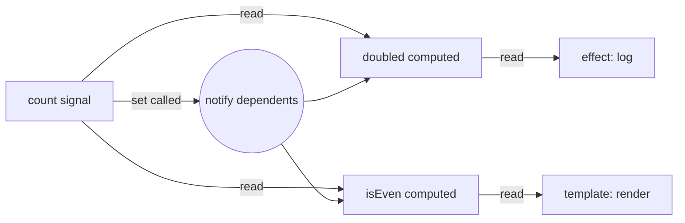

# Signals

> **One-liner**: A signal is a reactive value with a current state and dependents — read it as `count()`, write it with `set` / `update`, and Angular tracks who needs to re-run automatically.

---

## Quick Reference

| API | Purpose |
|-----|---------|
| `signal(initial)` | Writable signal |
| `signal(initial, { equal })` | Writable with custom equality |
| `signal.asReadonly()` | Read-only view |
| `computed(() => …)` | Derived signal — auto-tracks deps |
| `effect(() => …)` | Side-effect that re-runs when its reads change |
| `untracked(() => …)` | Read inside a reactive context without subscribing |
| `input()` / `model()` | Signal-based component inputs |
| `viewChild()` / `contentChild()` | Signal-based queries |
| `toSignal(obs$)` | Bridge: Observable → Signal |
| `toObservable(sig)` | Bridge: Signal → Observable |

---

## Core Concept

A **signal** is a value plus a list of dependents. Reading `count()` registers your reader as a dependent; writing `count.set(5)` notifies them all. The runtime guarantees:

- **Glitch-free**: a `computed` only re-runs after *all* its inputs settle, never with a stale mix.
- **Lazy**: `computed` doesn't run until something reads it.
- **Synchronous**: reads return the current value immediately. No subscriptions, no callback ceremony.

Compared to **RxJS**, signals are like spreadsheet cells — synchronous derived values. RxJS is for **streams over time** (HTTP responses, websocket messages, debounced inputs). Use signals for everything UI-state-shaped; reach for RxJS when you need operators (debounce, switchMap, retry).

`effect()` is the escape hatch into the imperative world — DOM imperative APIs, logging, syncing to localStorage. Effects run after change detection settles and re-run when their reads change.

The key win: signals + `OnPush` change detection means Angular only checks components whose signals actually changed. That's the path to a fast, predictable app.

---

## Diagram



---

## Syntax & API

### Writable signal

```ts
import { signal } from '@angular/core';

const count = signal(0);
count();           // read: 0
count.set(5);      // write
count.update(n => n + 1); // mutate from previous
count();           // 6
```

### Computed (derived, lazy, cached)

```ts
import { signal, computed } from '@angular/core';

const first = signal('Ada');
const last  = signal('Lovelace');
const fullName = computed(() => `${first()} ${last()}`);

fullName(); // 'Ada Lovelace'
first.set('Grace');
fullName(); // 'Grace Lovelace' — cache invalidated, re-runs
```

### Effect

```ts
import { Component, signal, effect } from '@angular/core';

@Component({ /* ... */ })
export class FooComponent {
  count = signal(0);

  constructor() {
    effect(() => {
      // re-runs whenever any signal it READS changes
      console.log('count is', this.count());
    });
  }
}
```

### Custom equality (skip notifications)

```ts
import { signal } from '@angular/core';
import _ from 'lodash';

const items = signal<Item[]>([], { equal: _.isEqual });
items.set([{ id: 1 }]); // notifies
items.set([{ id: 1 }]); // does NOT notify — deep equal
```

### Read-only signal (expose state, hide setters)

```ts
@Injectable({ providedIn: 'root' })
export class CartService {
  private _items = signal<CartItem[]>([]);
  items = this._items.asReadonly();

  add(it: CartItem) { this._items.update(arr => [...arr, it]); }
}
```

### Bridging: Observable ↔ Signal

```ts
import { toSignal, toObservable } from '@angular/core/rxjs-interop';

@Injectable({ providedIn: 'root' })
export class UserStore {
  private api = inject(UsersApi);
  // initialValue avoids the `T | undefined` union
  users = toSignal(this.api.list(), { initialValue: [] as User[] });

  query = signal('');
  query$ = toObservable(this.query); // for debounceTime/switchMap chains
}
```

---

## Common Patterns

```ts
// Pattern: signal-based store
@Injectable({ providedIn: 'root' })
export class TodoStore {
  private _todos = signal<Todo[]>([]);
  private _filter = signal<'all' | 'active' | 'done'>('all');

  todos = this._todos.asReadonly();
  filter = this._filter.asReadonly();
  visible = computed(() => {
    const f = this._filter();
    return this._todos().filter(t =>
      f === 'all' ? true : f === 'active' ? !t.done : t.done
    );
  });

  add(text: string) {
    this._todos.update(ts => [...ts, { id: crypto.randomUUID(), text, done: false }]);
  }
  toggle(id: string) {
    this._todos.update(ts => ts.map(t => t.id === id ? { ...t, done: !t.done } : t));
  }
  setFilter(f: 'all' | 'active' | 'done') { this._filter.set(f); }
}
```

```ts
// Pattern: effect with cleanup
effect((onCleanup) => {
  const id = setInterval(() => console.log('tick'), 1000);
  onCleanup(() => clearInterval(id));
});
```

---

## Gotchas & Tips

- **Don't write inside a `computed`.** It must be a pure read of other signals. Writes go in event handlers or `effect`.
- **`effect` is for side effects, not derived state.** If you find yourself writing `signal.set` inside an effect, use a `computed` instead.
- **By default `effect` won't allow writes** to other signals (catches infinite loops). Pass `{ allowSignalWrites: true }` to opt in — but reconsider the design first.
- **`untracked()`** lets you read a signal inside an effect without becoming dependent on it. Use it when you need the current value but don't want to re-run on its changes.
- **Mutate immutably.** `set([...arr, x])` not `arr.push(x); set(arr)` — equality checks and OnPush rely on reference changes.
- **Effects run *after* change detection.** They're not synchronous with `set()`. For sync derived values, use `computed`.

---

## See Also

- [[02 - RxJS Fundamentals]]
- [[09 - Component Communication]]
- [[13 - Change Detection]]
- [[01 - Angular Internals]]
