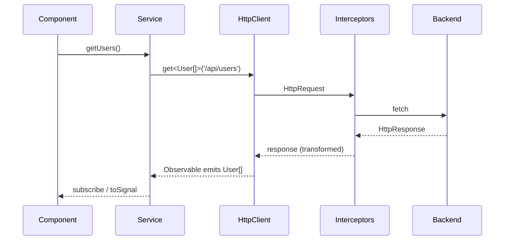

# HttpClient

> **One-liner**: `HttpClient` is Angular's wrapper around `fetch` / `XMLHttpRequest` — every method returns a typed cold Observable, and you opt into features (interceptors, fetch backend) via `provideHttpClient(...)`.

---

## Quick Reference

| Method | Returns |
|--------|---------|
| `http.get<T>(url, opts?)` | `Observable<T>` |
| `http.post<T>(url, body, opts?)` | `Observable<T>` |
| `http.put<T>(url, body, opts?)` | `Observable<T>` |
| `http.patch<T>(url, body, opts?)` | `Observable<T>` |
| `http.delete<T>(url, opts?)` | `Observable<T>` |
| Provide it | `provideHttpClient(withFetch(), withInterceptors([...]))` |
| Headers | `headers: new HttpHeaders({ 'X-Foo': 'bar' })` |
| Params | `params: new HttpParams().set('q', 'x')` or `{ params: { q: 'x' } }` |
| Full response | `observe: 'response'` |
| Progress events | `reportProgress: true, observe: 'events'` |

---

## Core Concept

`HttpClient` is a thin reactive layer on top of the browser's HTTP APIs. Every call returns a **cold** Observable — the request fires only when you subscribe (the `async` pipe and `toSignal()` count as subscriptions). When the response arrives, the Observable emits **once** and completes.

You provide it via `provideHttpClient()` in your bootstrap providers. Modern Angular prefers the `fetch` backend (`withFetch()`), which integrates with SSR and request streaming better than the legacy `XHR` backend.

The two big wins over raw `fetch`:

1. **Type inference** — `get<User>(...)` returns `Observable<User>` and you can chain `pipe(map(...))`.
2. **Interceptors** — middleware for auth headers, retries, error normalization, logging. See [[05 - HTTP Interceptors]].

By default, `HttpClient` parses JSON responses automatically. For other types (`Blob`, `text`, `ArrayBuffer`), pass `responseType`.

---

## Diagram



---

## Syntax & API

### Provide HttpClient

```ts
// main.ts
import { provideHttpClient, withFetch, withInterceptors } from '@angular/common/http';
import { authInterceptor } from './core/auth.interceptor';

bootstrapApplication(AppComponent, {
  providers: [
    provideHttpClient(
      withFetch(),
      withInterceptors([authInterceptor]),
    ),
  ],
});
```

### Typed GET / POST

```ts
import { Injectable, inject } from '@angular/core';
import { HttpClient } from '@angular/common/http';
import { Observable } from 'rxjs';

export interface User { id: number; name: string; email: string; }

@Injectable({ providedIn: 'root' })
export class UsersApi {
  private http = inject(HttpClient);

  list(): Observable<User[]> {
    return this.http.get<User[]>('/api/users');
  }

  get(id: number): Observable<User> {
    return this.http.get<User>(`/api/users/${id}`);
  }

  create(user: Omit<User, 'id'>): Observable<User> {
    return this.http.post<User>('/api/users', user);
  }

  update(id: number, patch: Partial<User>): Observable<User> {
    return this.http.patch<User>(`/api/users/${id}`, patch);
  }

  delete(id: number): Observable<void> {
    return this.http.delete<void>(`/api/users/${id}`);
  }
}
```

### Headers and params

```ts
import { HttpHeaders, HttpParams } from '@angular/common/http';

this.http.get<User[]>('/api/users', {
  headers: new HttpHeaders({ 'X-Tenant': 'acme' }),
  params: new HttpParams().set('q', 'ada').set('page', '1'),
});

// Shorthand object form (since v15)
this.http.get<User[]>('/api/users', {
  headers: { 'X-Tenant': 'acme' },
  params: { q: 'ada', page: 1 },
});
```

### Full response (status, headers)

```ts
this.http.get<User[]>('/api/users', { observe: 'response' }).subscribe(res => {
  console.log(res.status);                  // 200
  console.log(res.headers.get('X-Total'));  // pagination header
  console.log(res.body);                    // User[]
});
```

### Upload with progress

```ts
import { HttpEventType } from '@angular/common/http';

upload(file: File) {
  const form = new FormData();
  form.append('file', file);

  this.http
    .post('/api/upload', form, { reportProgress: true, observe: 'events' })
    .subscribe(event => {
      if (event.type === HttpEventType.UploadProgress) {
        const pct = Math.round(100 * (event.loaded / (event.total ?? 1)));
        this.progress.set(pct);
      } else if (event.type === HttpEventType.Response) {
        this.uploaded.set(true);
      }
    });
}
```

### Other response types

```ts
this.http.get('/manual.pdf', { responseType: 'blob' });
this.http.get('/notes.txt', { responseType: 'text' });
```

---

## Common Patterns

```ts
// Pattern: convert HTTP Observable to a Signal
import { toSignal } from '@angular/core/rxjs-interop';

@Component({ /* ... */ })
export class UsersListComponent {
  private api = inject(UsersApi);
  users = toSignal(this.api.list(), { initialValue: [] as User[] });
}
```

```ts
// Pattern: error mapping in the service
import { catchError, throwError } from 'rxjs';
import { HttpErrorResponse } from '@angular/common/http';

list(): Observable<User[]> {
  return this.http.get<User[]>('/api/users').pipe(
    catchError((e: HttpErrorResponse) => throwError(() => ({
      kind: 'http',
      status: e.status,
      message: e.error?.message ?? e.statusText,
    }))),
  );
}
```

```ts
// Pattern: cancel on navigation by using switchMap on a route param
this.user$ = this.route.paramMap.pipe(
  switchMap(p => this.api.get(+p.get('id')!)),
);
```

---

## Gotchas & Tips

- **HTTP Observables are cold.** Each `subscribe()` triggers a new request. Use `shareReplay({ bufferSize: 1, refCount: true })` to share among subscribers.
- **The `async` pipe subscribes once per template binding.** Multiple `| async` on the same Observable fire multiple HTTP calls — share or store the result.
- **Use `withFetch()` always.** The default XHR backend is legacy; `fetch` works in SSR, supports `AbortSignal` natively, and is required for some streaming features.
- **Don't `.toPromise()`.** It's deprecated. Use `firstValueFrom(obs$)` if you genuinely need a promise (only in non-Angular code paths).
- **Errors propagate as `HttpErrorResponse`.** Match on `e.status` (network errors are `0`).
- **JSON is the default body parser.** For non-JSON, pass `responseType: 'text' | 'blob' | 'arraybuffer'`.
- **Don't subscribe inside subscribe.** Use `switchMap` / `mergeMap` to flatten — see [[03 - RxJS Operators]].

---

## See Also

- [[05 - HTTP Interceptors]]
- [[02 - RxJS Fundamentals]]
- [[03 - RxJS Operators]]
- [[01 - Signals]]
