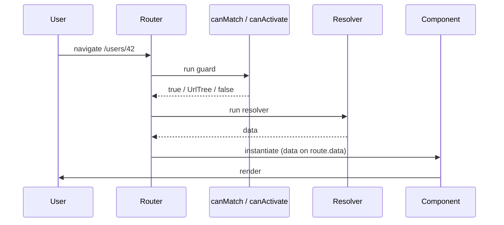

# Route Guards and Resolvers

> **One-liner**: Guards run before navigation completes (allow, redirect, or block); resolvers fetch data before the route activates so the component renders with data already in hand. Modern Angular uses **plain functions** with `inject()`.

---

## Quick Reference

| Hook | Signature | Purpose |
|------|-----------|---------|
| `CanActivate` | `(route, state) => boolean \| UrlTree \| Observable<...> \| Promise<...>` | Allow entry to a route |
| `CanActivateChild` | same | Allow entry to children |
| `CanMatch` | same | Allow this route to even match (better than `CanActivate` for most auth) |
| `CanDeactivate<T>` | `(component, route, state, next) => boolean \| UrlTree \| ...` | Allow leaving (e.g. unsaved changes) |
| `Resolve<T>` | `(route, state) => T \| Observable<T> \| Promise<T>` | Pre-fetch data |
| Register | `canActivate: [authGuard]` / `canMatch: [...]` / `resolve: { user: userResolver }` |

---

## Core Concept

A **guard** is a function that returns `true` (allow), `false` (block), or a `UrlTree` (redirect). Guards can return Observables/Promises for async checks (e.g. wait for an auth state to load).

**`CanMatch` is the modern preferred form for auth.** Unlike `CanActivate`, which runs *after* the route matches, `CanMatch` runs *during* matching — if it returns false, the router moves on to try other routes (so an unauthenticated user falls through to a 404 or login route, instead of getting a "blocked navigation" error).

**`CanDeactivate`** typically asks "are there unsaved changes?" before allowing the user to leave a form route.

A **resolver** runs before the route activates and the component instantiates. It returns data; the router stuffs it into `route.data`. Use it sparingly — most data fetching is fine inside the component (with a loading state). Resolvers are best for required, fast data that you don't want a flash of blank UI for.

All of these are **functions** with `inject()` access — no decorators, no classes.

---

## Diagram



---

## Syntax & API

### Functional auth guard with `CanMatch`

```ts
// core/auth.guard.ts
import { CanMatchFn, Router } from '@angular/router';
import { inject } from '@angular/core';
import { AuthService } from './auth.service';

export const authGuard: CanMatchFn = () => {
  const auth = inject(AuthService);
  const router = inject(Router);
  return auth.isLoggedIn() ? true : router.createUrlTree(['/login']);
};
```

```ts
// app.routes.ts
{
  path: 'admin',
  canMatch: [authGuard],
  loadChildren: () => import('./admin/admin.routes').then(m => m.adminRoutes),
}
```

### Role guard with parameters (factory)

```ts
import { CanMatchFn } from '@angular/router';

export const hasRole = (role: string): CanMatchFn => () => {
  const auth = inject(AuthService);
  return auth.user()?.roles.includes(role) ?? false;
};

// Usage
{ path: 'admin', canMatch: [hasRole('admin')], /* ... */ }
```

### `CanDeactivate` for unsaved changes

```ts
import { CanDeactivateFn } from '@angular/router';

export interface CanLeave { canLeave(): boolean | Promise<boolean>; }

export const unsavedChangesGuard: CanDeactivateFn<CanLeave> =
  (component) => component.canLeave();

// Usage
{ path: 'edit', component: EditComponent, canDeactivate: [unsavedChangesGuard] }

// Component
export class EditComponent implements CanLeave {
  dirty = signal(false);
  canLeave(): boolean { return !this.dirty() || confirm('Discard changes?'); }
}
```

### Resolver

```ts
// users/user.resolver.ts
import { ResolveFn } from '@angular/router';
import { inject } from '@angular/core';
import { UsersApi } from './users.api';
import { catchError, of } from 'rxjs';

export const userResolver: ResolveFn<User | null> = (route) => {
  const id = +route.paramMap.get('id')!;
  return inject(UsersApi).get(id).pipe(catchError(() => of(null)));
};

// Route
{
  path: 'users/:id',
  loadComponent: () => import('./user-detail.component').then(m => m.UserDetailComponent),
  resolve: { user: userResolver },
}

// Component reads it from route.data
@Component({ /* ... */ })
export class UserDetailComponent {
  private route = inject(ActivatedRoute);
  user = toSignal(this.route.data.pipe(map(d => d['user'] as User | null)), { initialValue: null });
}
```

### Component input binding for resolved data

With `withComponentInputBinding()`, resolved data binds to inputs by name:

```ts
@Component({ /* ... */ })
export class UserDetailComponent {
  @Input() user!: User | null; // bound from resolve.user
}
```

---

## Common Patterns

```ts
// Pattern: combine a guard that waits for auth state to load
export const authGuard: CanMatchFn = async () => {
  const auth = inject(AuthService);
  const router = inject(Router);
  await auth.ready();             // resolves once initial auth check completes
  return auth.isLoggedIn() || router.createUrlTree(['/login']);
};
```

```ts
// Pattern: shared data via parent route resolver
{
  path: 'users/:id',
  resolve: { user: userResolver },
  children: [
    { path: '', component: ProfileComponent },
    { path: 'edit', component: EditComponent },
    // both children read user via route.parent.data or @Input bound from parent
  ],
}
```

---

## Gotchas & Tips

- **Prefer `CanMatch` to `CanActivate` for auth.** With `CanActivate`, blocking still navigates to the route (and shows "blocked" in dev tools); with `CanMatch`, the router skips to the next match.
- **Resolvers block rendering.** If the API is slow, the user sees a frozen previous page. For non-critical data, fetch inside the component with a loading state.
- **`inject()` works in guard/resolver functions** because the router calls them in an injection context. Don't try to import service instances directly.
- **Return a `UrlTree` for redirects**, not `false`. `false` blocks navigation in place; `UrlTree` redirects.
- **Functional guards beat class guards** in modern code — they're tree-shakable, easier to test (just call the function with mocks), and avoid boilerplate.
- **`CanDeactivate` should never silently block.** Ask the user (`confirm` or a dialog) — surprise blocks are user-hostile.
- **Resolvers + lazy components**: the resolver runs *before* the lazy chunk loads. Together they can hide the lazy-load latency from the user.

---

## See Also

- [[09 - Routing Basics]]
- [[11 - Lazy Loading]]
- [[12 - Dependency Injection Deep Dive]]
