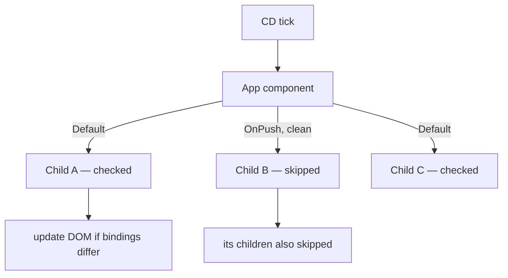

# Change Detection

> **One-liner**: Change detection (CD) is the loop that re-runs templates after some event might have changed state — `Default` strategy checks every component every tick, `OnPush` only checks when inputs change or signals notify, and signals + OnPush is the modern fast path.

---

## Quick Reference

| Concept | Value |
|---------|-------|
| `ChangeDetectionStrategy.Default` | Check every component every tick |
| `ChangeDetectionStrategy.OnPush` | Check only when input ref changes, signal fires, event handler runs, or async pipe emits |
| `ChangeDetectorRef.markForCheck()` | Mark this component dirty (for OnPush trees) |
| `ChangeDetectorRef.detectChanges()` | Synchronously run CD on this view |
| `ChangeDetectorRef.detach()` | Remove view from CD tree (manual mode) |
| `NgZone` | Zone.js wrapper that triggers CD on async events |
| `runOutsideAngular(fn)` | Run code without triggering CD (perf) |
| `provideExperimentalZonelessChangeDetection()` | Opt out of Zone.js (signals only) |

---

## Core Concept

By default, Angular wraps the browser's async APIs (timers, events, XHR) with **Zone.js** so it knows when something *might* have changed. After every async event, Angular runs **change detection**: it walks the component tree top-down, re-runs each template's bindings, and updates the DOM where values differ.

That sounds expensive — and it can be. **`OnPush`** is the relief valve: a component marked `OnPush` is only checked when:

1. An `@Input()` (object reference) changes.
2. An event fires inside the component.
3. An `async` pipe emits.
4. A **signal** the template reads notifies.
5. You call `cdr.markForCheck()` manually.

With **signals**, OnPush becomes the obvious default: signals + OnPush means a component is checked only when something it actually reads changes. Compared to Default + manual CD juggling, it's faster and more predictable.

The future is **zoneless**. Angular 18+ supports opting out of Zone.js entirely (`provideExperimentalZonelessChangeDetection()`); CD runs only on signal notifications and explicit `markForCheck`. See [[02 - Zone.js and Zoneless]].

---

## Diagram



---

## Syntax & API

### `OnPush` component

```ts
import { ChangeDetectionStrategy, Component, input } from '@angular/core';

@Component({
  selector: 'app-user-card',
  standalone: true,
  changeDetection: ChangeDetectionStrategy.OnPush,
  template: `<h3>{{ user().name }}</h3>`,
})
export class UserCardComponent {
  user = input.required<User>();
}
```

### Manual `markForCheck` after a non-tracked update

```ts
import { ChangeDetectorRef } from '@angular/core';

@Component({ /* OnPush */ })
export class ChartComponent {
  private cdr = inject(ChangeDetectorRef);

  websocketUpdate(data: ChartData) {
    this.data = data;          // mutation (no signal, no input change)
    this.cdr.markForCheck();   // tell Angular to re-check on next tick
  }
}
```

### `runOutsideAngular` for noisy DOM

```ts
import { NgZone } from '@angular/core';

constructor(private zone: NgZone) {
  this.zone.runOutsideAngular(() => {
    window.addEventListener('mousemove', this.onMouseMove);
  });
}

onMouseMove = (e: MouseEvent) => {
  if (Math.random() < 0.05) {
    this.zone.run(() => this.updateDebugSignal(e)); // re-enter zone for CD
  }
};
```

### Detach for fully manual CD (rare)

```ts
constructor(private cdr: ChangeDetectorRef) {
  cdr.detach();
}

push(data: T) {
  this.data = data;
  this.cdr.detectChanges(); // when YOU say so
}
```

### Going zoneless (Angular 18+)

```ts
// main.ts
import { provideExperimentalZonelessChangeDetection } from '@angular/core';

bootstrapApplication(AppComponent, {
  providers: [
    provideExperimentalZonelessChangeDetection(),
  ],
});
// Remove zone.js from polyfills in angular.json
```

---

## Common Patterns

```ts
// Pattern: signal-driven OnPush component
@Component({
  selector: 'app-counter',
  standalone: true,
  changeDetection: ChangeDetectionStrategy.OnPush,
  template: `
    <p>Count: {{ count() }} (doubled: {{ doubled() }})</p>
    <button (click)="inc()">+</button>
  `,
})
export class CounterComponent {
  count = signal(0);
  doubled = computed(() => this.count() * 2);
  inc() { this.count.update(n => n + 1); }
}
// No markForCheck, no NgZone, no async — just signals.
```

```ts
// Pattern: third-party callback that needs to enter the zone
constructor(private zone: NgZone) {
  thirdPartyLib.onEvent(data => {
    this.zone.run(() => this.signal.set(data));
  });
}
```

---

## Gotchas & Tips

- **Default `OnPush` for new components.** It's the modern norm and forces you to think about reactivity (which catches bugs early).
- **OnPush + mutations break.** `this.user.name = 'x'` doesn't change the input *reference*, so OnPush doesn't fire. Use immutable updates (`this.user = { ...this.user, name: 'x' }`) or signals.
- **`async` pipe automatically triggers `markForCheck`** — that's why it works under OnPush without ceremony.
- **`setTimeout` outside the zone won't trigger CD.** That's the point of `runOutsideAngular` for hot paths (mousemove, scroll, animation frames).
- **The CD tree is the *component* tree, not the DOM tree.** Projecting content with `<ng-content>` doesn't change which components Angular checks.
- **Signals "notify" not "set"** — a signal write only triggers CD if the new value isn't `===` the old (or fails your custom `equal`).
- **Profile before optimizing.** Open the Angular DevTools profiler — it shows which components are checked and how often.

---

## See Also

- [[01 - Signals]]
- [[02 - Zone.js and Zoneless]]
- [[06 - Performance Optimization]]
- [[01 - Angular Internals]]
