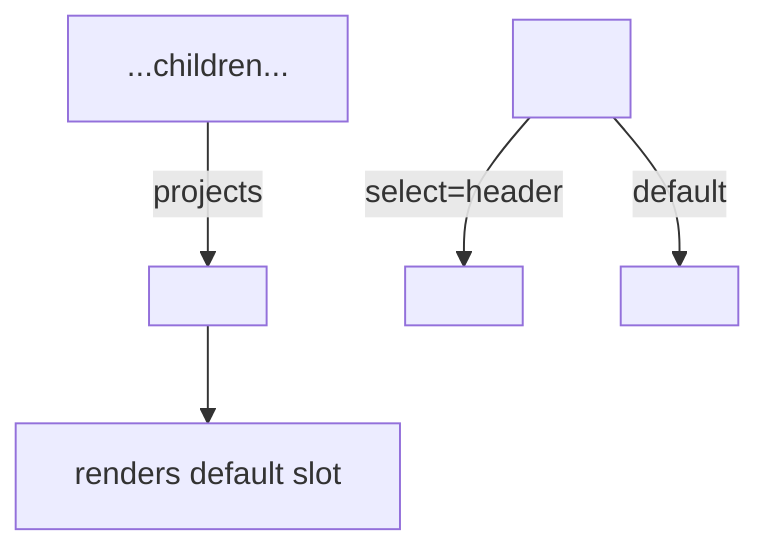

# Content Projection

> **One-liner**: Content projection lets a component accept children from its caller — `<ng-content>` is the slot where they appear, and `select="..."` lets you have multiple named slots (like web-component slots).

---

## Quick Reference

| Element | Purpose |
|---------|---------|
| `<ng-content>` | Default slot — anything between the host tags lands here |
| `<ng-content select="header">` | Named slot — only matching content goes here |
| `<ng-template>` | Reusable template snippet, not rendered until used |
| `<ng-container>` | Logical wrapper that doesn't render an element |
| `[ngTemplateOutlet]="tplRef"` | Render a template by reference |
| `*ngTemplateOutlet="tplRef; context: { $implicit: x }"` | Pass context |

---

## Core Concept

Imagine writing a `<Card>` component that should let the caller decide what's inside. Without projection you'd take a `title` input, an `actions` input, etc. — every variation needs another input. With projection, the caller writes the structure inline:

```html
<app-card>
  <h2>Title</h2>
  <p>Body content here.</p>
  <button>Action</button>
</app-card>
```

Inside `<app-card>`'s template, you place a `<ng-content>` and the children appear there. With `select="..."` you can have multiple named slots: caller marks content with a CSS selector, the matching content goes into the matching slot.

`<ng-template>` is a "template that hasn't been rendered yet." You can pass `TemplateRef`s as inputs and render them with `[ngTemplateOutlet]` — that's how you let the caller customize a render slot (e.g. "use this template for each row of a table").

`<ng-container>` is a render-less group: it lets you apply structural directives or group content without injecting an extra DOM node.

---

## Diagram



---

## Syntax & API

### Single default slot

```ts
@Component({
  selector: 'app-card',
  standalone: true,
  template: `
    <div class="card">
      <ng-content />
    </div>
  `,
})
export class CardComponent {}
```

```html
<app-card>
  <h2>Hello</h2>
  <p>World</p>
</app-card>
```

### Multi-slot projection

```ts
@Component({
  selector: 'app-page',
  standalone: true,
  template: `
    <header><ng-content select="[slot=header]" /></header>
    <main><ng-content /></main>
    <footer><ng-content select="[slot=footer]" /></footer>
  `,
})
export class PageComponent {}
```

```html
<app-page>
  <h1 slot="header">Title</h1>
  <p>Main content</p>
  <p slot="footer">Bottom</p>
</app-page>
```

You can also select by component name (`app-button`), tag (`button`), or class (`.cta`).

### Fallback content (Angular 18+)

```html
<ng-content>
  <p>Default if nothing projected.</p>
</ng-content>
```

### `<ng-template>` + `[ngTemplateOutlet]`

```ts
@Component({
  selector: 'app-list',
  standalone: true,
  imports: [NgTemplateOutlet],
  template: `
    <ul>
      @for (item of items; track item.id) {
        <li>
          <ng-container *ngTemplateOutlet="rowTpl; context: { $implicit: item }" />
        </li>
      }
    </ul>
  `,
})
export class ListComponent {
  @Input() items: Item[] = [];
  @ContentChild('row', { read: TemplateRef }) rowTpl!: TemplateRef<{ $implicit: Item }>;
}
```

```html
<app-list [items]="users">
  <ng-template #row let-user>
    <strong>{{ user.name }}</strong> — {{ user.email }}
  </ng-template>
</app-list>
```

### `<ng-container>` for logical grouping

```html
<!-- No extra DOM element -->
<ng-container *ngIf="user as u">
  <h2>{{ u.name }}</h2>
  <p>{{ u.email }}</p>
</ng-container>
```

---

## Common Patterns

```ts
// Pattern: customizable empty state
@Component({
  selector: 'app-list',
  standalone: true,
  template: `
    @if (items().length) {
      <ul>@for (i of items(); track i.id) { <li>{{ i.name }}</li> }</ul>
    } @else {
      <ng-content select="[empty]">
        <p>No results.</p>      <!-- fallback -->
      </ng-content>
    }
  `,
})
export class ListComponent {
  items = input<Item[]>([]);
}
```

```html
<app-list [items]="results">
  <p empty>Try a different filter.</p>
</app-list>
```

```ts
// Pattern: render-prop via TemplateRef input
@Component({
  selector: 'app-table',
  standalone: true,
  imports: [NgTemplateOutlet],
  template: `
    <table>
      @for (row of rows(); track row.id) {
        <tr>
          <ng-container *ngTemplateOutlet="cellTpl(); context: { $implicit: row }" />
        </tr>
      }
    </table>
  `,
})
export class TableComponent {
  rows = input<Row[]>([]);
  cellTpl = contentChild.required<TemplateRef<{ $implicit: Row }>>('cell');
}
```

---

## Gotchas & Tips

- **Projected content is owned by the parent**, not the component receiving it. Its bindings (`{{ }}`) evaluate in the parent's context.
- **`viewProviders` aren't visible to projected content.** Use `providers` if a projected child needs the service.
- **`<ng-container>` doesn't render** — you can put structural directives on it without polluting the DOM.
- **`select="..."` matches CSS selectors** — element, attribute, class, or component selector. Most apps use attribute selectors (`[slot=header]`).
- **Multi-slot projection re-projects only the first match** of each `<ng-content>` slot. Multiple matches go to the slot with that selector if it appears multiple times.
- **Don't forget `NgTemplateOutlet` import** in standalone code if you use `*ngTemplateOutlet`.
- **`TemplateRef` + `EmbeddedViewRef.detectChanges()`** is the manual way to render templates programmatically — usually you just use `*ngTemplateOutlet`.

---

## See Also

- [[15 - View and Content Queries]]
- [[16 - Custom Directives]]
- [[03 - Components and Templates]]
