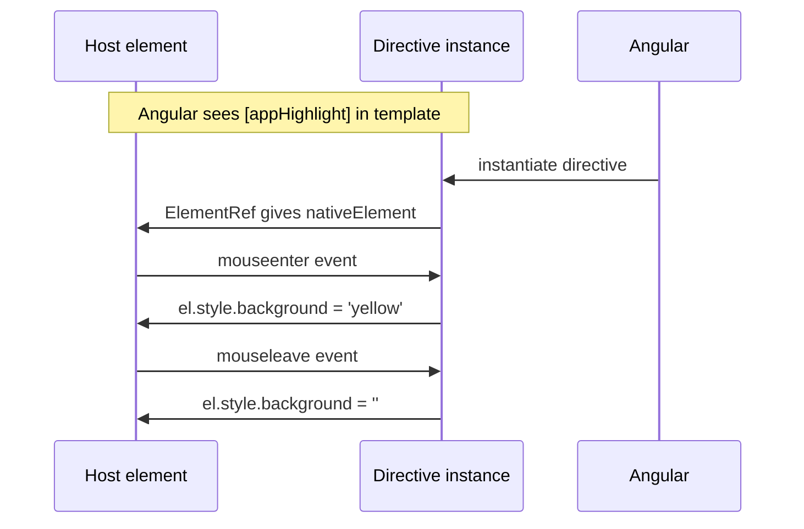

# Custom Directives

> **One-liner**: A directive is a class with `@Directive` that attaches behavior to an element — **attribute directives** modify an existing element (a tooltip, a click-outside listener); **structural directives** add or remove DOM (like `*ngIf` did).

---

## Quick Reference

| Concept | Syntax |
|---------|--------|
| Mark as directive | `@Directive({ selector: '[appHighlight]', standalone: true })` |
| Selector | Attribute (`[app-x]`), tag, or class — usually attribute |
| Inputs | `@Input()` or signal `input()` |
| Host element ref | `inject(ElementRef)` |
| Host bindings | `host: { '[class.x]': 'expr', '(click)': 'fn()' }` or `@HostBinding` / `@HostListener` |
| Structural | Inject `TemplateRef` and `ViewContainerRef`; render conditionally |
| Apply | `<button appHighlight>...</button>` |

---

## Core Concept

Directives are how you add **reusable element behavior** without wrapping the element in a component. Where a component owns its own template, a directive sits *on someone else's element* and changes it — bind classes, listen to events, manage focus, draw an overlay.

**Attribute directives** are the common case: they read/write the host element via `ElementRef` and `host` bindings. Build one for tooltips, click-outside detection, autofocus, debounced inputs, drag handles.

**Structural directives** generate or destroy DOM. They're harder — you inject `TemplateRef` (the `<ng-template>` you're attached to) and `ViewContainerRef` (where to render it), then call `createEmbeddedView()`. The new control flow (`@if`, `@for`) replaced most use cases, but custom structural directives still have a place (lazy mounting, permission gates).

The modern style is **`host: { ... }`** in the `@Directive` config rather than scattered `@HostBinding` / `@HostListener` decorators — it groups all DOM concerns in one place.

---

## Diagram



---

## Syntax & API

### Simple attribute directive: highlight on hover

```ts
import { Directive, ElementRef, inject, input } from '@angular/core';

@Directive({
  selector: '[appHighlight]',
  standalone: true,
  host: {
    '(mouseenter)': 'enter()',
    '(mouseleave)': 'leave()',
  },
})
export class HighlightDirective {
  private el = inject(ElementRef<HTMLElement>);
  color = input('yellow', { alias: 'appHighlight' });

  enter() { this.el.nativeElement.style.background = this.color(); }
  leave() { this.el.nativeElement.style.background = ''; }
}
```

```html
<p appHighlight>Hover me</p>
<p [appHighlight]="'lightblue'">Or me</p>
```

### Click-outside directive

```ts
import { Directive, ElementRef, inject, output, DestroyRef } from '@angular/core';

@Directive({
  selector: '[appClickOutside]',
  standalone: true,
})
export class ClickOutsideDirective {
  private el = inject(ElementRef<HTMLElement>);
  appClickOutside = output<MouseEvent>();

  constructor() {
    const handler = (e: MouseEvent) => {
      if (!this.el.nativeElement.contains(e.target as Node)) {
        this.appClickOutside.emit(e);
      }
    };
    document.addEventListener('click', handler, true);
    inject(DestroyRef).onDestroy(() => document.removeEventListener('click', handler, true));
  }
}
```

```html
<div appClickOutside (appClickOutside)="closeMenu()">…</div>
```

### Structural directive: `*appUnless`

```ts
import { Directive, Input, TemplateRef, ViewContainerRef, inject } from '@angular/core';

@Directive({
  selector: '[appUnless]',
  standalone: true,
})
export class UnlessDirective {
  private tpl = inject(TemplateRef<unknown>);
  private vcr = inject(ViewContainerRef);
  private hasView = false;

  @Input() set appUnless(condition: boolean) {
    if (!condition && !this.hasView) {
      this.vcr.createEmbeddedView(this.tpl);
      this.hasView = true;
    } else if (condition && this.hasView) {
      this.vcr.clear();
      this.hasView = false;
    }
  }
}
```

```html
<p *appUnless="loggedIn">Please log in.</p>
```

### Decorator form (legacy, still works)

```ts
@Directive({ selector: '[appAutofocus]', standalone: true })
export class AutofocusDirective {
  @HostBinding('attr.tabindex') tabindex = '-1';
  @HostListener('focus') onFocus() { /* ... */ }
}
```

---

## Common Patterns

```ts
// Pattern: directive with required input via signal
@Directive({
  selector: '[appPermission]',
  standalone: true,
})
export class PermissionDirective {
  private vcr = inject(ViewContainerRef);
  private tpl = inject(TemplateRef<unknown>);
  private auth = inject(AuthService);

  appPermission = input.required<string>();

  constructor() {
    effect(() => {
      this.vcr.clear();
      if (this.auth.has(this.appPermission())) this.vcr.createEmbeddedView(this.tpl);
    });
  }
}
```

```html
<button *appPermission="'admin:write'">Delete</button>
```

```ts
// Pattern: directive composing built-in input behavior
@Directive({
  selector: 'input[appDebounce]',
  standalone: true,
})
export class DebounceInputDirective {
  private el = inject(ElementRef<HTMLInputElement>);
  appDebounce = input(300);
  debounced = output<string>();

  constructor() {
    fromEvent(this.el.nativeElement, 'input')
      .pipe(
        debounceTime(this.appDebounce()),
        map(e => (e.target as HTMLInputElement).value),
        takeUntilDestroyed(),
      )
      .subscribe(v => this.debounced.emit(v));
  }
}
```

---

## Gotchas & Tips

- **Attribute directive selectors must be in brackets**: `[appHighlight]`. A bare `appHighlight` selector matches a tag.
- **Don't manipulate the DOM through `nativeElement`** in SSR — the element doesn't exist on the server. Use `Renderer2` for cross-platform safety, or guard with `isPlatformBrowser()`.
- **Structural directive selectors start with `*`** in usage but not in the declaration: declare `[appUnless]`, use `*appUnless`. The `*` is sugar for an `<ng-template>` wrapper.
- **`host: {...}` is the modern style.** It works without the `Reflect.metadata` polyfill that `@HostBinding`/`@HostListener` historically required.
- **Apply directives to components** too — they bind to the host element of the component just like a regular DOM element.
- **For complex behaviors that need their own template/styles**, write a component instead. Directives are for behavior on existing elements.

---

## See Also

- [[05 - Directives]]
- [[14 - Content Projection]]
- [[15 - View and Content Queries]]
- [[17 - Custom Pipes]]
