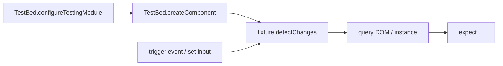

# Testing Components

> **One-liner**: Angular tests instantiate components in **`TestBed`** — a synthetic injector — and use a **`ComponentFixture`** to drive change detection, query the DOM, and assert behavior.

---

## Quick Reference

| API | Purpose |
|-----|---------|
| `TestBed.configureTestingModule({...})` | Set up providers, imports, declarations |
| `TestBed.createComponent(Comp)` | Returns a `ComponentFixture<Comp>` |
| `fixture.componentInstance` | The component class instance |
| `fixture.nativeElement` / `fixture.debugElement` | DOM access |
| `fixture.detectChanges()` | Run change detection on the fixture |
| `fixture.whenStable()` | Promise that resolves when async work finishes |
| `By.css('selector')` | Query DOM via `debugElement` |
| `HttpTestingController` | Mock `HttpClient` calls |
| Component harnesses | High-level helpers (`MatButtonHarness`, etc.) |
| Runners | Karma + Jasmine (default), Jest, Vitest |

---

## Core Concept

`TestBed` is Angular's testing module — it builds a real injector, instantiates real components, and renders into a detached DOM. Your test gets a `ComponentFixture` that wraps the live component and its host element.

The standard test loop is:

1. **Arrange**: configure `TestBed` (mocks, imports), create a fixture.
2. **Act**: set inputs, trigger events, call `fixture.detectChanges()`.
3. **Assert**: query DOM via `fixture.nativeElement` or `debugElement.query(By.css(...))`.

For **HTTP**, use `HttpTestingController` from `provideHttpClientTesting()` — it intercepts every call so you can match expectations and flush canned responses without hitting the network.

For **Material/CDK** components, prefer **component harnesses** — typed helper classes (`MatButtonHarness`, `MatInputHarness`) that abstract the DOM. They're more stable than raw selectors and work with both unit tests and Protractor/Playwright.

The test runner doesn't matter much for the patterns — Jasmine/Karma is the default, but Jest is widely used for speed. Tests look the same.

---

## Diagram



---

## Syntax & API

### Component test

```ts
// counter.component.spec.ts
import { ComponentFixture, TestBed } from '@angular/core/testing';
import { CounterComponent } from './counter.component';

describe('CounterComponent', () => {
  let fixture: ComponentFixture<CounterComponent>;
  let comp: CounterComponent;

  beforeEach(async () => {
    await TestBed.configureTestingModule({
      imports: [CounterComponent], // standalone
    }).compileComponents();

    fixture = TestBed.createComponent(CounterComponent);
    comp = fixture.componentInstance;
    fixture.detectChanges();
  });

  it('renders the initial count', () => {
    const span = fixture.nativeElement.querySelector('span');
    expect(span.textContent).toContain('0');
  });

  it('increments when the button is clicked', () => {
    const btn = fixture.nativeElement.querySelector('button');
    btn.click();
    fixture.detectChanges();
    expect(comp.count).toBe(1);
  });
});
```

### Service mocking via providers

```ts
import { UsersApi } from './users.api';
import { of } from 'rxjs';

class FakeUsersApi {
  list = jasmine.createSpy().and.returnValue(of([{ id: 1, name: 'Ada' }]));
}

beforeEach(() => {
  TestBed.configureTestingModule({
    imports: [UsersListComponent],
    providers: [{ provide: UsersApi, useClass: FakeUsersApi }],
  });
});
```

### HTTP testing

```ts
import { provideHttpClient } from '@angular/common/http';
import { provideHttpClientTesting, HttpTestingController } from '@angular/common/http/testing';

describe('UsersApi', () => {
  let api: UsersApi;
  let http: HttpTestingController;

  beforeEach(() => {
    TestBed.configureTestingModule({
      providers: [provideHttpClient(), provideHttpClientTesting()],
    });
    api = TestBed.inject(UsersApi);
    http = TestBed.inject(HttpTestingController);
  });

  afterEach(() => http.verify());

  it('GETs /api/users', () => {
    api.list().subscribe(users => expect(users.length).toBe(1));
    const req = http.expectOne('/api/users');
    expect(req.request.method).toBe('GET');
    req.flush([{ id: 1, name: 'Ada' }]);
  });
});
```

### Async behavior with `fakeAsync` / `tick`

```ts
import { fakeAsync, tick } from '@angular/core/testing';

it('debounces input', fakeAsync(() => {
  const input = fixture.nativeElement.querySelector('input');
  input.value = 'a';
  input.dispatchEvent(new Event('input'));
  tick(100);
  expect(spy).not.toHaveBeenCalled();
  tick(200);
  expect(spy).toHaveBeenCalledWith('a');
}));
```

### Query with `DebugElement`

```ts
import { By } from '@angular/platform-browser';

const debugBtn = fixture.debugElement.query(By.css('button.primary'));
debugBtn.triggerEventHandler('click', null);
fixture.detectChanges();
```

### Component harnesses (Material example)

```ts
import { HarnessLoader } from '@angular/cdk/testing';
import { TestbedHarnessEnvironment } from '@angular/cdk/testing/testbed';
import { MatButtonHarness } from '@angular/material/button/testing';

let loader: HarnessLoader;

beforeEach(() => {
  loader = TestbedHarnessEnvironment.loader(fixture);
});

it('clicks via harness', async () => {
  const btn = await loader.getHarness(MatButtonHarness.with({ text: 'Save' }));
  await btn.click();
  expect(comp.saved).toBeTrue();
});
```

---

## Common Patterns

```ts
// Pattern: setting signal inputs in tests
it('shows the user name', () => {
  fixture.componentRef.setInput('user', { id: 1, name: 'Ada' });
  fixture.detectChanges();
  expect(fixture.nativeElement.textContent).toContain('Ada');
});
```

```ts
// Pattern: ActivatedRoute mock
import { ActivatedRoute } from '@angular/router';
import { of } from 'rxjs';

TestBed.configureTestingModule({
  providers: [
    { provide: ActivatedRoute, useValue: { paramMap: of(convertToParamMap({ id: '42' })) } },
  ],
});
```

---

## Gotchas & Tips

- **Always call `fixture.detectChanges()` after a state change.** Without it, the DOM is stale.
- **Standalone components are imported, not declared.** `imports: [MyStandaloneComp]`, not `declarations`.
- **Set signal inputs via `fixture.componentRef.setInput('name', value)`** — direct assignment to `comp.name` doesn't go through the input system.
- **`fakeAsync` + `tick` for timers, `whenStable` for HTTP / promises.** Don't use both in the same test if you can avoid it.
- **`HttpTestingController.verify()` in `afterEach`** catches unfulfilled or extra HTTP expectations — keep it.
- **Don't test implementation details.** Test behavior visible to the user (DOM, emitted events) and to the rest of the app (output observables, service state).
- **Coverage targets**: services 80%+ (they're mostly logic), components 50–70% (logic + a few DOM smoke tests). E2E covers the rest.

---

## See Also

- [[20 - Angular CLI Workflow]]
- [[12 - Dependency Injection Deep Dive]]
- [[04 - HttpClient]]
- [[10 - Angular CDK]]
