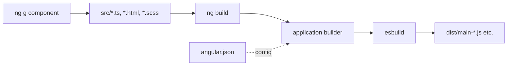

# Angular CLI Workflow

> **One-liner**: The Angular CLI (`ng`) scaffolds, builds, serves, and tests your app — `ng generate` writes consistent files, `ng build` produces an optimized bundle, and `angular.json` is the workspace config.

---

## Quick Reference

| Command | Purpose |
|---------|---------|
| `ng new <name>` | Create a workspace |
| `ng serve` | Dev server with HMR |
| `ng build` | Production bundle (`dist/`) |
| `ng test` | Run unit tests (Karma + Jasmine by default) |
| `ng e2e` | E2E tests (you choose: Cypress, Playwright) |
| `ng lint` | ESLint (must add `@angular-eslint`) |
| `ng generate component foo` | Scaffold a component (alias `ng g c`) |
| `ng generate service foo` | Scaffold a service (`ng g s`) |
| `ng generate directive foo` | (`ng g d`) |
| `ng generate pipe foo` | (`ng g p`) |
| `ng generate guard foo` | functional guard scaffold |
| `ng update` | Update Angular and dependencies (with migrations) |
| `ng add <pkg>` | Install + run a schematic (e.g. `@angular/material`) |
| `ng deploy` | Builder-driven deploy (after `ng add` of a target) |

---

## Core Concept

The CLI is a **builder + scaffolder + migrator** wrapped in one tool. Three things matter:

1. **`angular.json`** is the workspace config — it lists projects, build targets, dev/prod configurations, file replacements, budgets. Nearly every CLI command reads it.
2. **Builders** are the engines: `@angular-devkit/build-angular:application` (esbuild — modern default since v17), `:browser-esbuild`, the legacy `:browser` (Webpack). Each accepts options you set under a build target.
3. **Schematics** are code-generators. `ng generate` runs schematics from `@schematics/angular`. Libraries can ship their own (e.g. `ng add @angular/material` runs the Material setup schematic).

`ng update` is the secret weapon: when Angular or a major library bumps versions, `ng update` runs migration schematics that rewrite your code to fit the new APIs (e.g. converting `*ngIf` to `@if`, decorator inputs to signal `input()`). Always upgrade through `ng update`, not manual `npm install`.

For monorepos and bigger workspaces, **Nx** wraps the same CLI with caching, generators, and dependency graphs (see [[16 - Monorepo with Nx]]).

---

## Diagram



---

## Syntax & API

### Create a workspace

```bash
ng new my-app --standalone --routing --style=scss --strict
cd my-app
ng serve --open
```

### Generate components / services

```bash
ng g component features/users --change-detection=OnPush --skip-tests=false
ng g service core/users --skip-tests=false
ng g pipe shared/truncate
ng g directive shared/highlight
ng g guard core/auth --functional
ng g resolver users/user --functional
ng g interceptor core/auth --functional
ng g environments
```

Common flags:
- `--inline-template` / `--inline-style` — single-file component
- `--standalone` — default in v19+; in older versions you must add it
- `--export` — re-export from the index file (in libraries)
- `--module` — only relevant for legacy NgModule code

### Build

```bash
ng build                                # production by default since v15
ng build --configuration=development    # dev build
ng build --output-hashing=all --optimization
ng build --stats-json                   # for bundle analysis
```

### Test

```bash
ng test                                  # one-off CI mode: ng test --watch=false --browsers=ChromeHeadless
ng test --code-coverage
```

### `angular.json` highlights

```json
{
  "projects": {
    "my-app": {
      "architect": {
        "build": {
          "builder": "@angular-devkit/build-angular:application",
          "options": {
            "outputPath": "dist/my-app",
            "index": "src/index.html",
            "browser": "src/main.ts",
            "polyfills": ["zone.js"],
            "tsConfig": "tsconfig.app.json",
            "assets": ["src/favicon.ico", "src/assets"],
            "styles": ["src/styles.scss"],
            "scripts": []
          },
          "configurations": {
            "production": {
              "budgets": [
                { "type": "initial", "maximumError": "1mb", "maximumWarning": "500kb" }
              ],
              "outputHashing": "all"
            },
            "development": {
              "optimization": false,
              "extractLicenses": false,
              "sourceMap": true
            }
          },
          "defaultConfiguration": "production"
        }
      }
    }
  }
}
```

### Update

```bash
ng update                       # see what's outdated
ng update @angular/core @angular/cli
ng update @angular/material     # runs material's migrations
```

### Add a library that has a schematic

```bash
ng add @angular/material
ng add @ngrx/store
ng add @angular/pwa
ng add @angular/ssr               # adds SSR + hydration
```

---

## Common Patterns

```bash
# Pattern: clean prod build for CI
ng build --configuration=production --output-path=dist/build

# Pattern: bundle size analysis
ng build --stats-json
npx webpack-bundle-analyzer dist/my-app/stats.json
# (esbuild builder: use `npx esbuild-visualizer --metadata dist/my-app/stats.json`)

# Pattern: keep test runs deterministic
ng test --watch=false --browsers=ChromeHeadless --code-coverage
```

```json
// Pattern: file replacements for environments
"configurations": {
  "production": {
    "fileReplacements": [
      { "replace": "src/environments/environment.ts", "with": "src/environments/environment.prod.ts" }
    ]
  }
}
```

```json
// Pattern: budgets to fail builds when bundles bloat
"budgets": [
  { "type": "initial",     "maximumError": "1mb",   "maximumWarning": "500kb" },
  { "type": "anyComponentStyle", "maximumError": "10kb" }
]
```

---

## Gotchas & Tips

- **Use `ng update`, not manual upgrades.** It runs migrations — manual upgrades skip them and leave deprecated code.
- **`--strict` is the default** for `ng new` since v12. Don't disable it.
- **The application builder (esbuild) is the default since v17.** Old `browser` (Webpack) builder works but is much slower; migrate via `ng update`.
- **`environment.ts` files are convention, not a feature.** They're loaded as plain TS imports and swapped via `fileReplacements`. There's no special "process.env" handling.
- **Schematics are dry by default with `--dry-run`.** Use it before generating into a complex tree to see what will change.
- **`ng deploy`** isn't a built-in deploy — you `ng add @angular/fire` (or another deploy package) which adds a deploy target. Vercel/Netlify/Cloudflare Pages all detect Angular and need no schematic.
- **Custom builders**: you can write a builder for unusual workflows (e.g. zip + upload), but for 99% of cases the bundled builders are right.

---

## See Also

- [[14 - Build and Bundling]]
- [[19 - Testing Components]]
- [[03 - Standalone Migration]]
- [[16 - Monorepo with Nx]]
