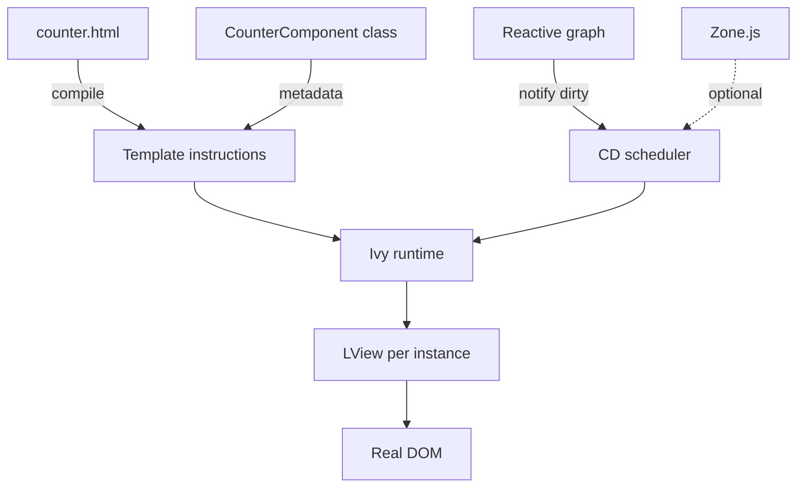

# Angular Internals

> **One-liner**: Angular compiles templates into TypeScript instructions (the **Ivy** runtime), runs change detection by walking the component tree, and tracks signal dependencies in a parallel **reactive graph** that lets it skip work.

---

## Quick Reference

| Layer | Role |
|-------|------|
| **Template compiler** (`@angular/compiler`) | Converts `.html` to TS instruction sequences (template functions) |
| **Ivy runtime** | Executes those instructions to create / update views |
| **TView / TNode** | Static template metadata (one per template, shared across instances) |
| **LView** | Live view data (one per component instance) |
| **Renderer2** | Cross-platform DOM API; SSR uses a different renderer |
| **Reactive graph** | `signal` / `computed` / `effect` dependency tracking |
| **Zone.js** | Wraps async APIs to trigger CD (optional in zoneless mode) |
| **CD scheduler** | Decides when to run a tick (zone, microtask, signal notify) |

---

## Core Concept

Angular's job at runtime is to keep the DOM in sync with your component state. To do it efficiently, it doesn't re-run your template HTML on every change — it pre-compiles each template into a sequence of **instructions** (`elementStart`, `text`, `property`, `listener`, `advance`). Your component class just provides the values; the compiled instructions know what DOM nodes exist and how to update them.

This compiled output is the **Ivy** runtime (replaced "View Engine" in v9). Ivy splits view info in two:

- **TView / TNode** is the *static* metadata for a template: which DOM elements, which bindings, which directives. One copy per template, shared across every instance.
- **LView** is the *live* per-instance data: actual DOM nodes, current binding values, child injectors.

A **change-detection tick** walks the LView tree top-down, running each component's "update block" (the instructions that re-evaluate bindings and patch the DOM where values changed). With `OnPush`, the walker skips views marked clean. With **signals**, the tick is even smarter: only views whose tracked signals notified are checked.

The reactive graph that powers signals is independent of the CD tree — it's a producer/consumer DAG with epoch-based dirty propagation. When you `set` a signal, dependents are marked dirty; reading a `computed` lazily re-evaluates if dirty. This is how `effect()` knows to re-run.

---

## Diagram



---

## Syntax & API

### What the template compiler produces (conceptual)

```ts
// counter.component.html
// <button (click)="inc()">+</button>
// <span>{{ count }}</span>

// Compiled (simplified) — you never write this:
template(rf: RenderFlags, ctx: CounterComponent) {
  if (rf & RenderFlags.Create) {
    elementStart(0, 'button');
      listener('click', () => ctx.inc());
      text(1, '+');
    elementEnd();
    elementStart(2, 'span');
      text(3);
    elementEnd();
  }
  if (rf & RenderFlags.Update) {
    advance(3);
    textInterpolate(ctx.count);
  }
}
```

### Manual peek at metadata

```ts
import { ɵNG_COMP_DEF as NG_COMP_DEF } from '@angular/core';

const def = (CounterComponent as any)[NG_COMP_DEF];
console.log(def.template);  // the compiled function
console.log(def.consts);    // template constants
```

(Use only for debugging — `ɵ`-prefixed APIs are private.)

### Triggering CD manually

```ts
import { ApplicationRef } from '@angular/core';

inject(ApplicationRef).tick();              // run a CD tick globally
inject(ChangeDetectorRef).detectChanges();  // just this view subtree
```

### Reading the reactive graph (debug)

```ts
import { signal, untracked } from '@angular/core';

const a = signal(1);
const b = signal(2);
const sum = computed(() => a() + b());
console.log(sum()); // 3 — registers dependencies
a.set(10);
// next read of sum() re-evaluates lazily
```

---

## Common Patterns

```ts
// Pattern: manually-controlled CD (rare — use signals first)
@Component({ /* ... */ })
export class HighFrequencyComponent {
  private cdr = inject(ChangeDetectorRef);
  data = new Float64Array(10_000);

  constructor() {
    this.cdr.detach();                    // opt out of automatic CD
    requestAnimationFrame(this.frame);
  }

  frame = () => {
    // mutate this.data...
    this.cdr.detectChanges();             // CD when WE say so
    requestAnimationFrame(this.frame);
  };
}
```

```ts
// Pattern: write to a signal from outside Angular safely
NgZone.assertInAngularZone();   // throws if outside
ngZone.run(() => signal.set(value)); // re-enter zone if outside
```

---

## Gotchas & Tips

- **`ɵ`-prefixed exports are private.** They're stable between minor versions but the team can rename them in any major release. Don't depend on them in production code.
- **Compiler errors mention `TView` / `LView`** — those are runtime data structures. The error usually means a template is doing something the compiler can't infer (often a type-check issue with `strictTemplates`).
- **Signals don't replace Zone.js automatically.** In zoned apps, the scheduler is still Zone-driven; signals add finer-grained dirty-marking on top. Going zoneless (see [[02 - Zone.js and Zoneless]]) removes Zone.js entirely.
- **Profile, don't speculate.** Angular DevTools (Chrome / Edge extension) shows actual CD timing per component — invaluable for finding the slow path.
- **The compiler runs at build time.** "Just-in-time" (JIT) compilation exists but is unsupported in production since v17 (it doesn't ship the compiler at all). Expect AOT.
- **CD and the reactive graph are different machines** that cooperate. Signals tell the scheduler "this view needs a check next tick"; the tick is what actually runs the template.

---

## See Also

- [[02 - Zone.js and Zoneless]]
- [[01 - Signals]]
- [[13 - Change Detection]]
- [[06 - Performance Optimization]]
