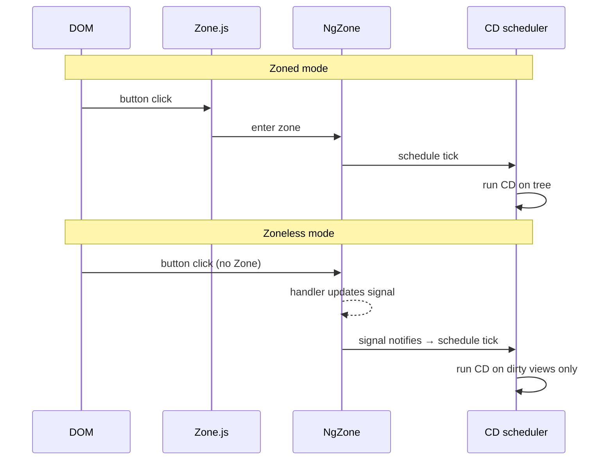

# Zone.js and Zoneless

> **One-liner**: **Zone.js** monkey-patches every async API so Angular knows when to run change detection — but it adds startup cost and ambient overhead, so modern apps can opt out with **zoneless** mode and rely on signals to drive CD.

---

## Quick Reference

| API | Purpose |
|-----|---------|
| `NgZone` | Wrapper around Zone.js' Angular zone |
| `ngZone.run(fn)` | Run inside the zone (CD will fire) |
| `ngZone.runOutsideAngular(fn)` | Run outside the zone (no CD) |
| `ngZone.onStable` / `onMicrotaskEmpty` | Lifecycle Observables |
| Provider | Default: `BrowserModule` adds it; standalone bootstrap auto-includes if `zone.js` is in polyfills |
| Zoneless | `provideExperimentalZonelessChangeDetection()` (Angular 18+) |

---

## Core Concept

Browsers expose async APIs (`setTimeout`, `Promise`, event listeners, `XMLHttpRequest`) that complete *outside* synchronous code. Angular needs to know when one of these completes so it can re-check the UI. **Zone.js** is a library that monkey-patches every async API in the browser so that any callback runs inside a "zone" — a context the runtime can hook into.

When zoned Angular boots, it creates the **NgZone** and runs your app inside it. Every async callback that originated inside this zone fires the `onMicrotaskEmpty` event, which triggers a CD tick. That's why `setTimeout(() => state++, 0)` "just works" without you calling anything Angular-specific.

The cost: Zone.js adds ~30 KB to the bundle, slows microtasks slightly, and produces noisy stack traces. It also runs CD **too often** for fine-grained UIs — every event triggers a full tree check.

**Zoneless** mode (developer preview in v18, stabilizing) removes Zone.js entirely. CD is driven by:

- **Signals** notifying their dependents
- `markForCheck()` / `detectChanges()` calls
- Default change detection on `@Input()` reference changes
- `async` pipe emissions

This requires your code to be reactive — all state changes must flow through signals or `markForCheck`. Old callback-mutates-field patterns silently stop updating the DOM.

---

## Diagram



---

## Syntax & API

### `NgZone.runOutsideAngular` for hot paths

```ts
import { NgZone, inject } from '@angular/core';

@Component({ /* ... */ })
export class CanvasComponent {
  private zone = inject(NgZone);

  ngAfterViewInit() {
    this.zone.runOutsideAngular(() => {
      const loop = () => {
        this.draw();
        requestAnimationFrame(loop);
      };
      requestAnimationFrame(loop);
    });
  }

  reportFps(fps: number) {
    this.zone.run(() => this.fpsSignal.set(fps)); // re-enter for CD
  }
}
```

### Going zoneless

```ts
// main.ts
import { provideExperimentalZonelessChangeDetection } from '@angular/core';

bootstrapApplication(AppComponent, {
  providers: [
    provideExperimentalZonelessChangeDetection(),
    // … your other providers
  ],
});
```

```json
// angular.json — remove zone.js from polyfills
"polyfills": []
// (or empty array)
```

```json
// package.json — zone.js can be removed
{
  "dependencies": {
    // "zone.js": "..." ← remove
  }
}
```

### Detecting whether you're zoneless

```ts
import { ɵPendingTasks as PendingTasks, NgZone, inject } from '@angular/core';

const zone = inject(NgZone);
const isZoneless = !(zone instanceof NgZone) || zone.isStable === undefined;
// (Better: just don't write code that depends on it.)
```

### `onStable` for waiting on the app

```ts
inject(NgZone).onStable.pipe(take(1)).subscribe(() => {
  // CD has settled; safe to take a screenshot, hydrate analytics, etc.
});
```

---

## Common Patterns

```ts
// Pattern: zoneless-ready component (works in both modes)
@Component({
  selector: 'app-counter',
  standalone: true,
  changeDetection: ChangeDetectionStrategy.OnPush,
  template: `<button (click)="inc()">{{ count() }}</button>`,
})
export class CounterComponent {
  count = signal(0);
  inc() { this.count.update(n => n + 1); }
}
// No setState, no markForCheck — signals do the work.
```

```ts
// Pattern: third-party callback compatibility for zoneless
const zone = inject(NgZone, { optional: true });
thirdParty.onChange(data => {
  if (zone) zone.run(() => this.signal.set(data));
  else      this.signal.set(data);
});
```

---

## Gotchas & Tips

- **Going zoneless requires audit.** Any code that mutates a class field expecting CD to notice will silently break. Convert state to signals.
- **Third-party libraries that don't use signals or `async` pipe may not update.** Wrap their callbacks with `markForCheck` or convert their state to signals at your boundary.
- **`runOutsideAngular` is essential even in zoned mode** for high-frequency events (mousemove, scroll, animation frames) — otherwise every event triggers full CD.
- **`onStable` is unreliable for "the app is done."** It fires whenever the zone goes stable, which may happen many times per page lifecycle.
- **In zoneless mode, `setTimeout(() => state.set(...))` works** — but `setTimeout(() => this.field = ...)` does not. Always set signals.
- **Tests may need `NoopNgZone`** in zoneless config — `provideExperimentalZonelessChangeDetection()` works in tests too, but some legacy testing helpers assume zone.

---

## See Also

- [[13 - Change Detection]]
- [[01 - Signals]]
- [[01 - Angular Internals]]
- [[06 - Performance Optimization]]
