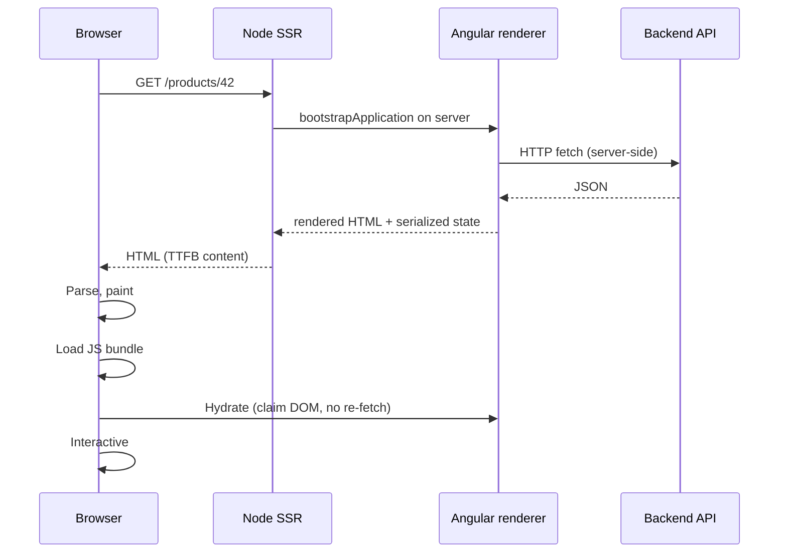

# Server-Side Rendering

> **One-liner**: Angular SSR renders the first page on the **Node server**, ships fully-formed HTML for fast first paint and SEO, then hands the live DOM to the client app via hydration.

---

## Quick Reference

| Concept / API | Purpose |
|---------------|---------|
| `ng add @angular/ssr` | Adds SSR builders, server entrypoint, hydration |
| `provideServerRendering()` | Server-side providers (in `app.config.server.ts`) |
| `provideClientHydration()` | Client-side: claim server DOM instead of re-rendering |
| `@nguniversal/express-engine` (legacy) | Old Universal package — replaced by `@angular/ssr` in v17 |
| `TransferState` / `makeStateKey` | Pass server-fetched data to client without re-fetching |
| `isPlatformServer()` / `isPlatformBrowser()` | Branch logic by execution environment |
| `REQUEST` / `RESPONSE` tokens | Inject Express req/res in SSR-only services |
| `ng build` (with SSR) | Produces `dist/<app>/browser/` + `dist/<app>/server/` |

---

## Core Concept

Single-page Angular apps ship a near-empty `index.html` and let the browser execute JS to fill in the DOM. That is bad for: **first contentful paint** (the user stares at a blank screen until JS parses), **SEO** (some crawlers don't run JS reliably), and **social previews** (OG scrapers want HTML).

**Server-side rendering** runs the same Angular app on a Node server, produces fully-rendered HTML for the requested route, and sends that to the browser. The user sees real content immediately. Once the JS bundle loads, the client app **hydrates** that HTML — it claims the existing DOM nodes instead of re-creating them — and the page becomes interactive.

Modern Angular ships SSR via the **`@angular/ssr`** package (Angular 17+). Adding it is one command (`ng add @angular/ssr`) and the new application builder produces both browser and server bundles in one build. The server entrypoint is a small Express app that you can run with `npm run serve:ssr:<app>` or deploy to any Node host (Vercel, Cloud Run, AWS Lambda, etc.).

The trade: you now run a Node server (cost, ops). State that touched `window`/`document` directly will crash on the server unless you guard it with `isPlatformBrowser`. HTTP calls double-fire unless you use `TransferState`. Auth/cookies must be wired through `REQUEST`. SSR is powerful but it changes how you write code at the boundaries.

---

## Diagram



---

## Syntax & API

### Add SSR to an existing app

```bash
ng add @angular/ssr
# Generates:
#   server.ts                    ← Express bootstrap
#   src/main.server.ts           ← server entry
#   src/app/app.config.server.ts ← server providers
#   updates angular.json with the SSR builder
```

### Server config

```ts
// app.config.server.ts
import { mergeApplicationConfig, ApplicationConfig } from '@angular/core';
import { provideServerRendering } from '@angular/platform-server';
import { appConfig } from './app.config';

const serverConfig: ApplicationConfig = {
  providers: [provideServerRendering()],
};

export const config = mergeApplicationConfig(appConfig, serverConfig);
```

### Client config (must enable hydration)

```ts
// app.config.ts
import { provideClientHydration } from '@angular/platform-browser';
import { provideHttpClient, withFetch } from '@angular/common/http';

export const appConfig: ApplicationConfig = {
  providers: [
    provideClientHydration(),
    provideHttpClient(withFetch()),  // fetch is required for SSR HTTP cache
  ],
};
```

### Branching by platform

```ts
import { inject, PLATFORM_ID } from '@angular/core';
import { isPlatformBrowser } from '@angular/common';

@Component({ /* ... */ })
export class ChartComponent {
  private isBrowser = isPlatformBrowser(inject(PLATFORM_ID));

  ngOnInit() {
    if (this.isBrowser) {
      // window/document/IntersectionObserver are safe here
      this.initChartLib();
    }
  }
}
```

### TransferState — avoid double-fetching

```ts
import { TransferState, makeStateKey } from '@angular/core';

const PRODUCTS_KEY = makeStateKey<Product[]>('products');

export class ProductService {
  private http = inject(HttpClient);
  private state = inject(TransferState);

  getProducts() {
    const cached = this.state.get(PRODUCTS_KEY, null);
    if (cached) {
      this.state.remove(PRODUCTS_KEY);  // one-shot
      return of(cached);
    }
    return this.http.get<Product[]>('/api/products').pipe(
      tap(data => this.state.set(PRODUCTS_KEY, data)),
    );
  }
}
```

> Tip: `provideHttpClient(withFetch())` + `provideClientHydration(withHttpTransferCacheOptions(...))` does this **automatically** for GET requests in modern Angular — manual `TransferState` is only needed for non-HTTP data.

### Inject the Express request

```ts
import { inject } from '@angular/core';
import { REQUEST } from '@angular/core';   // available via @angular/ssr setup

export class AuthService {
  private req = inject(REQUEST, { optional: true });

  getTokenFromCookie(): string | null {
    return this.req?.headers.cookie?.match(/token=([^;]+)/)?.[1] ?? null;
  }
}
```

### Build & serve

```bash
ng build
# dist/<app>/browser  → static assets (CDN)
# dist/<app>/server   → Node bundle (entry: server.mjs)

npm run serve:ssr:<app>   # production server on :4000
```

---

## Common Patterns

```ts
// Pattern: pre-render static routes at build time (SSG)
// angular.json → architect.build.options.prerender = true (default in v17+)
{
  "prerender": {
    "routes": ["/", "/about", "/blog"]
  }
}
// Output: dist/.../browser/about/index.html, etc.
// Mix-and-match: prerender marketing pages, SSR for /dashboard, CSR for /admin.
```

```ts
// Pattern: skip a component on the server (browser-only widgets)
@Component({
  selector: 'app-live-chat',
  template: `@if (isBrowser) {<chat-widget />}`,
})
export class LiveChatComponent {
  isBrowser = isPlatformBrowser(inject(PLATFORM_ID));
}
```

```ts
// Pattern: per-request state (auth, locale) flows through providers in server.ts
app.get('*', (req, res) => {
  commonEngine.render({
    bootstrap,
    documentFilePath: indexHtml,
    url: req.originalUrl,
    publicPath: browserDistFolder,
    providers: [
      { provide: APP_BASE_HREF, useValue: req.baseUrl },
      { provide: 'USER_LOCALE', useValue: req.acceptsLanguages()[0] },
    ],
  }).then(html => res.send(html));
});
```

---

## Gotchas & Tips

- **`window` / `document` / `localStorage` blow up on the server.** Guard with `isPlatformBrowser` or move to `ngAfterViewInit` (which doesn't run during SSR rendering by default).
- **Use `withFetch()`** for `HttpClient`. The default `XMLHttpRequest` backend doesn't exist in Node, so without `withFetch()` SSR HTTP either fails or relies on a Node-only adapter.
- **Time-based code is non-deterministic.** `Date.now()` will differ between server render and client hydration; use it inside browser-only branches or pass it via `TransferState`.
- **Long server renders block the response.** Keep first-paint data lean; defer dashboards and reports behind `@defer` or lazy routes so they're CSR.
- **Cookies and auth need explicit forwarding.** The server's `HttpClient` does not automatically attach the user's browser cookies to outbound API calls — read them from `REQUEST` and add a header.
- **Pre-rendering > SSR for static content.** If a route's HTML doesn't depend on the request, build it once at deploy time. Cheaper, faster, no runtime server needed.
- **Memory leaks from singleton state.** `providedIn: 'root'` services are *per-request* on the server (Angular creates a new injector each render). But shared module-level globals (e.g., a top-level `Map`) leak across requests — never mutate module-scope state.
- **Test with `Karma`/`Jest` for client logic, but spin up a real SSR build to catch SSR-only bugs.** A passing `ng test` does not prove the app SSRs correctly.

---

## See Also

- [[05 - Hydration]]
- [[14 - Build and Bundling]]
- [[06 - Performance Optimization]]
- [[04 - HttpClient]]
