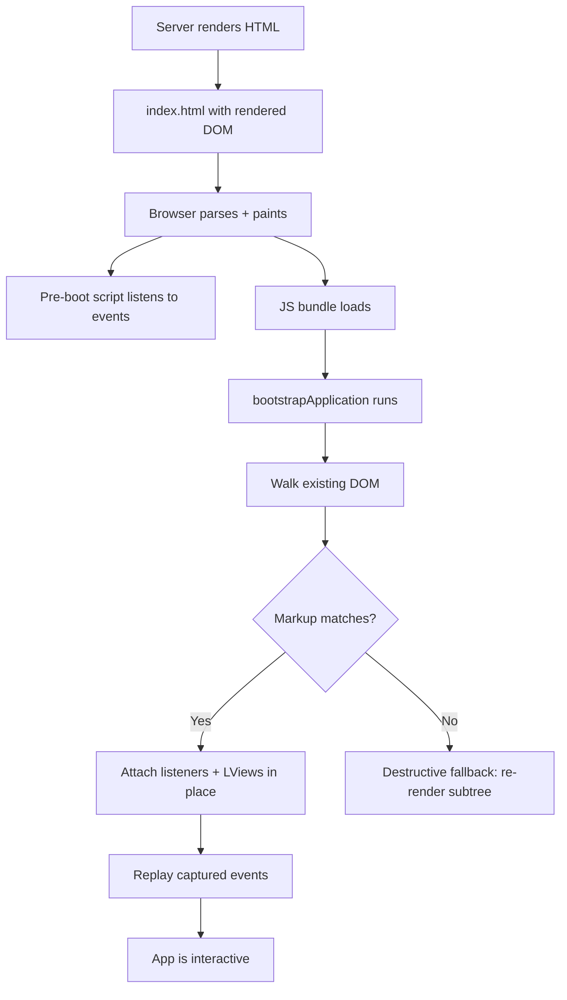

# Hydration

> **One-liner**: Hydration lets the client app **claim the existing server-rendered DOM** instead of throwing it away and re-rendering, avoiding flicker, preserving scroll, and cutting time-to-interactive.

---

## Quick Reference

| API / feature | Purpose |
|---------------|---------|
| `provideClientHydration()` | Enable non-destructive hydration |
| `withEventReplay()` | Capture clicks before JS loads, replay after hydrate (v18+) |
| `withIncrementalHydration()` | Hydrate `@defer` blocks lazily on trigger (v19+) |
| `withHttpTransferCacheOptions()` | Cache server `HttpClient` GETs to skip client re-fetch |
| `withI18nSupport()` | Hydrate apps that use `$localize` |
| `ngSkipHydration` (host attribute) | Disable hydration for one component (escape hatch) |
| `NG0500` series | Hydration mismatch error codes |

---

## Core Concept

Before Angular v16, "hydration" meant *destructive* hydration: the server rendered HTML, the browser threw it away, and Angular re-rendered the DOM on the client. Users saw a flash of unstyled content, scroll position reset, and the CPU paid twice.

**Non-destructive hydration** (v16+, stable in v17) walks the existing DOM and attaches event listeners, view references, and component instances *to the nodes that already exist*. No removal, no re-creation. The app simply "wakes up" in place.

For this to work, the server-rendered DOM must match what the client would render. If the markup differs (e.g., the client renders extra nodes due to `Date.now()`-driven content), Angular logs an `NG0500` mismatch warning and falls back to destructive hydration for that subtree.

Hydration unlocks two further features:

- **Event replay** (`withEventReplay()`) — a tiny pre-bootstrap script captures clicks, inputs, and other events that happen *before* the JS bundle finishes loading. After hydration, those events are replayed in order. Users no longer experience a "dead button" window.
- **Incremental hydration** (`withIncrementalHydration()`, v19+) — `@defer` blocks stay un-hydrated until their trigger fires (`on viewport`, `on interaction`, `on idle`, ...), then download and hydrate just that subtree. Pages with heavy below-the-fold content become drastically faster.

You enable hydration with one line in `app.config.ts`. The hard part is fixing the mismatches the diagnostics complain about.

---

## Diagram



---

## Syntax & API

### Enable hydration

```ts
// app.config.ts
import { ApplicationConfig } from '@angular/core';
import {
  provideClientHydration,
  withEventReplay,
  withIncrementalHydration,
  withHttpTransferCacheOptions,
} from '@angular/platform-browser';
import { provideHttpClient, withFetch } from '@angular/common/http';

export const appConfig: ApplicationConfig = {
  providers: [
    provideHttpClient(withFetch()),
    provideClientHydration(
      withEventReplay(),
      withIncrementalHydration(),
      withHttpTransferCacheOptions({
        includePostRequests: false,
        filter: req => !req.url.endsWith('/auth/me'),
      }),
    ),
  ],
};
```

### Skip hydration for a problem component

```html
<!-- Third-party widget that mutates DOM during init breaks hydration. -->
<flaky-third-party-chart ngSkipHydration></flaky-third-party-chart>
```

```ts
// Or set it in host bindings
@Component({
  selector: 'flaky-chart',
  host: { ngSkipHydration: 'true' },
  template: '<canvas #c></canvas>',
})
export class FlakyChart {}
```

### Incremental hydration with `@defer`

```html
<!-- Top of page renders + hydrates immediately. -->
<app-hero />

<!-- Heavy comments block: SSR'd, but JS isn't shipped or hydrated until the user scrolls to it. -->
@defer (hydrate on viewport) {
  <app-comment-thread [postId]="post.id" />
} @placeholder {
  <p>Comments loading…</p>
}
```

Other triggers: `on idle`, `on hover`, `on interaction`, `on timer(2s)`, or `when expr`.

### Diagnose mismatches

Open DevTools console. Mismatches log as `NG0500` with the offending node and a snippet of expected vs actual HTML. Common causes:

```ts
// Bad — Date.now() differs between server and client
template: `<span>Generated at {{ Date.now() }}</span>`,

// Fix — use a signal initialized after hydration, or hide on server
@Component({
  template: `
    @if (isBrowser()) {
      <span>Generated at {{ now() }}</span>
    }
  `,
})
export class StampComponent {
  isBrowser = signal(isPlatformBrowser(inject(PLATFORM_ID)));
  now = signal(Date.now());
}
```

---

## Common Patterns

```ts
// Pattern: cache server HTTP GETs so client doesn't re-fetch
provideClientHydration(
  withHttpTransferCacheOptions({
    includeHeaders: ['x-tenant'],   // vary cache by tenant header
    filter: req => req.method === 'GET',
  }),
);
// Result: every GET fired during SSR is serialized into the HTML payload
// and the client returns the cached body without hitting the network.
```

```ts
// Pattern: hydrate above-the-fold instantly, defer the rest
// Page renders + hydrates: <app-header>, <app-hero>
// Defer with on viewport: <app-features>, <app-pricing>, <app-footer>
@defer (hydrate on viewport) { <app-features /> }
@defer (hydrate on idle)     { <app-footer /> }
```

```ts
// Pattern: opt out of one component, not the whole app
// Example: a CodeMirror editor mutates DOM during attach.
<code-editor ngSkipHydration [doc]="doc" />
// Subtree falls back to destructive render; rest of the app still hydrates non-destructively.
```

---

## Gotchas & Tips

- **Mismatch errors are real bugs.** Don't suppress them with `ngSkipHydration` blanket-style. Most are caused by: time-based output, random IDs, browser-only globals leaking into the template, or third-party scripts injecting DOM during SSR.
- **`innerHTML` bindings can mismatch** if the source string differs (e.g., contains `Date.now()`). Sanitize to a stable value or wrap in `@if (isBrowser())`.
- **Hydration disables direct DOM manipulation in `ngOnInit`/`constructor`.** Use Angular's renderer or a `MutationObserver` after `ngAfterViewInit` runs (it runs only on the client).
- **Order of children matters.** If your template uses `Math.random()` to shuffle list items, server and client will produce different orders → mismatch. Sort deterministically.
- **`ngSkipHydration` is a sledgehammer.** It re-renders the subtree from scratch on the client, undoing the SSR benefit for that area. Reserve it for libraries you can't fix.
- **Event replay is best-effort.** Synthetic events (those dispatched by JS) are never replayed; only native browser events. Form submits with `requestSubmit` are tricky — test critical flows.
- **Incremental hydration ties bundle splits to triggers.** A `@defer (hydrate on viewport)` block ships its JS only when the user scrolls. Use it for the largest below-the-fold subtrees first; small components don't benefit.
- **Test hydration in production builds.** Dev mode is more forgiving. Run `ng build && node server.mjs` and view the source to confirm the SSR HTML matches what you expect.

---

## See Also

- [[04 - Server-Side Rendering]]
- [[06 - Performance Optimization]]
- [[14 - Build and Bundling]]
- [[01 - Signals]]
