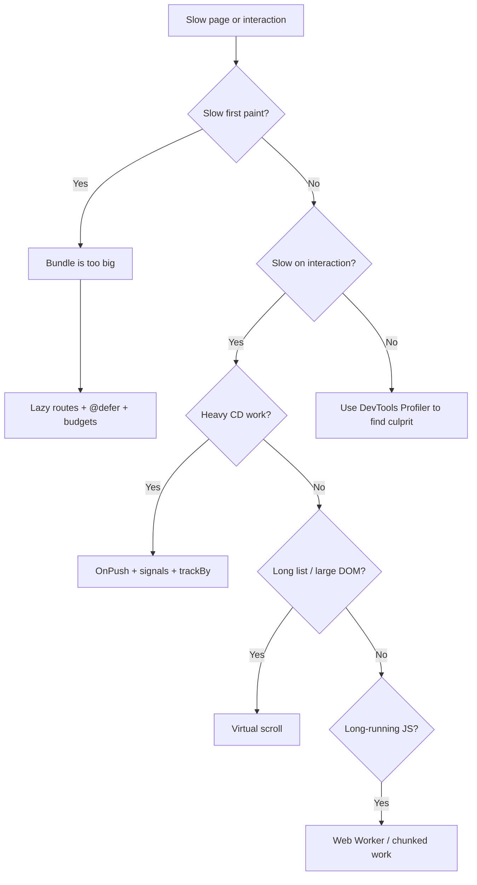

# Performance Optimization

> **One-liner**: Angular performance is **mostly about reducing the work change detection does** — push state through signals, gate components with `OnPush`, defer below-the-fold work, and only profile when the budget says so.

---

## Quick Reference

| Lever | Where | Win |
|-------|-------|-----|
| `OnPush` change detection | `@Component({ changeDetection: ChangeDetectionStrategy.OnPush })` | Skip CD for clean subtrees |
| Signals | `signal()`, `computed()` | Targeted CD on signal change |
| `trackBy` / `track` | `@for (x of list; track x.id)` | Avoid DOM re-creation on list updates |
| `@defer` blocks | template | Lazy-load chunks on trigger |
| Virtual scroll | `@angular/cdk/scrolling` | Render only visible rows |
| `provideExperimentalZonelessChangeDetection` | bootstrap | Remove Zone.js overhead |
| Lazy routes | `loadComponent` | Split bundles per route |
| `ChangeDetectorRef.detach()` | rare | Manual control over a subtree |
| Web Worker | `@angular/cli` | Move CPU-heavy work off main thread |
| Image directive | `NgOptimizedImage` | Auto-srcset, lazy loading, priority hints |
| Performance profiler | DevTools "Profiler" tab | Find slow CD ticks |

---

## Core Concept

Most Angular performance problems come from one of three sources:

1. **Change detection runs too often** — every async event triggers a full tree check by default. Solve with `OnPush` + signals.
2. **Templates do too much per CD** — heavy `@for`, expensive getters in the template, unbounded lists. Solve with `track`, virtual scroll, and computed signals.
3. **Bundle is too big** — slow first paint, slow route transitions. Solve with lazy routes, `@defer`, and bundle analysis.

The right order is **measure → fix → measure**. Use the Angular DevTools Profiler before reaching for `OnPush`. A page that takes 500 ms to render because of a synchronous JSON parse will not get faster with signals.

The **Performance Decision Tree**: identify the symptom, find the corresponding lever, apply it. Don't blanket the codebase with `OnPush` on day one — it's a refactor that changes how `@Input` updates propagate, and bugs from forgotten `markForCheck()` calls are subtle.

The deepest wins come from **reducing reactive surface area**: pass minimal data into components, prefer signals to BehaviorSubjects for shared state, and let the framework skip subtrees naturally.

---

## Diagram



---

## Syntax & API

### `OnPush` + signals

```ts
@Component({
  selector: 'product-card',
  changeDetection: ChangeDetectionStrategy.OnPush,
  template: `
    <h3>{{ product().name }}</h3>
    <p>{{ formattedPrice() }}</p>
  `,
})
export class ProductCardComponent {
  product = input.required<Product>();
  formattedPrice = computed(() => `$${this.product().price.toFixed(2)}`);
}
```

`OnPush` only re-checks this component when:
- An `@Input()` reference changes (or a signal input is `set`)
- An event fires inside the component
- A signal it reads changes
- `markForCheck()` / `detectChanges()` is called explicitly

### `track` for lists

```html
<!-- Bad: Angular re-creates DOM for every row when the array reference changes. -->
@for (item of items(); track $index) { ... }

<!-- Good: track by stable id. Only changed rows are touched. -->
@for (item of items(); track item.id) { ... }
```

### `@defer` blocks

```html
<app-hero />

@defer (on viewport) {
  <app-related-products [productId]="id()" />
} @loading (after 200ms; minimum 500ms) {
  <skeleton-card count="4" />
} @placeholder {
  <p>Scroll for more</p>
} @error {
  <p>Failed to load. <button (click)="retry()">Retry</button></p>
}
```

Triggers: `on idle`, `on viewport`, `on hover`, `on interaction`, `on timer(2s)`, `when condition`.

### Virtual scroll

```ts
import { ScrollingModule } from '@angular/cdk/scrolling';

@Component({
  imports: [ScrollingModule],
  template: `
    <cdk-virtual-scroll-viewport itemSize="48" class="h-96">
      @for (row of rows; track row.id) {
        <div class="row">{{ row.name }}</div>
      }
    </cdk-virtual-scroll-viewport>
  `,
  styles: `.row { height: 48px; }`,
})
export class BigList {
  rows = generate(100_000);
}
```

### `NgOptimizedImage`

```html

<!-- For LCP images, add `priority`. Auto-generates srcset, lazy-loads non-priority by default. -->
```

### Web Worker

```bash
ng generate web-worker app/heavy
```

```ts
const worker = new Worker(new URL('./heavy.worker', import.meta.url), { type: 'module' });
worker.onmessage = ({ data }) => this.result.set(data);
worker.postMessage(payload);
```

### Detach / reattach a subtree

```ts
constructor(private cdr: ChangeDetectorRef) {
  this.cdr.detach();
}
// Later, when really ready:
update() {
  this.cdr.detectChanges();
}
```

(Use sparingly — fragile and easy to leak.)

---

## Common Patterns

```ts
// Pattern: signals for shared state replace BehaviorSubject + async pipe
@Injectable({ providedIn: 'root' })
export class CartService {
  items = signal<Item[]>([]);
  total = computed(() => this.items().reduce((s, i) => s + i.price, 0));
  add(item: Item) { this.items.update(arr => [...arr, item]); }
}
// Components read `this.cart.total()` directly. With OnPush, only views that
// read `total()` re-check when items change.
```

```ts
// Pattern: hoist work out of templates
// Bad: getter recomputes on every CD
get visibleItems() { return this.items.filter(i => i.active); }

// Good: computed signal, runs once per dependency change
visibleItems = computed(() => this.items().filter(i => i.active));
```

```ts
// Pattern: budgets in angular.json fail the build at a size regression
"budgets": [
  { "type": "initial",   "maximumWarning": "500kb", "maximumError": "1mb" },
  { "type": "anyComponentStyle", "maximumWarning": "4kb", "maximumError": "8kb" }
]
```

---

## Gotchas & Tips

- **Don't put function calls in templates.** `{{ expensiveCompute() }}` runs on every CD. Use a `computed()` or memoize.
- **`OnPush` + plain `@Input` + array mutation = stale UI.** `OnPush` checks reference equality. Use immutable updates (`[...arr, x]`, `{...obj, k: v}`) or signal inputs.
- **Pipes are pure by default.** `pure: true` pipes only re-run when arguments change — use them as poor-man's memoization in templates.
- **`async` pipe is OnPush-friendly** — it calls `markForCheck()` automatically when the observable emits.
- **`trackBy` matters only on long lists with frequent updates.** For static or short lists, `track $index` is fine.
- **Don't measure dev builds.** Production (`ng build`) enables AOT, optimizations, and tree-shaking. Dev mode performance is irrelevant.
- **`@defer` ships separate bundles** — verify with `ng build --stats-json` + `webpack-bundle-analyzer`. A `@defer` block that imports the same modules as its parent gives no bundle benefit.
- **Zoneless > OnPush** for greenfield apps if your code can be made signals-only. Bigger payoff than chasing OnPush retrofits.
- **`NgOptimizedImage` requires `width` + `height`.** It refuses to render images without intrinsic size — that's intentional, it prevents CLS.
- **Don't optimize blind.** A 2-second flame graph from the Angular DevTools Profiler beats a week of speculative refactoring.

---

## See Also

- [[01 - Signals]]
- [[13 - Change Detection]]
- [[02 - Zone.js and Zoneless]]
- [[14 - Build and Bundling]]
- [[10 - Angular CDK]]
