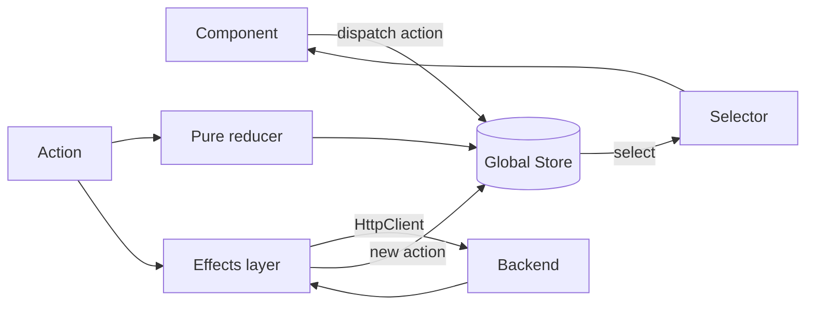

# NgRx and State Management

> **One-liner**: NgRx is the Angular flavour of Redux — a single store, pure reducers, side effects in a separate layer; modern alternatives (`@ngrx/component-store`, `@ngrx/signals`) trade scope for ergonomics, and many apps need only a service-with-signals.

---

## Quick Reference

| Library / API | Scope | Use when |
|---------------|-------|----------|
| Service + `signal()` | feature / app | Default. 90% of apps stop here. |
| `@ngrx/signals` (SignalStore) | feature / app | Structured signal store with hooks, deep state, RxJS interop |
| `@ngrx/component-store` | component subtree | One feature, no global broadcast |
| `@ngrx/store` + `@ngrx/effects` | global | Many features, time-travel debugging, audit log |
| `provideStore({...})` | bootstrap | Global store config |
| `provideEffects([...])` | bootstrap | Side-effect classes |
| `createReducer` / `on()` | reducer | Pure state transitions |
| `createAction` | actions | Typed action creators |
| `createSelector` | selectors | Memoized derived state |
| `createFeatureSelector` | selectors | Feature root accessor |
| `Store#dispatch(action)` | components | Trigger reducer + effects |

---

## Core Concept

State management exists to keep UI consistent across components when many of them depend on the same data. The simplest tool is a service. The most complex is global Redux. Pick the smallest tool that fits.

**Three tiers:**

1. **Service with signals.** A `@Injectable({ providedIn: 'root' })` exposing `signal()` / `computed()` / methods. No actions, no reducers, no boilerplate. This handles the vast majority of apps.
2. **`@ngrx/signals` SignalStore.** A structured factory: `signalStore(withState({...}), withMethods(...), withComputed(...))`. Built-in helpers for entities, RxJS interop, lifecycle hooks. Modern best-practice for medium-complexity apps.
3. **Global NgRx store + effects.** Redux pattern: components dispatch actions, pure reducers update a single store, effects handle async (API calls, debounced searches). Brings DevTools time travel, an audit trail, and predictable flow — at the cost of significant boilerplate.

**`@ngrx/component-store`** is a middle option: a per-component reactive store, scoped to a feature, with the same operator-based effect API but no global registry.

The thing to avoid: half-Redux. Apps that have actions and reducers but mutate state inside components, or sprinkle `subscribe()` blocks instead of using `select`, get the boilerplate without the predictability. Pick a tier and apply it consistently.

---

## Diagram



---

## Syntax & API

### Tier 1 — Service with signals

```ts
@Injectable({ providedIn: 'root' })
export class CounterService {
  private state = signal({ count: 0, history: [] as number[] });

  count = computed(() => this.state().count);
  history = computed(() => this.state().history);

  increment() {
    this.state.update(s => ({
      count: s.count + 1,
      history: [...s.history, s.count + 1],
    }));
  }
}
```

### Tier 2 — `@ngrx/signals` SignalStore

```ts
import { signalStore, withState, withComputed, withMethods, patchState } from '@ngrx/signals';
import { rxMethod } from '@ngrx/signals/rxjs-interop';
import { switchMap, tap } from 'rxjs';

export const ProductsStore = signalStore(
  { providedIn: 'root' },
  withState({ items: [] as Product[], loading: false, query: '' }),
  withComputed(({ items }) => ({
    count: computed(() => items().length),
  })),
  withMethods((store, api = inject(ProductApi)) => ({
    setQuery(q: string) { patchState(store, { query: q }); },
    load: rxMethod<string>(
      pipe(
        tap(() => patchState(store, { loading: true })),
        switchMap(q => api.search(q)),
        tap(items => patchState(store, { items, loading: false })),
      ),
    ),
  })),
);
```

```ts
// Usage in component
@Component({ /* ... */ })
export class ProductsPage {
  store = inject(ProductsStore);
  // template: <li *ngFor="let p of store.items()">{{ p.name }}</li>
}
```

### Tier 3 — Global NgRx Store

```ts
// counter.actions.ts
import { createActionGroup, emptyProps, props } from '@ngrx/store';

export const CounterActions = createActionGroup({
  source: 'Counter',
  events: {
    'Increment': emptyProps(),
    'Add': props<{ value: number }>(),
    'Reset': emptyProps(),
  },
});

// counter.reducer.ts
import { createReducer, on } from '@ngrx/store';
import { CounterActions } from './counter.actions';

export interface CounterState { count: number; }
const initial: CounterState = { count: 0 };

export const counterReducer = createReducer(
  initial,
  on(CounterActions.increment, s => ({ ...s, count: s.count + 1 })),
  on(CounterActions.add, (s, { value }) => ({ ...s, count: s.count + value })),
  on(CounterActions.reset, () => initial),
);

// counter.selectors.ts
import { createFeatureSelector, createSelector } from '@ngrx/store';
const selectCounter = createFeatureSelector<CounterState>('counter');
export const selectCount = createSelector(selectCounter, s => s.count);

// app.config.ts
import { provideStore } from '@ngrx/store';
import { provideEffects } from '@ngrx/effects';
import { provideStoreDevtools } from '@ngrx/store-devtools';

export const appConfig: ApplicationConfig = {
  providers: [
    provideStore({ counter: counterReducer }),
    provideEffects([]),
    provideStoreDevtools({ maxAge: 25 }),
  ],
};
```

### Effects (async side-effects)

```ts
@Injectable()
export class CounterEffects {
  private actions$ = inject(Actions);
  private api = inject(CounterApi);

  loadOnInit$ = createEffect(() =>
    this.actions$.pipe(
      ofType(CounterActions.loadFromServer),
      switchMap(() => this.api.fetch().pipe(
        map(value => CounterActions.add({ value })),
        catchError(err => of(CounterActions.loadFailed({ error: err.message }))),
      )),
    ),
  );
}

// register: provideEffects([CounterEffects])
```

### Component-Store (feature-scoped)

```ts
@Injectable()
export class TodoStore extends ComponentStore<{ todos: Todo[] }> {
  constructor() { super({ todos: [] }); }

  readonly todos$ = this.select(s => s.todos);

  readonly addTodo = this.updater((s, todo: Todo) => ({ todos: [...s.todos, todo] }));

  readonly loadAll = this.effect<void>(trigger$ =>
    trigger$.pipe(switchMap(() => this.api.list().pipe(
      tap(todos => this.patchState({ todos })),
    ))),
  );
}
```

---

## Common Patterns

```ts
// Pattern: entity collections — @ngrx/entity for normalized state
import { createEntityAdapter, EntityState } from '@ngrx/entity';
const adapter = createEntityAdapter<User>();
export interface UsersState extends EntityState<User> { loading: boolean; }
const initial = adapter.getInitialState({ loading: false });
// reducer: on(loaded, (s, { users }) => adapter.setAll(users, s))
// selectors: adapter.getSelectors() → selectAll, selectEntities, selectIds
```

```ts
// Pattern: ban side effects in reducers
// Reducers must be pure: input state + action → output state. No `Date.now()`, no
// `Math.random()`, no I/O. Move those into effects (they take an action and produce a new action).
```

```ts
// Pattern: feature state via `provideState` for lazy modules
// app.config.ts: provideStore() with no features
// products.routes.ts: provideState('products', productsReducer)
//   → loaded only when /products route activates → smaller initial bundle
```

---

## Gotchas & Tips

- **Default to the smallest tier.** A signals service with 50 lines beats a 500-line NgRx setup for most CRUD UIs. Reach for global NgRx when the audit log or DevTools time travel is genuinely useful.
- **NgRx + signals is now first-class.** `Store.selectSignal(selector)` returns a signal — components can be `OnPush` + signal-based without any `async` pipes.
- **Selectors are memoized.** `createSelector` skips work if input slices haven't changed. Don't reach inside the store with raw `.subscribe(s => s.foo.bar)`.
- **Effects must dispatch new actions, not mutate.** Effects taking an action and never returning one (`{ dispatch: false }`) are valid for fire-and-forget (e.g., `Router.navigate`), but the default is action-in / action-out.
- **`@ngrx/signals` SignalStore is reactive end-to-end.** The state is a signal; `withComputed` produces signals; `rxMethod` interops with RxJS streams. No subscriptions in components.
- **Don't store derived data.** Compute it from base state via selectors / `computed()`. Storing both `items` and `total` is two sources of truth → bugs.
- **Action types must be unique strings.** `createActionGroup` generates them as `[Source] Event`. Collisions across features cause silent reducer crosstalk.
- **DevTools require dev builds.** Production builds strip `@ngrx/store-devtools` unless explicitly kept. Don't ship time-travel debugging to production.
- **State should be JSON-serializable** if you want hot-reload, replay, persistence. Avoid putting `Map`, `Set`, class instances directly in the store.

---

## See Also

- [[01 - Signals]]
- [[02 - RxJS Fundamentals]]
- [[08 - RxJS Advanced]]
- [[12 - Dependency Injection Deep Dive]]
