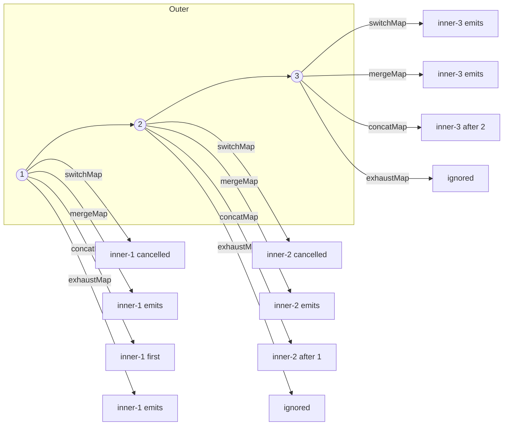

# RxJS Advanced

> **One-liner**: Past the everyday operators, RxJS is about **controlling concurrency** (which inner stream wins), **multicasting** (one source, many subscribers), **schedulers** (when emissions run), and **building custom operators** when the library doesn't have one.

---

## Quick Reference

| Concept | API |
|---------|-----|
| Higher-order observables | Observable of Observables → flatten with `switchMap` / `mergeMap` / `concatMap` / `exhaustMap` |
| Multicasting | `share()`, `shareReplay({ bufferSize, refCount })`, `connectable()`, `multicast()` |
| Subjects | `Subject`, `BehaviorSubject`, `ReplaySubject`, `AsyncSubject` |
| Schedulers | `asapScheduler`, `asyncScheduler`, `queueScheduler`, `animationFrameScheduler` |
| Error recovery | `catchError`, `retry`, `retryWhen` (legacy), `repeat`, `onErrorResumeNext` |
| Custom operator | `function myOp() { return source$ => source$.pipe(...) }` |
| Custom operator (low-level) | `new Observable(subscriber => ...)` |
| Backpressure helpers | `throttleTime`, `debounceTime`, `auditTime`, `sampleTime`, `bufferTime` |
| Combination | `combineLatest`, `forkJoin`, `zip`, `withLatestFrom`, `merge`, `concat`, `race` |
| Hot conversion | `share()`, `connectable()`, manual `Subject` proxy |

---

## Core Concept

The four flatteners are not interchangeable. Each picks a different "winner" when a new outer value arrives while an inner Observable is still running:

- **`switchMap`** — cancel the previous inner, start a new one. *Use for:* type-ahead, navigation-driven loads. The outer "wins."
- **`mergeMap`** — run all inners concurrently, interleave outputs. *Use for:* parallel uploads, fire-and-forget.
- **`concatMap`** — queue inners, run them in order one at a time. *Use for:* serial commands where order matters.
- **`exhaustMap`** — ignore new outers while an inner is running. *Use for:* button submits — guard against double-clicks. The current inner "wins."

**Multicasting** turns a cold Observable (one producer per subscriber) into a hot one (one shared producer). Without multicasting, two `subscribe()` calls trigger two HTTP requests. With `shareReplay({ bufferSize: 1, refCount: true })`, both subscribers see the same response.

**Schedulers** decide *when* an emission runs. `asyncScheduler` uses `setTimeout`, `asapScheduler` uses microtasks, `queueScheduler` runs synchronously, `animationFrameScheduler` syncs to `requestAnimationFrame`. Most code works fine on the default; reach for schedulers when you need to throttle inside a tight loop or animate.

**Custom operators** are functions that return `(source$) => source$.pipe(...)`. They compose existing operators into a reusable unit. Low-level operators that don't reduce to existing pipes use `new Observable(subscriber => ...)` directly.

---

## Diagram



---

## Syntax & API

### Picking the right flattener

```ts
// switchMap — type-ahead search
search$.pipe(
  debounceTime(200),
  distinctUntilChanged(),
  switchMap(q => http.get<Result[]>(`/api/search?q=${q}`)),
);

// concatMap — process saves one at a time
saveQueue$.pipe(
  concatMap(payload => http.post('/api/save', payload)),
);

// mergeMap — parallel uploads, max 3 concurrent
files$.pipe(
  mergeMap(file => uploadFile(file), 3 /* concurrency */),
);

// exhaustMap — submit button: ignore double-clicks
submitClicks$.pipe(
  exhaustMap(() => http.post('/api/submit', form.value)),
);
```

### Multicasting

```ts
// Cold by default — every subscribe = new HTTP call
const products$ = http.get<Product[]>('/api/products');

// Multicast: one HTTP call, replay last value to late subscribers
const sharedProducts$ = http.get<Product[]>('/api/products').pipe(
  shareReplay({ bufferSize: 1, refCount: true }),
);
// refCount: true → unsubscribe everyone → tear down source
// refCount: false → source stays alive forever (memory risk)
```

### Custom (high-level) operator

```ts
import { OperatorFunction, MonoTypeOperatorFunction, of } from 'rxjs';
import { catchError, finalize, map } from 'rxjs/operators';

export function withLoading<T>(loading$: Subject<boolean>): MonoTypeOperatorFunction<T> {
  return source$ => {
    loading$.next(true);
    return source$.pipe(finalize(() => loading$.next(false)));
  };
}

// Usage
http.get('/api').pipe(withLoading(this.loading$));
```

### Custom (low-level) operator — interval that pauses on document hidden

```ts
import { Observable } from 'rxjs';

export function visibilityAwareInterval(ms: number) {
  return new Observable<number>(subscriber => {
    let count = 0;
    let id: any = null;
    const start = () => {
      stop();
      id = setInterval(() => subscriber.next(count++), ms);
    };
    const stop = () => { if (id) clearInterval(id); id = null; };
    const onVis = () => document.hidden ? stop() : start();
    document.addEventListener('visibilitychange', onVis);
    start();
    return () => {
      stop();
      document.removeEventListener('visibilitychange', onVis);
    };
  });
}
```

### Schedulers

```ts
import { range, asapScheduler, animationFrameScheduler } from 'rxjs';
import { observeOn } from 'rxjs/operators';

range(1, 1_000).pipe(
  observeOn(asapScheduler),     // run emissions as microtasks (don't block paint)
);

// Animate via animationFrameScheduler
interval(0, animationFrameScheduler).subscribe(t => /* draw frame */);
```

### Error recovery patterns

```ts
http.get('/api').pipe(
  retry({ count: 3, delay: (_, i) => timer(2 ** i * 200) }),  // exp backoff
  catchError(err => {
    log(err);
    return of([] as Item[]);  // graceful fallback
  }),
);
```

### Combination operators (mental model)

```ts
combineLatest([a$, b$])  // emits when either emits, after both have emitted at least once
forkJoin([a$, b$])       // emits ONCE when both complete, with last values (Promise.all-like)
zip([a$, b$])            // pairs by index, waits for both
withLatestFrom(b$)       // a$ drives, samples latest b$
merge(a$, b$)            // emit whichever fires
concat(a$, b$)           // a$ first, then b$ after a$ completes
race(a$, b$)             // whichever emits first wins; the other is unsubscribed
```

---

## Common Patterns

```ts
// Pattern: cancel-aware data load tied to route
this.id$ = this.route.paramMap.pipe(map(p => +p.get('id')!));
this.product$ = this.id$.pipe(
  switchMap(id => this.http.get<Product>(`/api/products/${id}`)),
  shareReplay({ bufferSize: 1, refCount: true }),
);
// Navigate to a different id → previous request cancels.
```

```ts
// Pattern: state + actions via subjects
private actions = new Subject<Action>();
private state$ = this.actions.pipe(
  scan((state, action) => reduce(state, action), initial),
  shareReplay({ bufferSize: 1, refCount: true }),
);
dispatch(a: Action) { this.actions.next(a); }
```

```ts
// Pattern: long-poll
poll$ = timer(0, 5_000).pipe(
  switchMap(() => http.get<Status>('/api/status')),
  distinctUntilChanged((a, b) => a.version === b.version),
);
```

---

## Gotchas & Tips

- **`shareReplay({ bufferSize: 1 })` without `refCount: true` keeps the upstream alive forever.** This causes memory leaks and re-runs on hot reloads. Always set `refCount: true` unless you specifically want a permanent cache.
- **`retryWhen` is deprecated** in RxJS 7+. Use `retry({ count, delay })` with a delay function (returning a `timer()` Observable) instead.
- **`merge`/`combineLatest` of an empty array** behaves differently per operator. `combineLatest([])` emits an empty array immediately and completes; `forkJoin([])` emits nothing. Read the docs before relying on edge cases.
- **`finalize` runs on completion *and* error and *and* unsubscribe.** Useful for cleaning up loaders or websockets — not for distinguishing success from failure.
- **`takeUntilDestroyed()`** (Angular 16+) replaces the manual `destroy$ = new Subject()` pattern in components: `obs$.pipe(takeUntilDestroyed())`. Run inside a constructor / injection context.
- **Hot vs cold confusion is the #1 RxJS bug.** If a component sees stale data, your stream is probably cold and re-subscribing each consumer. Add `share()` or `shareReplay`.
- **`scan` is `reduce` for streams.** Build state machines, accumulators, running counters with it.
- **Don't write a new Observable from scratch unless you must.** 95% of operators are compositions of existing ones. The low-level constructor introduces subtle leak / completion bugs.
- **Schedulers can change synchronicity.** A test that expected `next` to fire synchronously may break if you add `observeOn(asyncScheduler)`. Use `TestScheduler` for deterministic marble tests.
- **`exhaustMap` for submit buttons** is the correct primitive — better than disabling the button manually, because the stream stays predictable.

---

## See Also

- [[02 - RxJS Fundamentals]]
- [[03 - RxJS Operators]]
- [[05 - HTTP Interceptors]]
- [[01 - Signals]]
