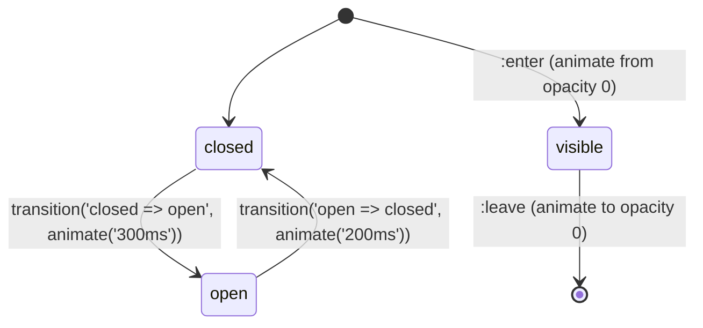

# Animations

> **One-liner**: Angular's `@angular/animations` package wraps the **Web Animations API** in a declarative DSL — you describe states and transitions, the framework runs them off the main thread.

---

## Quick Reference

| API | Purpose |
|-----|---------|
| `provideAnimations()` | Enable animation system |
| `provideAnimationsAsync()` | Lazy-load animations module (smaller initial bundle, v17+) |
| `trigger(name, [...])` | Defines animation states + transitions |
| `state('name', style({...}))` | A static "resting" style |
| `transition('a => b', [...])` | What runs between two states |
| `style({...})` | CSS-in-TS property bag |
| `animate('300ms ease', style({...}))` | Time + easing + target style |
| `keyframes([...])` | Multi-step animation |
| `group([...])` | Run animations in parallel |
| `sequence([...])` | Run animations one after another |
| `query('selector')` | Animate child elements |
| `stagger('100ms', ...)` | Delay each child by N |
| `:enter` / `:leave` | DOM-attach / DOM-detach pseudo-states |
| `AnimationBuilder` | Imperative one-shot animations |

---

## Core Concept

The animation package solves three things vanilla CSS struggles with: **animating elements as they enter or leave the DOM** (CSS only animates elements that exist), **coordinating sequences across many children**, and **animating state-driven transitions** (e.g., `'open' => 'closed'`) without manual class toggling.

You declare an `animations: [trigger(...)]` block in the `@Component` metadata. Each `trigger` is a state machine: a list of named **states** (each with a resting style) and **transitions** (which run when the state changes). You bind the trigger to a host element with `[@triggerName]="state"` and Angular runs the right transition when the value changes.

Under the hood, Angular compiles this DSL down to **Web Animations API** calls. Animations run on the compositor thread when possible (transform/opacity), so they don't block CD or layout. Falling back to JS-driven layout animations is what makes complex sequences slower than pure CSS.

For one-off, programmatic animations (e.g., shake-on-error), use **`AnimationBuilder`** — it gives you imperative control without a trigger declaration.

For modern apps, lots of animations are now done with **CSS view transitions** (router-level) and **CSS animations + signals** for state. The `@angular/animations` API still wins for: enter/leave choreography of `*ngFor`-style lists, and complex multi-stage choreographies that need synchronization.

---

## Diagram



---

## Syntax & API

### Setup

```ts
// app.config.ts
import { provideAnimationsAsync } from '@angular/platform-browser/animations/async';

export const appConfig: ApplicationConfig = {
  providers: [provideAnimationsAsync()],
};
```

### A simple state-driven animation

```ts
import { trigger, state, style, animate, transition } from '@angular/animations';

@Component({
  selector: 'app-panel',
  template: `
    <button (click)="open = !open">Toggle</button>
    <div [@expand]="open ? 'open' : 'closed'" class="panel">…</div>
  `,
  animations: [
    trigger('expand', [
      state('closed', style({ height: '0', opacity: 0 })),
      state('open',   style({ height: '*', opacity: 1 })),
      transition('closed <=> open', animate('250ms ease-in-out')),
    ]),
  ],
})
export class PanelComponent { open = false; }
```

### Enter / leave for `@for` lists

```ts
@Component({
  template: `
    @for (item of items(); track item.id) {
      <div @fade class="row">{{ item.name }}</div>
    }
  `,
  animations: [
    trigger('fade', [
      transition(':enter', [
        style({ opacity: 0, transform: 'translateY(-10px)' }),
        animate('200ms ease-out', style({ opacity: 1, transform: 'none' })),
      ]),
      transition(':leave', [
        animate('150ms ease-in', style({ opacity: 0 })),
      ]),
    ]),
  ],
})
export class ListComponent {
  items = signal<{ id: number; name: string }[]>([...]);
}
```

### Stagger across children

```ts
trigger('list', [
  transition('* => *', [
    query(':enter', [
      style({ opacity: 0, transform: 'translateY(20px)' }),
      stagger('60ms', [
        animate('300ms ease-out', style({ opacity: 1, transform: 'none' })),
      ]),
    ], { optional: true }),
  ]),
]),
```

```html
<ul [@list]="items().length">
  @for (i of items(); track i.id) {
    <li>{{ i.name }}</li>
  }
</ul>
```

### Keyframes (multi-step)

```ts
trigger('shake', [
  transition('* => shake', [
    animate('400ms', keyframes([
      style({ transform: 'translateX(0)',   offset: 0 }),
      style({ transform: 'translateX(-10px)', offset: 0.25 }),
      style({ transform: 'translateX(10px)',  offset: 0.75 }),
      style({ transform: 'translateX(0)',   offset: 1 }),
    ])),
  ]),
]),
```

### Imperative animations with `AnimationBuilder`

```ts
import { AnimationBuilder, animate, style } from '@angular/animations';

@Component({ /* ... */ })
export class FlashComponent {
  private builder = inject(AnimationBuilder);
  private elRef = inject(ElementRef);

  flash() {
    const factory = this.builder.build([
      style({ background: 'yellow' }),
      animate('1s ease-out', style({ background: 'transparent' })),
    ]);
    factory.create(this.elRef.nativeElement).play();
  }
}
```

### Route animations

```ts
// router setup
provideRouter(routes, withComponentInputBinding()),

// app.component.ts
@Component({
  template: `
    <main [@routeAnim]="getRouteState(outlet)">
      <router-outlet #outlet="outlet" />
    </main>
  `,
  animations: [
    trigger('routeAnim', [
      transition('* => *', [
        query(':enter', [style({ opacity: 0 })], { optional: true }),
        query(':enter', [animate('300ms', style({ opacity: 1 }))], { optional: true }),
      ]),
    ]),
  ],
})
export class AppComponent {
  getRouteState(outlet: RouterOutlet) {
    return outlet?.activatedRouteData?.['animation'];
  }
}

// in routes config
{ path: 'home', component: Home, data: { animation: 'home' } },
```

---

## Common Patterns

```ts
// Pattern: enter-only fade for newly added rows
transition(':enter', [
  style({ opacity: 0 }),
  animate('200ms', style({ opacity: 1 })),
]),
```

```ts
// Pattern: run two animations in parallel
transition('closed => open', [
  group([
    animate('300ms', style({ height: '*' })),
    animate('200ms 100ms', style({ opacity: 1 })),  // delay 100ms
  ]),
]),
```

```ts
// Pattern: AnimationBuilder for one-off feedback
shake() {
  const player = this.builder.build([
    animate('400ms', keyframes([...]))
  ]).create(host);
  player.onDone(() => player.destroy());
  player.play();
}
```

---

## Gotchas & Tips

- **`provideAnimationsAsync()` ships the animation engine in a separate chunk** — use it unless you need animations on the very first paint.
- **`height: '*'`** measures the natural height at runtime — the trick that makes "expand from 0 to natural" possible. Without it, you'd need a fixed pixel value.
- **`@triggerName` requires a value to bind to.** Even a static animation needs `[@fade]="true"`. Use `[@fade]` (no value) only for `:enter` / `:leave`.
- **Disable in tests** — `BrowserAnimationsModule` slows tests dramatically. Use `provideNoopAnimations()` in `TestBed`.
- **Don't animate `display`.** It's not animatable. Animate `height`, `opacity`, `transform` (preferred), or `visibility` with delay.
- **Transform + opacity = compositor-friendly = smooth.** Animating `width`/`top`/`left` triggers layout on every frame and stutters.
- **`:enter` doesn't fire for the initial render** if the element is in the DOM at component init. Use `query(':enter', ..., { optional: true })` and toggle visibility through the trigger value.
- **Route animations need the page wrapper** to be a `position: relative` element; outgoing/incoming pages overlap during transition.
- **Web Animations API + Safari quirks** — some easing functions render differently on iOS. Test on the real device for hero animations.
- **For purely visual transitions, plain CSS is simpler.** `transition: opacity 200ms` does what a `trigger` does without the API surface. Reach for `@angular/animations` when the animation depends on Angular state changes (enter/leave, signal-driven), not just hover/focus.

---

## See Also

- [[03 - Components and Templates]]
- [[06 - Performance Optimization]]
- [[10 - Angular CDK]]
- [[11 - Angular Material]]
