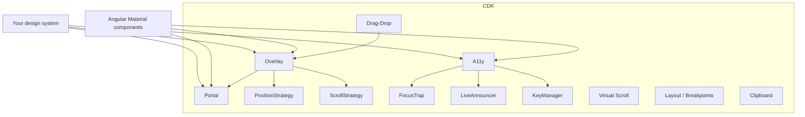

# Angular CDK

> **One-liner**: The **Component Dev Kit** is Angular Material's foundation — unstyled primitives for overlays, portals, drag-drop, virtual scroll, accessibility, layout, and clipboard, that you can use to build your own design system.

---

## Quick Reference

| Module | Primitives |
|--------|-----------|
| `@angular/cdk/overlay` | `Overlay`, `OverlayRef`, `OverlayConfig`, `PositionStrategy` |
| `@angular/cdk/portal` | `Portal`, `ComponentPortal`, `TemplatePortal`, `PortalModule` |
| `@angular/cdk/drag-drop` | `cdkDrag`, `cdkDropList`, `CdkDragDrop` event |
| `@angular/cdk/scrolling` | `cdk-virtual-scroll-viewport`, `*cdkVirtualFor` |
| `@angular/cdk/a11y` | `FocusTrap`, `LiveAnnouncer`, `FocusMonitor`, key managers |
| `@angular/cdk/layout` | `BreakpointObserver`, `Breakpoints` |
| `@angular/cdk/clipboard` | `Clipboard` service, `[cdkCopyToClipboard]` |
| `@angular/cdk/dialog` | Headless dialog primitive (`Dialog`, `DialogRef`) |
| `@angular/cdk/menu` | Headless menu with keyboard, ARIA |
| `@angular/cdk/listbox` | Accessible single/multi-select listbox |
| `@angular/cdk/observers` | `cdkObserveContent`, `BreakpointObserver` |
| `@angular/cdk/text-field` | Auto-resize textarea (`cdkTextareaAutosize`) |

---

## Core Concept

The CDK gives you the **hard parts** of building UI components — the parts that take weeks to get right — without imposing a visual design. Material Design components are themselves built on the CDK; you can build a "Bootstrap-style" or "Tailwind-style" library on the same foundation.

The two most powerful primitives are **Overlay** and **Portal**:

- **Overlay** creates a floating layer attached to the page (think dropdowns, dialogs, tooltips). It handles positioning relative to a host element, scroll strategies, backdrop click, and z-index management.
- **Portal** lets you render a component or template *somewhere else* in the DOM tree — typically inside an overlay. The portal'd content keeps its original Angular context (services, change detection) but renders elsewhere visually.

Together they replace `position: absolute` + manual portal logic with safe, accessible, framework-aware primitives.

The **a11y** module is also indispensable: focus traps for modals, live announcers for screen-reader updates, and key managers that turn a list of items into a keyboard-navigable widget. Most home-grown UI fails accessibility audits because these are hard to get right manually.

**Drag-drop** and **virtual scroll** solve their respective problems with a few directives. Both are zero-styling and integrate cleanly with `OnPush` and signals.

---

## Diagram



---

## Syntax & API

### Overlay + Portal — a tooltip from scratch

```ts
import { Overlay, OverlayConfig } from '@angular/cdk/overlay';
import { ComponentPortal } from '@angular/cdk/portal';

@Directive({ selector: '[appTooltip]', standalone: true })
export class TooltipDirective {
  text = input.required<string>({ alias: 'appTooltip' });
  private overlay = inject(Overlay);
  private host = inject(ElementRef<HTMLElement>);
  private ref?: OverlayRef;

  @HostListener('mouseenter') show() {
    const positionStrategy = this.overlay.position()
      .flexibleConnectedTo(this.host)
      .withPositions([{ originX: 'center', originY: 'top', overlayX: 'center', overlayY: 'bottom', offsetY: -8 }]);

    this.ref = this.overlay.create({ positionStrategy, scrollStrategy: this.overlay.scrollStrategies.reposition() });
    const portal = new ComponentPortal(TooltipComponent);
    const inst = this.ref.attach(portal).instance;
    inst.text = this.text();
  }

  @HostListener('mouseleave') hide() { this.ref?.dispose(); }
}
```

### Drag-drop

```ts
import { CdkDragDrop, DragDropModule, moveItemInArray } from '@angular/cdk/drag-drop';

@Component({
  imports: [DragDropModule],
  template: `
    <div cdkDropList (cdkDropListDropped)="drop($event)">
      @for (todo of todos(); track todo.id) {
        <div cdkDrag>{{ todo.text }}</div>
      }
    </div>
  `,
})
export class TodoListComponent {
  todos = signal<Todo[]>([...]);
  drop(event: CdkDragDrop<Todo[]>) {
    this.todos.update(arr => {
      const next = [...arr];
      moveItemInArray(next, event.previousIndex, event.currentIndex);
      return next;
    });
  }
}
```

### Virtual scroll

```html
<cdk-virtual-scroll-viewport itemSize="56" class="h-[600px]">
  <div *cdkVirtualFor="let row of bigList; trackBy: trackById" class="row">
    {{ row.name }}
  </div>
</cdk-virtual-scroll-viewport>
```

### Focus trap (modals)

```html
<div cdkTrapFocus cdkTrapFocusAutoCapture class="modal">
  <h2>Confirm delete</h2>
  <button (click)="confirm()">Yes</button>
  <button (click)="close()">Cancel</button>
</div>
```

### Live announcer (screen readers)

```ts
private live = inject(LiveAnnouncer);
this.live.announce('Saved successfully', 'polite');
```

### Breakpoint observer

```ts
import { BreakpointObserver, Breakpoints } from '@angular/cdk/layout';

private bp = inject(BreakpointObserver);
isHandset = toSignal(this.bp.observe(Breakpoints.Handset).pipe(map(r => r.matches)), { initialValue: false });
```

### Clipboard

```html
<button [cdkCopyToClipboard]="userId">Copy ID</button>
```

```ts
private clip = inject(Clipboard);
this.clip.copy(text);
```

---

## Common Patterns

```ts
// Pattern: connected dropdown with auto-flip
const positionStrategy = this.overlay.position()
  .flexibleConnectedTo(originRef)
  .withFlexibleDimensions(false)
  .withPush(false)
  .withPositions([
    { originX: 'start', originY: 'bottom', overlayX: 'start', overlayY: 'top' },   // primary
    { originX: 'start', originY: 'top',    overlayX: 'start', overlayY: 'bottom' }, // fallback (flip)
  ]);
```

```ts
// Pattern: dialog with focus trap, restore focus, ESC-to-close
const ref = this.dialog.open(MyDialog, {
  autoFocus: 'first-tabbable',
  restoreFocus: true,
  // backdropClass / panelClass for styling
});
ref.closed.subscribe(result => { /* ... */ });
```

```ts
// Pattern: make a long list keyboard-navigable
import { ListKeyManager } from '@angular/cdk/a11y';
@ViewChildren(MyItemComponent) items!: QueryList<MyItemComponent>;
ngAfterViewInit() {
  this.keyManager = new ListKeyManager(this.items).withWrap().withTypeAhead();
}
@HostListener('keydown', ['$event']) onKey(e: KeyboardEvent) {
  this.keyManager.onKeydown(e);
}
```

---

## Gotchas & Tips

- **Overlays render outside your component's DOM tree** — they attach to a global container. CSS-in-component selectors won't reach them; use `panelClass` or global styles.
- **`Portal` keeps Angular context.** A `ComponentPortal` injected into an overlay still has access to the host's services, signals, and DI tree (with optional `Injector` overrides).
- **Drag-drop with `OnPush`** needs the dropped array to be a *new* reference. `moveItemInArray` mutates — wrap with a copy.
- **Virtual scroll requires fixed `itemSize`** for `itemSize="N"`. For variable heights, use `autosize` from `@angular/cdk-experimental/scrolling`.
- **`BreakpointObserver` returns an Observable** — convert with `toSignal` for OnPush-friendly templates.
- **Focus traps don't restore focus by default.** Pair `cdkTrapFocus` with `cdkTrapFocusAutoCapture` and manually restore on close, or use `cdk/dialog` which does it for you.
- **`@angular/cdk/menu` and `@angular/cdk/dialog`** are headless versions of Material's menu/dialog. Use them when you want Material's UX without the visual style.
- **`LiveAnnouncer` debouncing matters** — too-frequent `announce()` calls flood the screen reader. Throttle to one announcement per user-meaningful event.
- **Overlay z-index defaults work** for nested overlays; if you stack a modal *inside* an overlay-based dropdown, set explicit z-index.
- **Don't mix Material and CDK styling.** Use Material's components when they fit. Reach for raw CDK when Material's design or API doesn't match your needs.

---

## See Also

- [[11 - Angular Material]]
- [[06 - Performance Optimization]]
- [[09 - Animations]]
- [[14 - Content Projection]]
