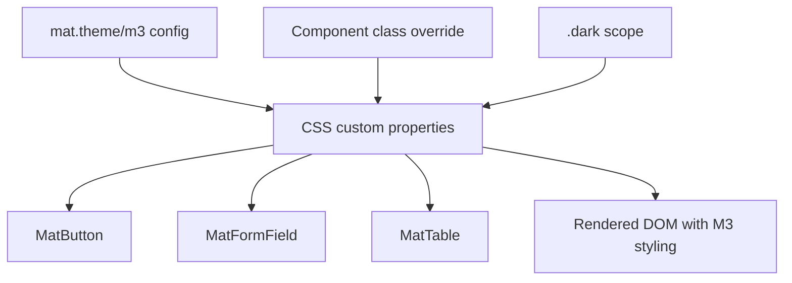

# Angular Material

> **One-liner**: **Angular Material** is Google's first-party component library — Material Design 3 components + theming via SCSS mixins, built on the CDK.

---

## Quick Reference

| Concept / API | Purpose |
|---------------|---------|
| `ng add @angular/material` | Install + bootstrap theming |
| `mat.theme(...)` (M3) / `mat.core()` + `mat.define-theme()` | Define color, typography, density |
| `mat.all-component-themes($theme)` | Emit CSS for every component |
| `mat.<component>-theme($theme)` | Per-component theming (smaller bundle) |
| Density | `mat.private-density-config(-N)` — compact UI |
| Typography | `mat.typography-hierarchy($theme)` |
| Component import | `import { MatButtonModule } from '@angular/material/button'` (or standalone components) |
| CSS variables (M3) | `--mat-sys-primary`, `--mat-button-text-label-text-color` |
| Schematics | `ng g @angular/material:navigation`, `:dashboard`, `:table`, ... |

---

## Core Concept

Angular Material gives you ~40 production-ready components (buttons, form fields, tables, datepickers, dialogs, snackbars, sidenavs, tabs, ...) styled in Google's Material Design language. With Material 3 (Angular 17+), the theming system moved from the older M2 SCSS palette API to a more flexible **system-token** approach: components expose CSS custom properties you can override at any level.

You theme an app once at the global level (`styles.scss`), then optionally tweak per-component, per-area, or per-breakpoint via CSS variables. Density (compact vs comfortable) and typography are independent axes.

Every component is **standalone** in modern Angular Material. Import the ones you use (`MatButton`, `MatFormField`, `MatInput`) directly into a component's `imports: [...]`. Tree-shaking works because you didn't import a god-module.

Material is opinionated. If your design system isn't Material, the styling-override cost grows. In that case, build on the **CDK** directly — Material is just a styled CDK consumer.

For most internal apps, dashboards, and admin tools, Material is the fastest way to ship polished UI in Angular.

---

## Diagram



---

## Syntax & API

### Install

```bash
ng add @angular/material
# Prompts:
#   - prebuilt theme or custom
#   - Material typography
#   - browser animations
# Generates styles.scss with theme setup, app config with provideAnimations.
```

### M3 theming (Angular 17+)

```scss
// styles.scss
@use '@angular/material' as mat;

html {
  color-scheme: light;

  @include mat.theme((
    color: (
      primary: mat.$violet-palette,
      tertiary: mat.$orange-palette,
    ),
    typography: Roboto,
    density: 0,
  ));
}

.dark {
  color-scheme: dark;
  @include mat.theme((
    color: (primary: mat.$violet-palette, tertiary: mat.$orange-palette),
  ));
}
```

### Use a component

```ts
import { Component } from '@angular/core';
import { MatButtonModule } from '@angular/material/button';
import { MatIconModule } from '@angular/material/icon';
import { MatFormFieldModule } from '@angular/material/form-field';
import { MatInputModule } from '@angular/material/input';

@Component({
  selector: 'app-login',
  standalone: true,
  imports: [MatButtonModule, MatIconModule, MatFormFieldModule, MatInputModule],
  template: `
    <mat-form-field appearance="fill">
      <mat-label>Email</mat-label>
      <input matInput type="email" [formControl]="email" />
    </mat-form-field>
    <button mat-flat-button color="primary">
      <mat-icon>login</mat-icon> Sign in
    </button>
  `,
})
export class LoginComponent {
  email = new FormControl('');
}
```

### Dialog

```ts
import { MatDialog } from '@angular/material/dialog';

const ref = this.dialog.open(ConfirmDialogComponent, {
  data: { title: 'Delete?', message: 'This cannot be undone.' },
  width: '400px',
});
ref.afterClosed().subscribe(result => { if (result) this.delete(); });
```

```ts
@Component({
  template: `
    <h2 mat-dialog-title>{{ data.title }}</h2>
    <mat-dialog-content>{{ data.message }}</mat-dialog-content>
    <mat-dialog-actions>
      <button mat-button [mat-dialog-close]="false">Cancel</button>
      <button mat-flat-button color="warn" [mat-dialog-close]="true">Delete</button>
    </mat-dialog-actions>
  `,
})
export class ConfirmDialogComponent {
  data = inject(MAT_DIALOG_DATA);
}
```

### Snack bar

```ts
import { MatSnackBar } from '@angular/material/snack-bar';
inject(MatSnackBar).open('Saved', 'OK', { duration: 3000 });
```

### Table with sort + paginator

```ts
@Component({
  imports: [MatTableModule, MatSortModule, MatPaginatorModule],
  template: `
    <table mat-table [dataSource]="ds" matSort>
      <ng-container matColumnDef="name">
        <th mat-header-cell *matHeaderCellDef mat-sort-header>Name</th>
        <td mat-cell *matCellDef="let r">{{ r.name }}</td>
      </ng-container>
      <tr mat-header-row *matHeaderRowDef="['name']"></tr>
      <tr mat-row *matRowDef="let row; columns: ['name']"></tr>
    </table>
    <mat-paginator [pageSize]="10" [pageSizeOptions]="[10, 25, 50]" />
  `,
})
export class TableComponent {
  ds = new MatTableDataSource<User>([...]);
  @ViewChild(MatSort) sort!: MatSort;
  @ViewChild(MatPaginator) page!: MatPaginator;
  ngAfterViewInit() { this.ds.sort = this.sort; this.ds.paginator = this.page; }
}
```

### Override a component token

```scss
.my-cta {
  --mat-button-filled-container-color: oklch(72% 0.18 280);
  --mat-button-filled-label-text-color: white;
}
```

### Density

```scss
.compact-area {
  @include mat.private-density-config(-2);  // compact form fields, buttons, etc.
}
```

---

## Common Patterns

```scss
// Pattern: per-component theme to keep CSS small
@use '@angular/material' as mat;

@include mat.theme((color: (primary: mat.$blue-palette)));
@include mat.button-theme();
@include mat.form-field-theme();
@include mat.icon-theme();
// Skip mat.all-component-themes — only emit CSS for what you import.
```

```ts
// Pattern: shared modal service wraps MatDialog
@Injectable({ providedIn: 'root' })
export class ConfirmService {
  private dialog = inject(MatDialog);
  ask(title: string, message: string): Observable<boolean> {
    return this.dialog.open(ConfirmDialogComponent, { data: { title, message } })
      .afterClosed().pipe(map(r => !!r));
  }
}
```

```ts
// Pattern: dark mode toggle
toggleDark() {
  document.documentElement.classList.toggle('dark');
}
// styles.scss has .dark { @include mat.theme(...) } overrides above.
```

---

## Gotchas & Tips

- **Material 3 uses CSS custom properties heavily.** Override tokens via class scopes, not by digging into mixins. The DevTools show the current `--mat-*` value on every component.
- **Importing `MatXxxModule` is fine** even with standalone components — the modules just re-export the same primitives.
- **`mat.all-component-themes` is large.** ~50 KB of CSS. Use per-component theming (`mat.button-theme`) for production bundles when you only use a few components.
- **Material typography defaults to Roboto.** Self-host the font or override `typography:` to your own.
- **Form field `appearance` matters.** `outline` is the modern default; `fill` and `legacy` exist but are increasingly deprecated.
- **Dialogs require `provideAnimations()`.** Without it, animations are noop and some components don't open. `provideAnimationsAsync()` works but loads on first dialog open (slight delay first time).
- **Don't query Material internals.** `_mat-` and `mdc-` selectors are private and change between versions; always override via the documented tokens or `panelClass`.
- **`MatTableDataSource` is fine for small lists** but doesn't paginate server-side. For server-side, implement `DataSource` directly or use a simpler `[dataSource]="rows()"`.
- **The schematic generators are great kickstarters.** `ng g @angular/material:dashboard mydash` scaffolds a working dashboard layout you can trim.
- **Bundle audit** — Material adds 100–200 KB gzipped depending on imports. If your design isn't Material-ish, you're paying for visuals you'll override; consider headless CDK + Tailwind instead.

---

## See Also

- [[10 - Angular CDK]]
- [[09 - Animations]]
- [[14 - Build and Bundling]]
- [[03 - Components and Templates]]
