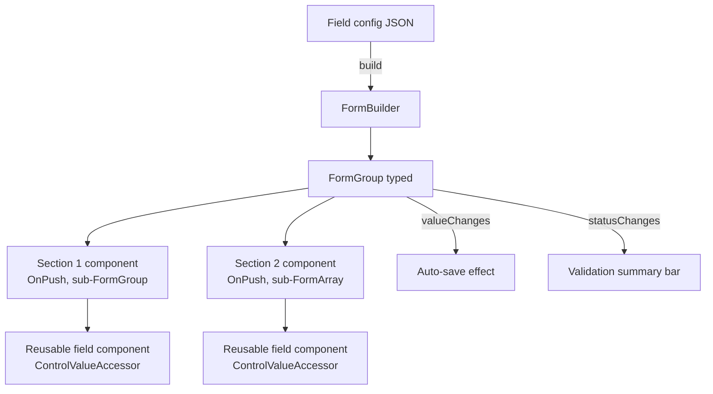

# Forms at Scale

> **One-liner**: Big forms break under three pressures — **dynamic structure** (fields driven by data), **performance** (CD storms on every keystroke), and **reusability** (one validation rule used everywhere) — solved with typed reactive forms, `OnPush`, and reusable form-control components.

---

## Quick Reference

| Problem | Lever |
|---------|-------|
| Same field everywhere | Reusable component implementing `ControlValueAccessor` |
| Form structure depends on data | Reactive forms + `FormArray.push()` driven by config |
| Form re-renders on every keystroke | `OnPush` + `updateOn: 'blur'` + scoped subscriptions |
| Cross-field validation | `validators` on `FormGroup` |
| Large nested form is slow | Split into per-section components, each with its own subform |
| Forms without RxJS | `signal()` + `linkedSignal()` (Angular 19+) — manual but light |
| Signal-based forms (preview) | `@angular/forms/signals` (experimental, watch the RFC) |
| Centralize errors | Custom `ErrorStateMatcher` (Material) or shared error component |
| Persist form draft | Subscribe to `valueChanges`, debounce, save to storage |
| Conditional fields | `if (cond)` add/remove control with `addControl`/`removeControl` |

---

## Core Concept

A "small" form is `<input>` + `formControl`. A "large" form has 30+ fields, dynamic sections, async validators, and may render 10× per second on a fast typist's keystrokes. Three failure modes show up:

**1. Performance.** With default change detection, every keystroke triggers a full app CD pass. Fix with: `ChangeDetection.OnPush` on form components, `updateOn: 'blur'` for fields that don't need live validation, and isolating subscriptions to the controls each component cares about.

**2. Dynamic structure.** The form's shape depends on JSON config (e.g., a survey app, an admin schema editor). Reactive forms shine here: build the `FormGroup` programmatically, add/remove `FormArray` entries by config, and render with `@for` over `controls.controls`.

**3. Reusability.** A "currency input" or "user picker" should be a normal child component that participates in the parent form. Implement `ControlValueAccessor` once, then use it via `formControlName` like any input.

The recently-stabilized **typed reactive forms** make this all type-safe — `FormGroup<{ email: FormControl<string>; age: FormControl<number> }>` — so refactors don't silently break form values.

The upcoming **signal forms** API replaces RxJS-driven `valueChanges` with signals. Prototype-only today; expect production stability in 2026.

---

## Diagram



---

## Syntax & API

### Typed reactive forms

```ts
import { FormBuilder, FormControl, FormGroup, Validators } from '@angular/forms';

interface ProfileForm {
  email: FormControl<string>;
  age: FormControl<number>;
  preferences: FormGroup<{ newsletter: FormControl<boolean>; theme: FormControl<'light' | 'dark'> }>;
}

const fb = inject(FormBuilder).nonNullable;

const form: FormGroup<ProfileForm> = fb.group({
  email: fb.control('', [Validators.required, Validators.email]),
  age: fb.control(0, Validators.min(13)),
  preferences: fb.group({
    newsletter: fb.control(false),
    theme: fb.control<'light' | 'dark'>('light'),
  }),
});

// Type-safe access
form.controls.email.setValue('a@b.com');
form.value.preferences?.theme;  // 'light' | 'dark' | undefined
```

### Dynamic structure from config

```ts
type FieldConfig =
  | { kind: 'text'; key: string; label: string; required?: boolean }
  | { kind: 'select'; key: string; label: string; options: { value: string; label: string }[] }
  | { kind: 'group'; key: string; fields: FieldConfig[] };

function buildForm(fb: FormBuilder, config: FieldConfig[]): FormGroup {
  const group: Record<string, AbstractControl> = {};
  for (const f of config) {
    if (f.kind === 'group') {
      group[f.key] = buildForm(fb, f.fields);
    } else {
      const validators = 'required' in f && f.required ? [Validators.required] : [];
      group[f.key] = fb.control('', validators);
    }
  }
  return fb.group(group);
}
```

### Reusable input — `ControlValueAccessor`

```ts
@Component({
  selector: 'app-currency-input',
  standalone: true,
  imports: [FormsModule],
  template: `<input [(ngModel)]="display" (blur)="onBlur()" />`,
  providers: [{ provide: NG_VALUE_ACCESSOR, useExisting: CurrencyInputComponent, multi: true }],
  changeDetection: ChangeDetectionStrategy.OnPush,
})
export class CurrencyInputComponent implements ControlValueAccessor {
  display = '';
  private onChange = (_: number) => {};
  private onTouched = () => {};

  writeValue(v: number) { this.display = (v ?? 0).toFixed(2); }
  registerOnChange(fn: (v: number) => void) { this.onChange = fn; }
  registerOnTouched(fn: () => void) { this.onTouched = fn; }
  onBlur() { this.onChange(parseFloat(this.display) || 0); this.onTouched(); }
}
```

### Performance: `updateOn: 'blur'`

```ts
fb.group({
  email: fb.control('', { validators: [Validators.email], updateOn: 'blur' }),
  // valueChanges/statusChanges fire only on blur, not every keystroke
});
```

### Performance: scoped subscriptions

```ts
@Component({ changeDetection: ChangeDetectionStrategy.OnPush })
export class SectionComponent {
  group = input.required<FormGroup<SectionShape>>();

  // Only subscribe to *this* section's value, not the whole form
  value = toSignal(toObservable(this.group).pipe(switchMap(g => g.valueChanges)));
}
```

### Cross-field validators

```ts
const passwordsMatch: ValidatorFn = (g: AbstractControl) => {
  const a = g.get('password')?.value;
  const b = g.get('confirm')?.value;
  return a === b ? null : { mismatch: true };
};

fb.group({
  password: fb.control(''),
  confirm: fb.control(''),
}, { validators: [passwordsMatch] });
```

### Async validators (debounced)

```ts
const usernameTaken: AsyncValidatorFn = (c) => {
  return timer(300).pipe(
    switchMap(() => http.get<{ taken: boolean }>(`/api/users/check/${c.value}`)),
    map(r => r.taken ? { taken: true } : null),
    take(1),
  );
};

fb.control('', { asyncValidators: [usernameTaken], updateOn: 'blur' });
```

### Auto-save draft

```ts
this.form.valueChanges.pipe(
  debounceTime(500),
  distinctUntilChanged((a, b) => JSON.stringify(a) === JSON.stringify(b)),
  takeUntilDestroyed(),
).subscribe(v => localStorage.setItem('draft', JSON.stringify(v)));
```

---

## Common Patterns

```ts
// Pattern: split a 100-field form into 5 section components
@Component({ /* parent */
  template: `
    <form [formGroup]="form">
      <app-personal-section [group]="form.controls.personal" />
      <app-address-section  [group]="form.controls.address" />
      <app-payment-section  [group]="form.controls.payment" />
    </form>
  `,
})
// Each section component is OnPush + scoped to its subform.
// Top-level CD only checks the form-level wrapper.
```

```ts
// Pattern: dynamic FormArray rows (e.g., line items)
get items() { return this.form.controls.items as FormArray<FormGroup<LineItem>>; }
addItem() { this.items.push(this.fb.group<LineItem>({ name: this.fb.nonNullable.control(''), qty: this.fb.nonNullable.control(1) })); }
removeItem(i: number) { this.items.removeAt(i); }
```

```ts
// Pattern: shared error component
@Component({
  selector: 'app-field-errors',
  template: `
    @if (control().touched && control().errors; as errs) {
      <small class="error">
        @if (errs['required']) { This is required. }
        @if (errs['email'])    { Invalid email. }
        @if (errs['minlength']) { At least {{ errs['minlength'].requiredLength }} chars. }
      </small>
    }
  `,
})
export class FieldErrorsComponent { control = input.required<AbstractControl>(); }
```

---

## Gotchas & Tips

- **`fb.nonNullable`** removes the implicit `null` from controls' types. Use it everywhere unless a control truly is nullable.
- **`updateOn: 'blur'`** is the single best perf win for fast typists. Reserve `'change'` for fields where live feedback is essential (password strength, search-as-you-type).
- **Don't use `disabled` in form configs** — `Validators.required` and `disabled: true` interact awkwardly with reactive forms. Use `form.disable()` / `enable()` programmatically instead.
- **`statusChanges`** fires for every async-validator transition. If you use it for UI (saving / saved), debounce or pipe through `distinctUntilChanged()`.
- **Subforms must be passed as inputs**, not re-built from config in each child. Re-building loses values and validation state.
- **Material's `ErrorStateMatcher`** lets you control *when* errors show. The default shows on `(touched && invalid)`. Override per-field for "show on submit only" or "show after first blur" UX.
- **`FormArray` reordering** does not auto-update the underlying values map — you have to `controls = newOrder` carefully or destroy/rebuild the array.
- **Async validators run on every value change unless `updateOn: 'blur'`.** They block form validity until they complete; race conditions are common — always `take(1)` the inner observable.
- **Save draft via debounced `valueChanges`,** but on reload restore with `patchValue(JSON.parse(...))` *before* attaching listeners, or you'll trigger spurious "dirty" state.
- **Signal forms (`@angular/forms/signals`) are not stable yet.** Track the RFC, don't migrate production forms.

---

## See Also

- [[07 - Reactive Forms]]
- [[08 - Custom Form Controls]]
- [[18 - Forms Validation Patterns]]
- [[06 - Performance Optimization]]
- [[01 - Signals]]
