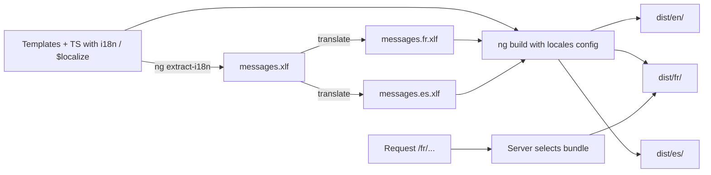

# Internationalization

> **One-liner**: Angular ships **`@angular/localize`** — a build-time i18n system: tag strings with `i18n` in templates or `$localize` in TS, extract to XLIFF/JSON, ship one bundle per locale.

---

## Quick Reference

| API / file | Purpose |
|------------|---------|
| `ng add @angular/localize` | Install i18n tooling |
| `i18n` attribute | Mark a translatable element in a template |
| `i18n-attr` (e.g. `i18n-title`) | Mark a translatable attribute |
| `$localize` tagged template | Translate a string in TS |
| `ng extract-i18n` | Extract messages to messages.xlf |
| `i18n` config in `angular.json` | Source locale + target locales + translation files |
| `LOCALE_ID` token | Current locale used by date/number/currency pipes |
| `registerLocaleData(locale)` | Register CLDR data for a locale at runtime |
| ICU `{count, plural, ...}` | Plural / select / gender messages |
| `:meaning|description@@id:` | i18n metadata format |

---

## Core Concept

Angular's i18n is **build-time**: at compile time, every `i18n`-tagged string and `$localize`-tagged literal is replaced with the translation for the target locale, producing one fully-localized bundle per language. There is no runtime translation lookup, no dictionary loaded over the network — each user downloads only their language.

**The workflow:**

1. **Mark** translatable strings in templates (`i18n`) and code (`$localize`).
2. **Extract** to a translation source file (`messages.xlf` by default; JSON or ARB also supported) with `ng extract-i18n`.
3. **Translate** the file (manually, with a TMS like Crowdin / Lokalise, or via an LLM-assisted workflow). Result: one file per target locale.
4. **Configure** locales in `angular.json` and build with `ng build` — Angular emits `dist/<app>/en/`, `dist/<app>/fr/`, etc.
5. **Serve** the right bundle based on URL path or sub-domain (typically via a server rule).

For dynamic strings (loaded from a database, depending on data), build-time i18n doesn't apply — use `@angular/localize/init` or a runtime library like `transloco` or `ngx-translate` instead. Many real apps do both: static UI via build-time i18n, dynamic content via runtime translation.

**ICU messages** handle plurals, gender, and "select" conditions. `{count, plural, =0 {no items} one {1 item} other {# items}}` is the same syntax used by formatjs and ICU MessageFormat.

---

## Diagram



---

## Syntax & API

### Mark template strings

```html
<!-- text node -->
<h1 i18n>Welcome to the dashboard</h1>

<!-- with metadata: meaning|description@@id -->
<h1 i18n="user greeting|shown on home page@@home.greeting">
  Welcome to the dashboard
</h1>

<!-- attribute -->


<!-- ICU plural -->
<p i18n>
  { count, plural, =0 {No items} one {1 item} other {# items} }
</p>

<!-- ICU select (gender) -->
<p i18n>
  { gender, select, male {He liked} female {She liked} other {They liked} } it.
</p>
```

### `$localize` in TS

```ts
import '@angular/localize/init';

const greeting = $localize`Welcome, ${user.name}!`;
// With metadata:
const help = $localize`:help text|tooltip on save button@@save.help:Saves your changes`;
```

### Extract

```bash
ng extract-i18n --output-path src/locale --format xlf2
# → src/locale/messages.xlf
```

### Configure locales

```json
// angular.json
"projects": {
  "my-app": {
    "i18n": {
      "sourceLocale": "en-US",
      "locales": {
        "fr": { "translation": "src/locale/messages.fr.xlf" },
        "es": "src/locale/messages.es.xlf"
      }
    },
    "architect": {
      "build": {
        "options": {
          "localize": true,            // build all locales
          "i18nMissingTranslation": "error"
        },
        "configurations": {
          "fr": { "localize": ["fr"] }
        }
      }
    }
  }
}
```

### Build

```bash
ng build               # builds all locales → dist/<app>/en/, /fr/, /es/
ng build --configuration=fr   # only French
```

### Serve the right locale

```nginx
# nginx example: send /fr/* requests to the fr bundle
location /fr/ { root /var/www/dist/<app>; try_files $uri $uri/ /fr/index.html; }
location /es/ { root /var/www/dist/<app>; try_files $uri $uri/ /es/index.html; }
location /    { root /var/www/dist/<app>; try_files $uri $uri/ /en/index.html; }
```

### Locale-aware pipes

```html
<!-- Uses LOCALE_ID set by the build for the active bundle -->
<p>{{ amount | currency }}</p>          <!-- $1,234.56 in en, 1 234,56 € in fr -->
<p>{{ orderDate | date: 'long' }}</p>
<p>{{ count | number: '1.0-2' }}</p>
```

### Programmatic locale data (rare)

```ts
import { registerLocaleData } from '@angular/common';
import localeFr from '@angular/common/locales/fr';
registerLocaleData(localeFr);
// Only needed for locales not active at build time, e.g. switching at runtime.
```

---

## Common Patterns

```ts
// Pattern: stable message IDs via @@custom.id
// In templates: i18n="@@signup.button"
// In TS:        $localize`:@@signup.button:Sign up`
// → Same id used in BOTH places, translators see one row.
```

```html
<!-- Pattern: rich text with placeholder interpolation -->
<p i18n="@@cart.summary">
  Your cart has <strong>{{ count }}</strong> items totaling
  {{ total | currency }}.
</p>
<!-- $localize encodes the interpolations as ICU placeholders so translators can move them -->
```

```ts
// Pattern: hybrid build-time + runtime
// Static UI: @angular/localize (zero runtime cost)
// Dynamic content (CMS articles, user-generated): transloco
//   - load JSON dictionaries from CDN
//   - swap without rebuild
```

---

## Gotchas & Tips

- **`@angular/localize` is build-time only.** Switching language at runtime requires reloading a different bundle (typical UX: subdomain or path-prefix per language).
- **Always set explicit `@@id`s** for messages used in multiple places. Without an id, a tiny wording change creates a new message and orphans the translation.
- **`i18nMissingTranslation: error`** in CI catches missed translations. Set to `warning` during development.
- **Plural and select are different.** Plurals respond to numbers (with locale-aware rules — Russian has 4 forms!); select responds to enums. Don't fake plural with `@if`.
- **CLDR rules differ by locale.** `one` in Polish doesn't mean exactly 1; trust the ICU runtime, don't write your own logic.
- **HTML inside `i18n` is preserved**, including `<strong>`, `<em>`, etc. But interpolations show up as `{$INTERPOLATION}` placeholders in XLIFF.
- **`$localize` as a runtime call** (without compilation) requires `import '@angular/localize/init'` early. Otherwise you get a "$localize is not defined" error.
- **Translation files are just XML/JSON.** Diff them in code review; CI can lint that every message has translations in every locale.
- **RTL languages** need extra CSS — `[dir=rtl]` rules, mirrored icons. The framework doesn't auto-flip the layout.
- **Locale-specific formats** for date, currency, number come for free via the locale data baked into the bundle. Don't hand-format `1,234.56` — it's `1 234,56` in fr-FR and `1.234,56` in de-DE.

---

## See Also

- [[06 - Pipes]]
- [[14 - Build and Bundling]]
- [[04 - Server-Side Rendering]]
