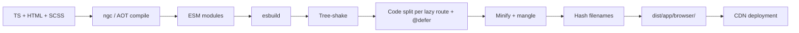

# Build and Bundling

> **One-liner**: Modern Angular uses the **`@angular/build:application`** builder (esbuild + Vite for dev) — fast, ESM-first, with budgets, source maps, and automatic per-route chunk splitting.

---

## Quick Reference

| Item | Detail |
|------|--------|
| Modern builder | `@angular/build:application` (default in v17+ for new apps) |
| Legacy builder | `@angular-devkit/build-angular:browser` (Webpack) |
| Dev server | esbuild + Vite (since v17) |
| Output structure | `dist/<app>/browser/` (+ `server/` if SSR) |
| Bundle budgets | `budgets:` array in `angular.json` |
| Source maps | `"sourceMap": true` (full) or `{ scripts: true, hidden: true }` |
| Stats / analyzer | `ng build --stats-json`, then `webpack-bundle-analyzer dist/*/stats.json` |
| Named chunks | `"namedChunks": true` for human-readable filenames |
| Subresource Integrity | `"subresourceIntegrity": true` |
| Output hashing | `"outputHashing": "all" \| "media" \| "bundles" \| "none"` |
| Pre-rendering | `"prerender": true` (or per-route config) |
| Deploy URL / base href | `"baseHref": "/app/"`, `"deployUrl": "..."` |

---

## Core Concept

Angular's old build was **Webpack** + Babel + Terser. It worked but was slow — 30-second incremental rebuilds were normal on big apps. The **application builder** (Angular 17+) uses **esbuild** for fast Rust/Go-speed compilation and **Vite** for the dev server, dropping the inner-loop time to sub-second.

A build runs three phases:

1. **TS / Angular compilation** — `@angular/compiler-cli` AOT-compiles every component, producing `_template_function`s and metadata.
2. **Bundling + tree-shaking** — esbuild crawls the import graph from `main.ts`, produces ESM chunks, eliminates dead code (unused exports, unreachable branches).
3. **Optimization** — minify, mangle names, hash filenames, gzip/brotli compress.

The builder automatically splits on **lazy route boundaries** (`loadChildren`, `loadComponent`) and **`@defer` blocks** — each becomes its own chunk that loads on demand. The initial bundle should ideally only contain what's needed for first paint.

**Budgets** in `angular.json` fail the build if a chunk grows past a configured size. They're the cheapest way to catch unintentional bundle bloat (someone imported the entire `lodash` instead of `lodash/debounce`).

For SSR, the builder also produces a Node bundle in `dist/<app>/server/`. For pre-rendering, it generates static HTML for configured routes at build time.

---

## Diagram



---

## Syntax & API

### `angular.json` — application builder

```json
{
  "projects": {
    "my-app": {
      "architect": {
        "build": {
          "builder": "@angular/build:application",
          "options": {
            "outputPath": "dist/my-app",
            "browser": "src/main.ts",
            "server": "src/main.server.ts",
            "ssr": { "entry": "src/server.ts" },
            "prerender": true,
            "polyfills": ["zone.js"],
            "tsConfig": "tsconfig.app.json",
            "assets": ["src/favicon.ico", "src/assets"],
            "styles": ["src/styles.scss"],
            "outputHashing": "all",
            "sourceMap": { "scripts": true, "styles": true, "hidden": false },
            "budgets": [
              { "type": "initial", "maximumWarning": "500kb", "maximumError": "1mb" },
              { "type": "anyComponentStyle", "maximumWarning": "4kb", "maximumError": "8kb" },
              { "type": "bundle", "name": "vendor", "maximumWarning": "300kb" }
            ]
          },
          "configurations": {
            "production": {
              "optimization": true,
              "outputHashing": "all",
              "subresourceIntegrity": true
            },
            "development": {
              "optimization": false,
              "sourceMap": true,
              "namedChunks": true
            }
          }
        }
      }
    }
  }
}
```

### Lazy routes (automatic chunk split)

```ts
export const routes: Routes = [
  { path: '', component: HomeComponent },
  { path: 'admin', loadChildren: () => import('./admin/admin.routes').then(m => m.routes) },
  { path: 'reports', loadComponent: () => import('./reports/reports.component').then(m => m.ReportsComponent) },
];
// Each → its own chunk file. First page load doesn't include admin/reports JS.
```

### `@defer` (chunk per deferred block)

```html
@defer (on viewport) {
  <heavy-chart [data]="data()" />
}
<!-- HeavyChart and its imports become a separate chunk loaded on viewport intersection. -->
```

### Bundle analysis

```bash
ng build --stats-json
npx esbuild-visualizer --metadata dist/my-app/browser/stats.json --filename bundle-report.html
# Or for legacy webpack builds:
npx webpack-bundle-analyzer dist/my-app/stats.json
```

### Programmatic per-environment config

```ts
// src/environments/environment.ts
export const environment = { production: false, apiUrl: '/api' };
// src/environments/environment.prod.ts
export const environment = { production: true,  apiUrl: 'https://api.prod' };
```

```json
// angular.json — file replacement
"configurations": {
  "production": {
    "fileReplacements": [
      { "replace": "src/environments/environment.ts", "with": "src/environments/environment.prod.ts" }
    ]
  }
}
```

### Run

```bash
ng build                                  # default (production)
ng build --configuration=development
ng serve                                  # Vite dev server
ng serve --configuration=production       # rare; previews prod build settings
ng build --watch                          # CI / containerized rebuilds
```

---

## Common Patterns

```json
// Pattern: tight initial budget enforces splitting discipline
"budgets": [
  { "type": "initial", "maximumWarning": "300kb", "maximumError": "500kb" },
]
// Result: any feature that bloats main bundle fails CI.
// Forces import audits and lazy loading.
```

```ts
// Pattern: dynamic imports for non-route lazy code
async openHelp() {
  const { HelpModalComponent } = await import('./help/help-modal.component');
  this.dialog.open(HelpModalComponent);
}
// Help feature ships in its own chunk, loaded only on click.
```

```ts
// Pattern: per-locale builds for i18n (one bundle per language)
"localize": true   // outputs dist/.../en/, dist/.../fr/
// Server picks the right one by URL prefix or accept-language.
```

---

## Gotchas & Tips

- **The application builder is a one-way migration.** Once on it, going back to webpack means undoing the new SSR/prerender features. Most apps should migrate (`ng update`).
- **`outputHashing: "all"`** invalidates browser cache when content changes — essential for production. With `none`, users keep old chunks after deploy.
- **Source maps + production = exposed source.** Use `"sourceMap": { "hidden": true }` to upload to Sentry but not serve publicly.
- **Tree-shaking only works on ESM** with `sideEffects: false` in package.json. Older CommonJS deps drag in everything they reference.
- **Barrel files (`index.ts` re-exports) hurt tree-shaking** if the consumer imports the whole barrel. Prefer specific imports: `import { x } from 'lib/x'` not `import { x } from 'lib'`.
- **`@defer` chunks share imports with their parent automatically** — esbuild de-duplicates. But if a deferred block imports a heavy lib that *only it uses*, that lib lands in the deferred chunk.
- **`vendor.js` doesn't exist anymore** in the modern builder — chunks are split by usage, not by package. Don't write CI rules expecting a `vendor.*` filename.
- **Budgets fail CI by default in production builds.** Override with `"maximumError"` only in dev branches.
- **`npm ls` your deps before shipping** — duplicate versions of RxJS / Angular Material in the tree double-bundle their code.
- **Don't trust local build size.** `ng build` and check `dist/<app>/browser/` actual file sizes — the dev server ships uncompressed assets.

---

## See Also

- [[20 - Angular CLI Workflow]]
- [[06 - Performance Optimization]]
- [[04 - Server-Side Rendering]]
- [[16 - Monorepo with Nx]]
