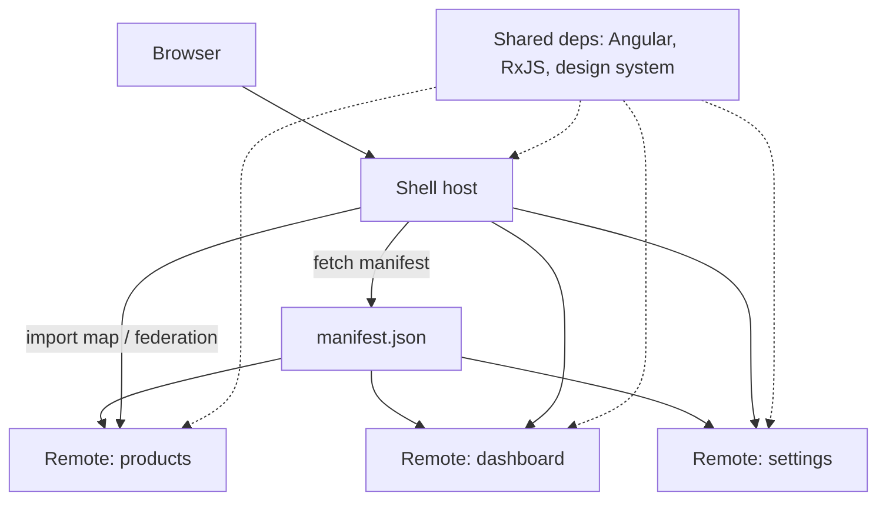

# Micro-Frontends

> **One-liner**: A **micro-frontend** is a separately-built, separately-deployed UI module loaded into a host shell at runtime — Angular supports this via **Module Federation** (Webpack era) or **Native Federation** (modern, esbuild + import maps).

---

## Quick Reference

| Concept / library | Purpose |
|-------------------|---------|
| Host (shell) | Orchestrator app, lazy-loads remotes |
| Remote (MFE) | Independently deployed feature app |
| Module Federation | Webpack 5 plugin for runtime sharing |
| Native Federation | `@angular-architects/native-federation` — esbuild-friendly, uses import maps |
| `loadRemoteModule(...)` | Helper from `@angular-architects/module-federation` |
| Shared deps | Single instance of Angular, RxJS across host + remotes |
| Import maps | Browser-native mechanism Native Federation builds on |
| `EventBus` / custom events | Cross-MFE communication channel |
| Manifest | JSON listing remotes' URLs, fetched at startup |
| Versioning | Semver ranges in shared config; mismatches fall back to per-remote copy |

---

## Core Concept

A monolithic frontend has one team, one deploy, one bundle. As the product and the org grow, that becomes a bottleneck — every team's deploy waits on every other team's tests. Micro-frontends decompose the UI like microservices decompose the backend: each team owns a feature, builds it independently, and deploys it on their own cadence.

The **shell app** (host) is the entry point — auth, top-level navigation, and the layout shell. It lazy-loads **remotes** (feature MFEs) at runtime. Each remote is a fully-working Angular app on its own; in the shell context, it renders as a sub-tree.

Two main mechanisms:

- **Module Federation (MF)** — Webpack 5 plugin. Each app declares what it `exposes` and what it `consumes`. At build time, it produces a `remoteEntry.js` manifest. At runtime, the shell fetches the remote's manifest and dynamically imports modules from it. Mature, widely-adopted, but tied to Webpack — incompatible with the new esbuild builder.
- **Native Federation (NF)** — community library that achieves the same outcome using browser-native **import maps**. Works with esbuild and the application builder. The host fetches a JSON manifest of remote URLs, registers an import map, then `loadRemoteModule` resolves to dynamic ESM imports.

Both rely on **shared dependencies**: Angular runtime, RxJS, etc. should be loaded once across the whole tree, not duplicated per MFE. The federation config negotiates a shared version using semver ranges; if the host's RxJS 7 doesn't satisfy a remote's `^6.0.0`, the remote falls back to its own bundled copy.

The non-technical cost is real: cross-MFE typings, design-system consistency, version drift, and shared auth state become work items. Pick MFEs only when the *org* genuinely needs decoupled deploys, not for "clean architecture."

---

## Diagram



---

## Syntax & API

### Native Federation — install

```bash
ng add @angular-architects/native-federation@latest --project shell --type host
ng add @angular-architects/native-federation@latest --project mfe1  --type remote
```

### Native Federation — host config (`federation.config.js`)

```js
const { withNativeFederation, shareAll } = require('@angular-architects/native-federation/config');

module.exports = withNativeFederation({
  shared: {
    ...shareAll({ singleton: true, strictVersion: true, requiredVersion: 'auto' }),
  },
});
```

### Native Federation — remote config

```js
module.exports = withNativeFederation({
  name: 'mfe1',
  exposes: {
    './Component': './projects/mfe1/src/app/products/products.component.ts',
    './routes':    './projects/mfe1/src/app/products/products.routes.ts',
  },
  shared: { ...shareAll({ singleton: true, strictVersion: true, requiredVersion: 'auto' }) },
});
```

### Manifest (`public/assets/federation.manifest.json`)

```json
{
  "mfe1": "https://mfe1.example.com/remoteEntry.json",
  "dashboard": "https://dashboard.example.com/remoteEntry.json"
}
```

### Bootstrap host

```ts
// main.ts (host)
import { initFederation } from '@angular-architects/native-federation';

initFederation('/assets/federation.manifest.json')
  .catch(err => console.error(err))
  .then(() => import('./bootstrap'));
```

```ts
// bootstrap.ts
bootstrapApplication(AppComponent, appConfig);
```

### Lazy-load a remote route

```ts
import { loadRemoteModule } from '@angular-architects/native-federation';

export const routes: Routes = [
  {
    path: 'products',
    loadChildren: () =>
      loadRemoteModule({ remoteName: 'mfe1', exposedModule: './routes' }).then(m => m.PRODUCT_ROUTES),
  },
  {
    path: 'dashboard',
    loadComponent: () =>
      loadRemoteModule({ remoteName: 'dashboard', exposedModule: './Component' }).then(m => m.DashboardComponent),
  },
];
```

### Module Federation (legacy webpack)

```js
// webpack.config.js — host
const { ModuleFederationPlugin } = require('webpack').container;
module.exports = {
  plugins: [new ModuleFederationPlugin({
    remotes: {
      mfe1: 'mfe1@https://mfe1.example.com/remoteEntry.js',
    },
    shared: { '@angular/core': { singleton: true, strictVersion: true } },
  })],
};
```

```ts
// route — host
{ path: 'products', loadChildren: () => import('mfe1/routes').then(m => m.PRODUCT_ROUTES) }
```

### Cross-MFE communication

```ts
// shared/event-bus.ts (published as a separate npm package, or shared via federation)
export const eventBus = new Subject<{ type: string; payload: any }>();

// In any MFE:
eventBus.next({ type: 'cart.add', payload: product });
eventBus.pipe(filter(e => e.type === 'auth.logout')).subscribe(...);
```

---

## Common Patterns

```ts
// Pattern: shared design system as an npm package
// packages/ds → published. Host + remotes consume the same version.
// Federation `shared` config keeps one runtime instance.
shared: { '@my-org/ds': { singleton: true } }
```

```ts
// Pattern: route-level isolation
// Each remote owns a top-level path; never reach inside another remote's components.
{ path: 'products', loadChildren: ... },
{ path: 'orders', loadChildren: ... },   // different team
{ path: 'settings', loadChildren: ... }, // different team
```

```ts
// Pattern: contract via shared types package
// All MFEs depend on `@my-org/contracts` — DTOs, event payload shapes, route param schemas.
// Versioned with semver. Breaking change → coordinated rollout.
```

---

## Gotchas & Tips

- **Native Federation is the modern path.** Module Federation requires Webpack, which the modern Angular builder doesn't use. If starting fresh in v17+, pick Native Federation.
- **Singletons matter.** Shared `Router`, `HttpClient`, NgRx `Store` *must* be singleton. Two Angular runtimes loaded means two Zones, two CD trees, two routers — broken navigation is the typical symptom.
- **Versioning is hard.** A remote built against `@angular/core@17.1.0` may be loaded by a host running `17.2.0`. With `strictVersion: true` and incompatible semver, the remote loads its own duplicate copy → bigger bundle, possibly two Zones.
- **Remote-side routes can't use the host's `provideRouter`** at the same time — design route ownership carefully (host owns top-level navigation, remote owns sub-routes).
- **Auth + global state needs a strategy.** Pass auth via shared service (singleton), or via cookies/headers picked up by an `HttpInterceptor` provided in shared deps. Don't duplicate the auth state per MFE.
- **`@defer` is often a better answer** than MFEs for the goal of "smaller initial bundle." MFEs solve *deploy independence*, not bundle size.
- **CORS + CSP + asset paths** — the host fetches remote assets from a different origin. Configure CORS on each remote's CDN, expose the manifest, and use absolute asset paths inside MFEs.
- **Local development is slower.** Running 3 MFEs + a shell means 4 dev servers. Use Nx with project-level affected commands, or develop one MFE at a time pointed at deployed others.
- **Type safety across MFEs** is best handled via a shared `@your-org/contracts` package. Without it, you're shipping shape mismatches at runtime.
- **Don't go MFE for one team.** The overhead is real — typings, infra, deploys, observability all multiply. Two-three teams owning distinct features is a reasonable threshold.

---

## See Also

- [[16 - Monorepo with Nx]]
- [[14 - Build and Bundling]]
- [[11 - Lazy Loading]]
- [[03 - Standalone Migration]]
