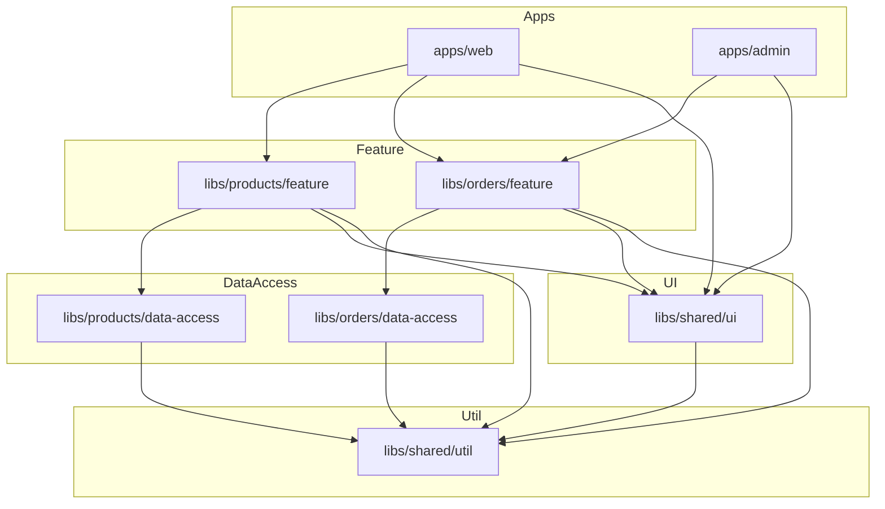

# Monorepo with Nx

> **One-liner**: **Nx** wraps the Angular CLI in a monorepo-friendly tool: many apps + many libraries in one workspace, with code-sharing, computation caching, dependency graph awareness, and `affected` commands so CI only runs what changed.

---

## Quick Reference

| Command / API | Purpose |
|---------------|---------|
| `npx create-nx-workspace` | Scaffold a new workspace |
| `nx g @nx/angular:app <name>` | Generate an Angular app |
| `nx g @nx/angular:lib <name>` | Generate a library |
| `nx serve <app>` | Run dev server |
| `nx build <app>` | Build app (cached) |
| `nx test <project>` | Run unit tests |
| `nx affected -t test` | Run task only on projects affected by current changes |
| `nx graph` | Visualize the dependency graph |
| `nx run-many -t lint test build` | Run multiple targets across many projects |
| `tsconfig.base.json` paths | Library aliases (`@my-org/ui`) |
| `project.json` | Per-project task config |
| `nx.json` | Workspace-level defaults, plugins |
| `eslint` enforced module boundaries | `@nx/enforce-module-boundaries` rule |

---

## Core Concept

A monorepo holds multiple deployable apps and many shared libraries in **one** Git repo. Every team commits to the same trunk; refactors that touch shared code are atomic; feature branches don't fork a library. The downsides — bigger checkout, slower CI, harder access control — are mitigated by tooling.

**Nx** brings four key benefits to an Angular monorepo:

1. **Computation caching.** Every task (`build`, `test`, `lint`) is hashed by inputs (source files, env vars, deps). The same hash → cached output, replayed instantly. Local cache + Nx Cloud distributed cache.
2. **Affected commands.** Given a base ref (`main`), Nx walks the dependency graph and runs tasks only on the projects whose code (or transitive deps) changed.
3. **Generators.** Schematics that scaffold apps, libraries, components, NgRx slices, etc., with consistent structure.
4. **Module boundary enforcement.** ESLint rules prevent libraries from importing each other in ways that break layering.

A typical Angular Nx workspace has:

- `apps/<name>/` — deployable Angular apps
- `libs/<scope>/<name>/` — libraries grouped by scope (e.g. `libs/products/feature`, `libs/products/data-access`, `libs/shared/ui`)
- `tsconfig.base.json` — TS path mappings (`@my-org/products/feature` → `libs/products/feature/src/index.ts`)
- `nx.json` — workspace config

The library taxonomy that has emerged as best-practice is **type tags**: `feature`, `ui`, `data-access`, `util`. Boundary rules forbid `util` from importing `feature`, `ui` from importing `data-access`, etc. The graph stays a DAG.

---

## Diagram



---

## Syntax & API

### Create a workspace

```bash
npx create-nx-workspace@latest my-org --preset=angular-monorepo \
  --appName=web --style=scss --routing=true --standalone=true
cd my-org
```

### Generate apps and libraries

```bash
nx g @nx/angular:app admin
nx g @nx/angular:lib shared-ui --tags=type:ui,scope:shared
nx g @nx/angular:lib products-feature --tags=type:feature,scope:products
nx g @nx/angular:lib products-data-access --tags=type:data-access,scope:products
```

### Use a lib from an app

```ts
// tsconfig.base.json
"paths": {
  "@my-org/shared/ui": ["libs/shared/ui/src/index.ts"],
  "@my-org/products/feature": ["libs/products/feature/src/index.ts"]
}
```

```ts
// apps/web/src/app/app.routes.ts
import { Route } from '@angular/router';
export const appRoutes: Route[] = [
  { path: 'products', loadChildren: () => import('@my-org/products/feature').then(m => m.PRODUCT_ROUTES) },
];
```

### Module boundary rules

```jsonc
// .eslintrc.json
{
  "rules": {
    "@nx/enforce-module-boundaries": ["error", {
      "depConstraints": [
        { "sourceTag": "type:feature", "onlyDependOnLibsWithTags": ["type:feature", "type:ui", "type:data-access", "type:util"] },
        { "sourceTag": "type:ui",      "onlyDependOnLibsWithTags": ["type:ui", "type:util"] },
        { "sourceTag": "type:data-access", "onlyDependOnLibsWithTags": ["type:data-access", "type:util"] },
        { "sourceTag": "type:util",    "onlyDependOnLibsWithTags": ["type:util"] },
        { "sourceTag": "scope:products", "onlyDependOnLibsWithTags": ["scope:products", "scope:shared"] }
      ]
    }]
  }
}
```

### Affected commands

```bash
# Run tests only on projects that changed since main
nx affected -t test --base=origin/main --head=HEAD

# Build only changed apps
nx affected -t build

# See the affected graph
nx affected:graph
```

### Cached tasks

```bash
nx test products-feature       # first run: 12s, runs tests
nx test products-feature       # second run: <1s, cache hit
nx reset                       # clear local cache if needed
```

### Distributed cache + remote execution

```bash
nx connect          # connects to Nx Cloud (free tier OK)
# CI now shares cache across machines and can distribute tasks
```

### Custom executors

```jsonc
// project.json — custom build target
"targets": {
  "build": {
    "executor": "@angular-devkit/build-angular:application",
    "options": { "outputPath": "dist/apps/web", ... }
  },
  "deploy": {
    "executor": "nx:run-commands",
    "options": { "command": "aws s3 sync dist/apps/web s3://my-bucket" }
  }
}
```

---

## Common Patterns

```bash
# Pattern: ship multiple apps from one workspace
apps/
  web/        # public site
  admin/      # internal admin
  e2e/        # Playwright tests
libs/
  shared/ui   # design system used by both apps
  shared/api  # generated API client
```

```ts
// Pattern: per-feature folder layout
libs/products/
  feature/      // smart components, routes
  data-access/  // services, NgRx, HttpClient calls
  ui/           // dumb presentational components
  util/         // helpers, types, constants
```

```jsonc
// Pattern: tag-based publishability
// libs/shared/ui has tag "publishable" → can be released as npm package
// CI only runs `nx release` on tagged libs; internal libs stay in monorepo.
```

---

## Gotchas & Tips

- **Nx is opinionated.** If you need a non-standard tool (a Rust binary build, a Go service), you can wrap it with `nx:run-commands`, but the developer experience is best on JS/TS.
- **Library granularity matters.** Too few libs → no caching benefit, monolithic CI. Too many → bookkeeping overhead. A reasonable rule: split when two teams independently change different parts.
- **`affected` only catches code-level dependency.** Changes to `package.json`, env files, or generated code may need explicit `inputs` config in `nx.json` to invalidate cache properly.
- **Path aliases are TypeScript-only.** Webpack/esbuild resolve them via the same `tsconfig`, but linters / Jest sometimes need their own config to find them.
- **Generators are starting points, not laws.** `nx g @nx/angular:component` creates a sensible default; you'll likely customize component templates via your own generator.
- **Build cache key includes env vars** when configured. `process.env.API_URL` changes → cache miss. List env-influencing vars in the target's `inputs`.
- **Don't fight the structure.** Apps depend on libs; libs don't depend on apps. Cyclic deps trigger build errors and are usually a smell.
- **`nx graph` is a debugging tool.** When the boundary linter complains, look at the graph to find the offending edge.
- **CI integration shines with Nx Cloud.** Without it, you're caching only locally. With it, a clean main-branch CI run takes seconds because every task is a cache hit.
- **Migration is supported.** `nx import` pulls an existing Angular CLI app into a workspace. Don't manually move files.

---

## See Also

- [[20 - Angular CLI Workflow]]
- [[14 - Build and Bundling]]
- [[15 - Micro-Frontends]]
- [[03 - Standalone Migration]]
